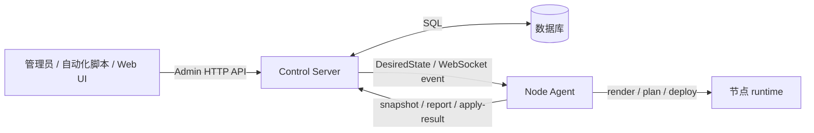
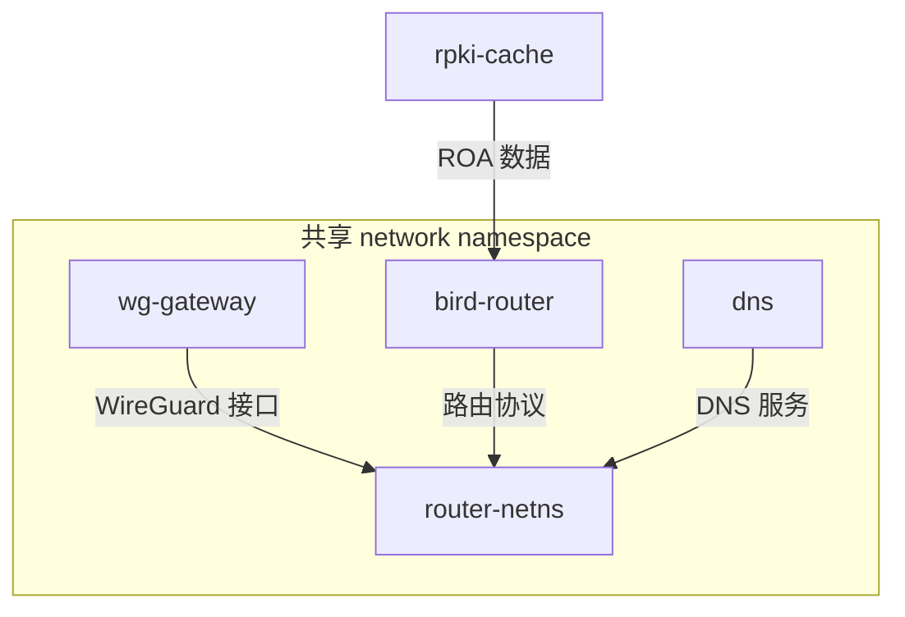

# DN42 Control Backend

[](https://github.com/chidakiko/dn42-control-backend/actions/workflows/ci.yml)
[](LICENSE)
[](https://www.python.org/)

`dn42-control-backend` 是一个面向 DN42 路由节点的控制平面与节点执行器。它把"节点应该运行什么配置"表达成 `DesiredState`，由 Control Server 保存和发布，由 Node Agent 在节点本机渲染、规划、部署并回报结果。

## 系统做什么

系统把 DN42 节点管理拆成一个持续运转的闭环：

1. 管理端通过 Admin API 或 Web UI 写入节点、peering、接口、BGP session、DNS 和 token（或用 provision / 导入工具整节点灌入）。
2. Control Server 把数据库中的事实数据合成为一份新的 `DesiredState`，保存为递增的 generation，并通过节点私有 WebSocket 通道通知对应 Agent。
3. Node Agent（常驻守护进程）拉取 `DesiredState`，渲染本地配置文件，比较当前文件和容器状态，按需要写入文件、重建容器、热重载服务，并把快照 / 对账 / 应用结果回报给 Control Server。
4. Control Server 持久化上报数据，推导每个节点的健康状态（`ok` / `stale` / `degraded` / `down` / `unknown`），供管理端查询。



系统的安全模型是"发布期望状态、节点本地收敛、回报观察结果"——Control Server **不提供**远程 shell 或任意命令执行接口（见 [docs/internals/security.md](docs/internals/security.md)）。

## 文档入口

完整文档索引见 **[docs/README.md](docs/README.md)**。文档按 Diátaxis 四层组织（教程 / 操作手册 / 参考 / 内部原理）。快速跳转：

| 你想… | 看这里 |
| --- | --- |
| 先了解系统是什么 | [docs/overview.md](docs/overview.md) |
| 从零上手 | [docs/tutorials/01-quickstart.md](docs/tutorials/01-quickstart.md) |
| 部署到生产 | [docs/guides/deployment.md](docs/guides/deployment.md) |
| 接入节点、看健康、排错 | [docs/guides/node-onboarding.md](docs/guides/node-onboarding.md) · [docs/guides/monitoring-and-troubleshooting.md](docs/guides/monitoring-and-troubleshooting.md) |
| 用 Web 管理界面 | [docs/guides/web-ui.md](docs/guides/web-ui.md) |
| 查接口 / 配置 / 字段 / 表 | [docs/reference/](docs/reference/) |
| 理解架构与数据流 | [docs/internals/architecture.md](docs/internals/architecture.md) |
| 改代码 / 跑测试 | [docs/contributing.md](docs/contributing.md) |

## Runtime 目标形态

节点 runtime 使用共享 network namespace。`router-netns` 提供网络命名空间，`wg-gateway` 在其中创建 WireGuard 接口，`bird-router` 在同一网络视图中运行 BIRD 2，`dns` 可选运行 CoreDNS，`rpki-cache` 提供 RPKI/ROA 数据。容器**不用 docker-compose**，由 Agent 直接通过 Docker Engine API 按 `DesiredState` 创建 / 重建。



## 目录结构

| 路径 | 说明 |
| --- | --- |
| `apps/control-server` | FastAPI 控制服务：API、数据库模型、token、DesiredState 生成、注册审批、健康视图、WebSocket 事件 |
| `apps/node-agent` | 节点执行器：注册、拉取、渲染、规划、部署、本机收敛、采集和上报；默认常驻守护进程 |
| `apps/web` | Web 管理界面：仪表盘、节点详情、互联 / 接入向导、审批、provision、审计 |
| `packages/dn42_schemas` | Pydantic 协议模型：`DesiredState`、Agent 注册、快照、对账报告等 |
| `packages/dn42_templates` | 把 `DesiredState` 渲染为 BIRD、WireGuard、CoreDNS 和脚本 |
| `packages/dn42_runtime` | 渲染文件、写盘计划、router Dockerfile 渲染 |
| `packages/dn42_common` | 公共校验、命名、label、community 与 Jinja 工具 |
| `migrations` | Alembic 数据库迁移 |
| `deploy` | systemd 生产单元、agent wheel 构建与滚动升级脚本、寻址 / 拓扑运维脚本、节点状态样本 |
| `scripts` | 开发辅助与节点导入工具 |
| `examples/rendered-hkg1` | hkg1 示例节点的渲染产物（golden 样本） |
| `tests` | 共享包单元测试与多节点集成测试 |

## 快速开始

### 安装

```bash
cd dn42-control-backend
python -m venv .venv
source .venv/bin/activate
pip install -e .[dev]
```

如果本地 editable install 没有覆盖所有子包，可以设置：

```bash
export PYTHONPATH=apps/control-server:apps/node-agent:packages/dn42_common:packages/dn42_schemas:packages/dn42_templates:packages/dn42_runtime
```

### 启动 Control Server

```bash
# 本地练手建议开启内置示例节点（默认不播种，启动即空库）
export DN42_CONTROL_SEED_BOOTSTRAP_NODE=1
uvicorn app.main:app --app-dir apps/control-server --reload --host 0.0.0.0 --port 8000
```

- 服务地址：`http://127.0.0.1:8000`
- OpenAPI：`http://127.0.0.1:8000/docs`
- 全部环境变量见 [docs/reference/configuration.md](docs/reference/configuration.md#control-server)

### 运行 Node Agent

只演练不动机器（不写盘、不部署）：

```bash
python -m agent.main \
  --controller-url http://127.0.0.1:8000 \
  --enrollment-token enroll-token \
  --requested-node-id edge1 \
  --state-dir .agent-state \
  --plan-only
```

单次完整部署后退出：

```bash
python -m agent.main \
  --controller-url http://127.0.0.1:8000 \
  --enrollment-token enroll-token \
  --requested-node-id edge1 \
  --state-dir .agent-state \
  --once
```

常驻守护进程（生产默认形态，去掉 `--once` 即可）：

```bash
python -m agent.main \
  --controller-url http://127.0.0.1:8000 \
  --enrollment-token enroll-token \
  --requested-node-id edge1 \
  --state-dir .agent-state
```

单次模式输出 JSON 摘要，包含 `node_id`、`generation`、文件计划、容器计划、部署结果、运行快照和对账报告。运行模式详解见 [docs/internals/node-agent.md](docs/internals/node-agent.md#运行模式)。

### 常用 API

```bash
# 节点列表
curl -s "http://127.0.0.1:8000/api/v1/admin/nodes"

# 机群健康概览
curl -s "http://127.0.0.1:8000/api/v1/admin/health"

# 手动通知 Agent 拉取新状态
curl -s -X POST \
  "http://127.0.0.1:8000/api/v1/admin/nodes/edge1/notify" \
  -H "Content-Type: application/json" \
  -d '{"event": "desired_state_updated", "reason": "manual"}'
```

完整接口见 [docs/reference/api.md](docs/reference/api.md)。

### 测试

```bash
python -m pytest
python -m compileall apps packages tests
```

详细说明见 [docs/contributing.md](docs/contributing.md)。
