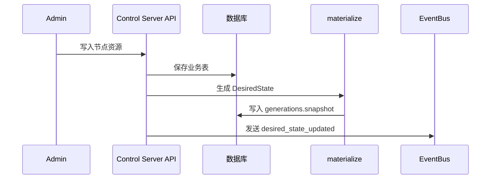

# Control Server

Control Server 是 DN42 控制平面的 API 服务。它保存节点事实数据，生成 `DesiredState`，签发和轮换 Agent token，处理注册审批，持久化节点状态并推导健康，通过 WebSocket 通知 Agent 拉取新状态。

完整架构见 [../../docs/architecture.md](../../docs/architecture.md)，API 见 [../../docs/api.md](../../docs/api.md)，数据库见 [../../docs/database.md](../../docs/database.md)，配置见 [../../docs/configuration.md](../../docs/configuration.md#control-server)。

## 代码结构

| 路径 | 说明 |
| --- | --- |
| `app/main.py` | `create_app()`、FastAPI lifespan、`app.state.*` 初始化 |
| `app/core/config.py` | `ControlServerConfig` |
| `app/core/events.py` | `EventBus`，按 `node_id` 维护 WebSocket 事件队列 |
| `app/db/engine.py` | async SQLAlchemy engine 与 session |
| `app/db/seed.py` | seed 开关开启时在空库写入 hkg1 示例节点 |
| `app/db/provision.py` | `provision_node_from_state()`：整节点幂等落库 |
| `app/db/models/` | ORM 模型 |
| `app/services/materializer.py` | 从数据库合成 `DesiredState` 并写入 generation |
| `app/services/desired_state.py` | 读取最新 generation snapshot |
| `app/services/tokens.py` | Agent token 签发、哈希存储、解析、过期、轮换 |
| `app/services/node_status.py` | 节点状态持久化与健康推导 |
| `app/services/pending_registrations.py` | 未知节点注册审批存储 |
| `app/api/v1/agent_http.py` | Agent HTTP API |
| `app/api/v1/agent_ws.py` | Agent WebSocket API（节点私有通道） |
| `app/api/v1/admin/` | Admin API：CRUD、provision、registrations、health、tokens |
| `app/tests/` | Control Server 测试 |

## 启动

```bash
cd dn42-control-backend
export PYTHONPATH=apps/control-server:packages/dn42_common:packages/dn42_schemas:packages/dn42_templates:packages/dn42_runtime
export DN42_CONTROL_SEED_BOOTSTRAP_NODE=1   # 可选：本地练手用 demo 节点
uvicorn app.main:app --app-dir apps/control-server --reload --host 0.0.0.0 --port 8000
```

OpenAPI：`http://127.0.0.1:8000/docs`

环境变量见 [../../docs/configuration.md](../../docs/configuration.md#control-server)。

## 运行逻辑



Agent 通过 HTTP 拉取完整状态，通过 WebSocket 接收事件。WebSocket 不承载完整业务数据。Agent 上报的快照 / 对账 / 应用结果由 `NodeStatusStore` 持久化，经 `/api/v1/admin/health` 暴露健康视图。

## 测试

```bash
python -m pytest apps/control-server/app/tests -q
```
