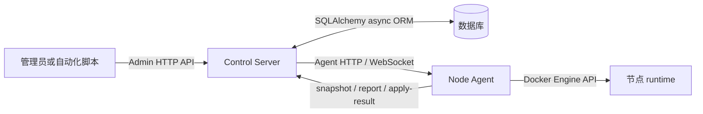
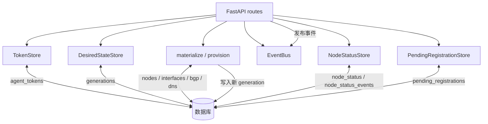
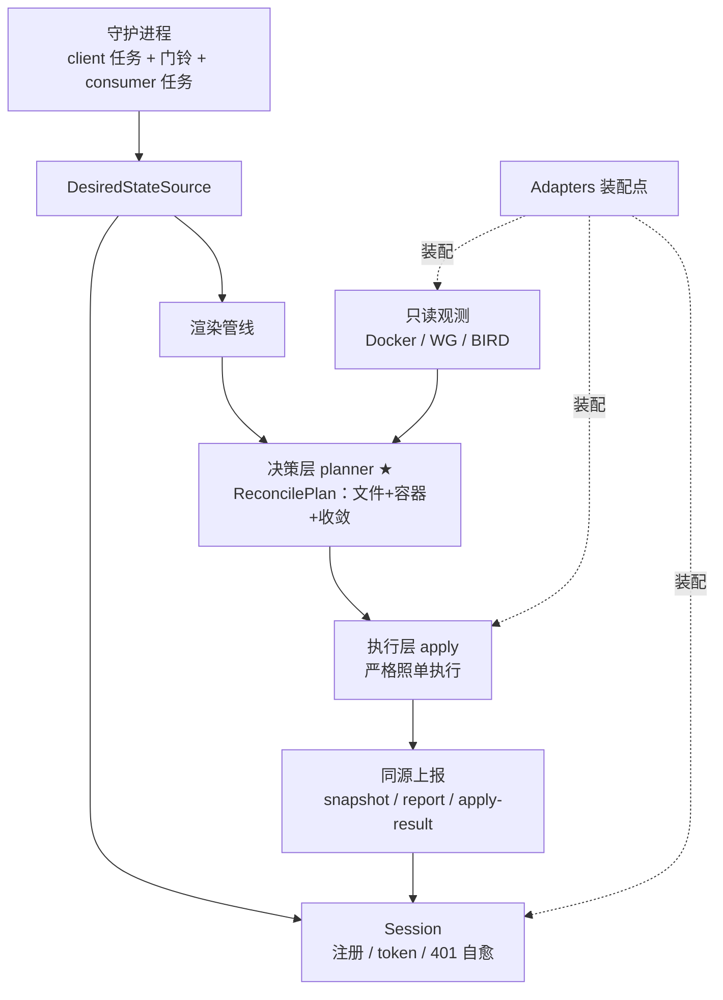
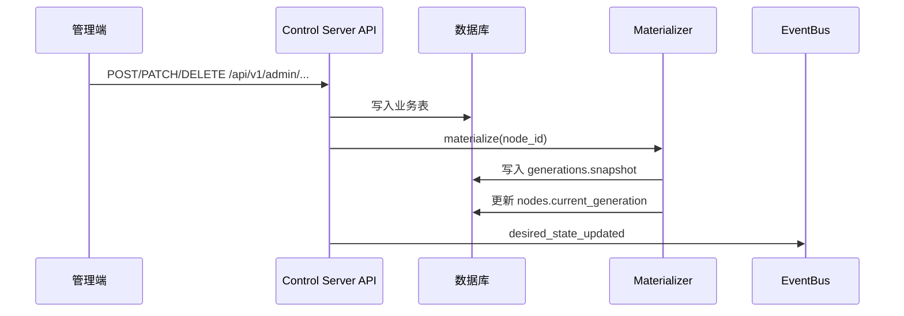
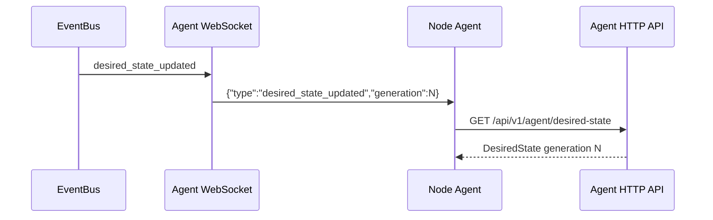
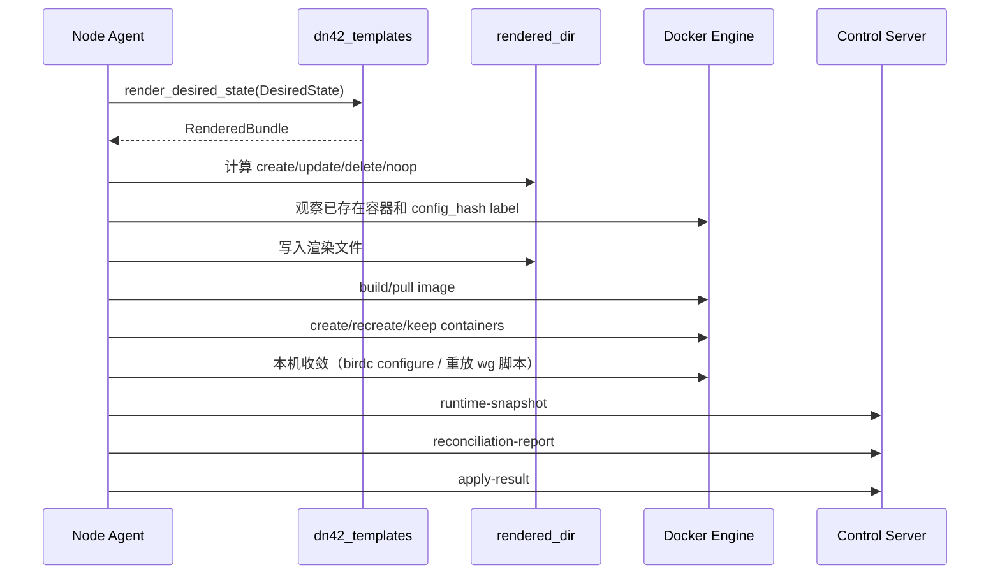
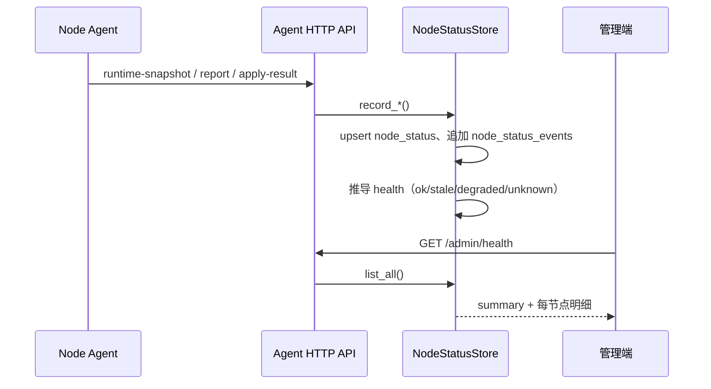
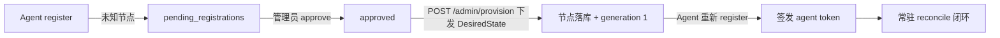
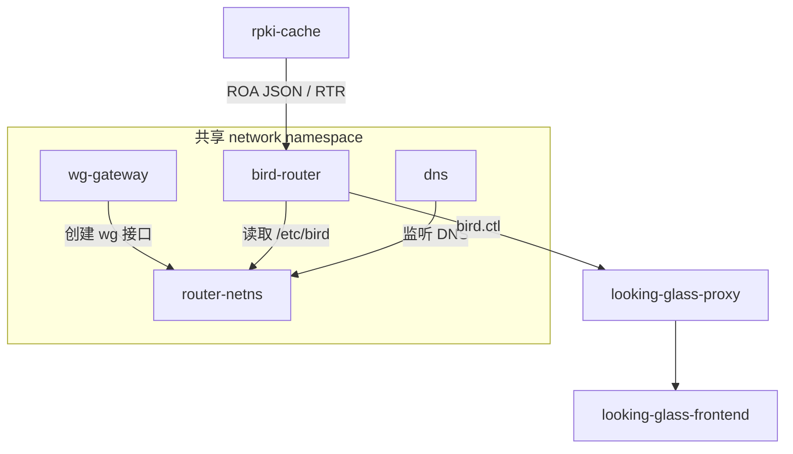

# 架构

本文说明系统如何把控制平面的数据库记录变成节点上的 Docker、WireGuard、BIRD、RPKI 和 DNS runtime，以及节点状态如何回流到控制面。

## 组件职责

| 组件 | 位置 | 职责 |
| --- | --- | --- |
| Control Server | `apps/control-server` | 提供 HTTP API 与 WebSocket API，管理数据库记录、token、`DesiredState` generation、事件通知、注册审批和节点健康视图 |
| Node Agent | `apps/node-agent` | 运行在节点上的常驻守护进程：拉取 `DesiredState`，渲染配置，规划和执行本机变更，上报运行结果 |
| Database | 外部服务或本地 SQLite 文件 | 保存节点、接口、BGP、DNS、token、generation snapshot 和节点状态 |
| `dn42_schemas` | `packages/dn42_schemas` | 定义跨组件传输的数据结构 |
| `dn42_templates` | `packages/dn42_templates` | 把 `DesiredState` 渲染为配置文件和脚本 |
| `dn42_runtime` | `packages/dn42_runtime` | 表达渲染文件、写盘计划、router Dockerfile 渲染 |
| `dn42_common` | `packages/dn42_common` | 公共校验、命名、label 和 community 工具 |

## 系统边界

Control Server 内部包含 API 路由、`TokenStore`、`DesiredStateStore`、`NodeStatusStore`、`PendingRegistrationStore`、`materialize()` / `provision_node_from_state()` 和 `EventBus`。这些不是外部服务。

Node Agent 内部包含配置加载、身份缓存、controller client、渲染、文件计划、容器计划、部署 backend、本机收敛、采集器和对账器。它们也不是外部服务。

## Control Server 内部结构

| 内部组件 | 职责 |
| --- | --- |
| `TokenStore` | Agent Bearer token 的签发、哈希存储、解析、过期校验、轮换与撤销 |
| `DesiredStateStore` | 按 `node_id` 读取最新 generation snapshot；`bump()` 触发重新 materialize |
| `materialize()` | 读取规范化表，合成完整 `DesiredState`，校验后写入 `generations.snapshot` |
| `provision_node_from_state()` | 接受完整 `DesiredState`，整节点幂等落库并 materialize（被 seed / `POST /admin/provision` / 导入脚本复用） |
| `NodeStatusStore` | 持久化 Agent 上报，推导节点健康（`ok` / `stale` / `degraded` / `unknown`） |
| `PendingRegistrationStore` | 记录未知节点的注册申请，支持审批流转 |
| `EventBus` | 进程内按 `node_id` 的发布/订阅队列，向 WS 连接推送事件；队列满时丢弃（agent 有兜底轮询） |

## Agent 内部结构

Agent 的核心是 `run_once(config, adapters)`：一次运行做一轮六阶段管线（source → render → observe → **plan** → execute → report）。决策层一次性产出唯一权威的 `ReconcilePlan`，执行层照单执行、上报与之同源。默认运行方式是 `run_watch(config)` 常驻守护进程：启动先 reconcile 一次，然后连接节点私有 WS 通道，收到门铃即再次 reconcile（带 hello 追赶与 generation 去重）。详见 [node-agent.md](node-agent.md)。

## 数据流

### 管理端写入变更

业务表包括 `nodes`、`peerings`、`wg_interfaces`、`bgp_sessions`、`dns_zones`、`agent_tokens` 和 `enrollment_tokens`。`generations` 保存已经发布给 Agent 的完整状态快照。

### Agent 接收新状态

WebSocket 只传事件，不传完整业务数据。Agent 收到事件后通过 HTTP 拉取完整 `DesiredState`。

### Agent 本地部署

Docker API backend 会先准备镜像，再删除需要重建的旧容器，避免构建失败时先破坏现有部署。

### 状态回流与健康视图

### 新节点接入生命周期

approve 只是放行名单；真正能工作取决于 provision 是否下发了 `DesiredState`。完整操作步骤见 [operations.md](operations.md#新节点接入与审批)。

## 节点 runtime

常见服务角色：

| role | 作用 |
| --- | --- |
| `router-netns` | 提供共享 network namespace |
| `wg-gateway` | 应用 WireGuard 配置、创建隧道接口 |
| `bird-router` | 运行 BIRD 2，承载 BGP、OSPF、静态路由和过滤策略 |
| `rpki-cache` | 为 BIRD 提供 DN42 RPKI/ROA 数据 |
| `dns` | 运行 CoreDNS |
| `debug-shell` | 调试容器 |
| `looking-glass-proxy` | 暴露 BIRD 查询代理 |
| `looking-glass-frontend` | 暴露 looking glass 页面 |

> **internal_topology 一致性不变量**：同一 AS 内多节点的 iBGP/OSPF 由
> `DesiredState.bird.internal_topology` 合成（不是 `bgp_sessions`）。所有节点的 `routers`+`hosts`
> 必须是同一份完整集合，否则会隐蔽缺路由。设计、加节点 checklist 与排错见
> [internal-interconnect.md](internal-interconnect.md)。

## 代码结构

### Control Server

| 路径 | 内容 |
| --- | --- |
| `app/main.py` | `create_app()`、FastAPI lifespan、全局 service 初始化 |
| `app/core/config.py` | `ControlServerConfig` |
| `app/core/events.py` | `EventBus` |
| `app/db/engine.py` | async engine 与 session 管理 |
| `app/db/seed.py` | seed 开关开启时在空库写入 hkg1 示例数据 |
| `app/db/provision.py` | `provision_node_from_state()` |
| `app/db/models/` | SQLAlchemy ORM 模型 |
| `app/services/materializer.py` | `DesiredState` 合成与 generation 写入 |
| `app/services/desired_state.py` | 根据 `node_id` 读取最新 `DesiredState` |
| `app/services/tokens.py` | Agent Bearer token 签发、哈希、解析与轮换 |
| `app/services/node_status.py` | 节点状态持久化与健康推导 |
| `app/services/pending_registrations.py` | 注册审批存储 |
| `app/api/v1/agent_http.py` | Agent HTTP API |
| `app/api/v1/agent_ws.py` | Agent WebSocket API |
| `app/api/v1/admin/` | Admin API（CRUD、provision、registrations、health、tokens） |

### Node Agent

| 路径 | 内容 |
| --- | --- |
| `agent/main.py` | CLI 参数解析与模式分发 |
| `agent/watch.py` | 常驻守护循环：WS 订阅、指数退避重连、兜底周期 reconcile |
| `agent/orchestrator.py` | `ReconcileOrchestrator` 与 `run_once()` |
| `agent/core/config.py` | `AgentConfig`、TOML 和环境变量加载 |
| `agent/core/identity.py` | `identity.json` 读写 |
| `agent/client/controller.py` | Control Server HTTP client |
| `agent/desired_state/` | 本地 `DesiredState` 文件加载与缓存 |
| `agent/render/pipeline.py` | 调用 `dn42_templates` 渲染 |
| `agent/planner/` | 文件计划和容器计划 |
| `agent/apply/` | 写盘、Docker API backend、本机收敛 |
| `agent/collectors/` | 主机、Docker、网络、WireGuard、BIRD 状态采集 |
| `agent/health/reconcile.py` | 生成 `ReconciliationReport` |

## 最小扰动设计

系统刻意采用 **电平触发（level-based）+ 内容寻址** 而不是"控制面推送 delta"
（边沿触发）：事件丢失、乱序、agent 重启都不影响正确性，每轮 reconcile 都
从最新全量状态推导出最小动作集。

| 层 | 机制 | 效果 |
| --- | --- | --- |
| 容器 | 身份 = `dn42.config_hash`（服务 spec + underlay + 构建参数的哈希） | generation 递增不重建任何容器；只有容器定义本身变化才重建 |
| 渲染产物 | 不携带 generation，跨代逐字节稳定 | 无实质变化时 file plan 全 noop |
| 配置文件 | file plan（SHA-256 对比）算出精确差异 | agent 本地就知道"到底变了什么"，无需控制面告知 |
| 数据面 | 定向收敛：`birdc configure` 热重载、按接口 WireGuard 同步/拆除 | 加一个 peer 只拉起一条隧道，其余 BGP 会话零扰动 |
| 事件 | WS 门铃 + 防抖合并 + 兜底周期 | 突发批量变更合并为一次 reconcile |

控制面在事件中附带 `reason`（变更原因）供日志排错，但 agent 的收敛判定
完全基于本地观测对比——这保证了"该收敛什么"永远以事实为准。

## 并发与一致性

| 场景 | 保障 |
| --- | --- |
| 并发 admin 写同一节点 | `materialize` 对节点行加 `SELECT ... FOR UPDATE` 锁，generation 严格单调递增；`UNIQUE(node_id, generation)` 兜底（SQLite 单写者 + 约束，极端并发下后写请求失败回滚，数据不脏） |
| 事件先发、事务后回滚 | materialize 不发事件；路由层在事务提交后才广播 |
| WS 事件丢失 / 队列溢出 | agent 兜底周期 reconcile（默认 300 秒）拉平 |
| 突发批量变更 | agent 防抖窗口合并；每次 reconcile 拉取的都是最新全量状态，中间代次天然被跳过 |
| agent 重复 reconcile | 幂等：file plan 全 noop、容器 plan 全 keep、收敛零动作 |
| 同节点多 agent 实例 | 不支持，部署约定每节点单实例（systemd 模板单元天然如此） |

生产环境建议使用 PostgreSQL（真正的行级锁并发串行化）；SQLite 适合开发与单管理员场景。

## 变更闭环

```mermaid
gantt
    title 单次配置变更闭环
    dateFormat X
    axisFormat %s
    section Control Server
    写入 Admin API             :0, 1
    materialize 新 generation  :1, 1
    WebSocket 发送事件         :2, 1
    section Node Agent
    拉取 DesiredState          :3, 1
    渲染与规划                 :4, 1
    写盘与部署                 :5, 2
    采集与对账                 :7, 1
    section Control Server
    接收 snapshot/report/result:8, 1
    更新 node_status 健康视图  :9, 1
```

这条闭环保证系统不是"远程执行命令"，而是"发布期望状态、节点本地收敛、回报观察结果"。Control Server 不提供远程 shell 或任意命令执行接口（见 [security.md](security.md#禁止的控制模型)）。
