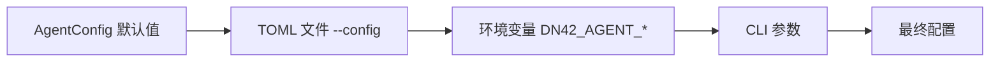

# 配置参考

本文是 Control Server 与 Node Agent 全部配置项的单一参考。其他文档（README、组件文档）只引用本文，不重复维护配置表。

## Control Server

定义：`apps/control-server/app/core/config.py` 中的 `ControlServerConfig`，启动时由 `from_env()` 从环境变量构造。

| 环境变量 | 默认值 | 说明 |
| --- | --- | --- |
| `DN42_CONTROL_DATABASE_URL` | `sqlite+aiosqlite:///<repo-root>/control.db` | SQLAlchemy async DSN。生产建议 `postgresql+asyncpg://...`（需安装 `asyncpg`）或 `mysql+asyncmy://...` |
| `DN42_CONTROL_ENROLLMENT_TOKEN` | `enroll-token` | Agent 注册时校验的 enrollment token，生产必须改掉 |
| `DN42_CONTROL_SEED_BOOTSTRAP_NODE` | `false` | 是否在**空库**启动时播种内置 hkg1 demo 节点。默认关闭：启动即空库，节点数据应由 [provision / 导入流程](operations.md#节点接入方式总览) 写入。接受 `1/true/yes/on` |
| `DN42_CONTROL_BOOTSTRAP_NODE_ID` | `edge1` | demo 节点的 `node_id`，仅在 seed 开启时使用 |
| `DN42_CONTROL_BOOTSTRAP_AGENT_TOKEN` | `mvp-agent-token` | 绑定 demo 节点的初始 agent token，便于本地联调 |

本地开发启用 demo 节点：

```bash
export DN42_CONTROL_SEED_BOOTSTRAP_NODE=1
uvicorn app.main:app --app-dir apps/control-server --reload --host 0.0.0.0 --port 8000
```

## Node Agent

定义：`apps/node-agent/agent/core/config.py` 中的 `AgentConfig`。

配置来源优先级（后者覆盖前者）：



### 配置项

| 字段 | 类型 | 默认值 | 环境变量 | CLI 参数 | 说明 |
| --- | --- | --- | --- | --- | --- |
| `controller_url` | string 或 null | null | `DN42_AGENT_CONTROLLER_URL` | `--controller-url` | Control Server 地址；常驻模式必填，与 `desired_state_path` 互斥 |
| `enrollment_token` | string 或 null | null | `DN42_AGENT_ENROLLMENT_TOKEN` | `--enrollment-token` | 首次注册使用的 token |
| `requested_node_id` | string 或 null | null | `DN42_AGENT_REQUESTED_NODE_ID` | `--requested-node-id` | 注册/加载的节点 ID；**首次注册必填**（控制面不做猜测绑定） |
| `hostname` | string 或 null | null | `DN42_AGENT_HOSTNAME` | `--hostname` | 覆盖 inventory 中的主机名 |
| `state_dir` | path | `/var/lib/dn42-control` | `DN42_AGENT_STATE_DIR` | `--state-dir` | 本地状态根目录 |
| `rendered_dir` | path 或 null | null | `DN42_AGENT_RENDERED_DIR` | `--rendered-dir` | 渲染输出目录；为空时使用 `<state_dir>/nodes/<node_id>/rendered` |
| `mode` | string | `apply` | `DN42_AGENT_MODE` | `--mode` | reconcile 深度：`apply`（写盘+部署+收敛）、`write-rendered`（只写渲染文件）、`plan-only`（只规划）；非法值直接报 `ConfigError` |
| `desired_state_path` | path 或 null | null | — | `--desired-state` | 离线模式的本地 `DesiredState` 文件，与 `controller_url` 互斥 |
| `http_timeout_seconds` | number | `10.0` | `DN42_AGENT_HTTP_TIMEOUT_SECONDS` | — | HTTP 请求超时 |
| `local_convergence` | boolean | true | `DN42_AGENT_LOCAL_CONVERGENCE` | — | 部署后本机收敛（`birdc configure`、重放 WireGuard apply 脚本），见 [node-agent.md](node-agent.md#本机收敛local-convergence) |
| `log_level` | string | `INFO` | `DN42_AGENT_LOG_LEVEL` | `--log-level` | 日志级别 |

### TOML 文件

通过 `--config /etc/dn42-control/agent.toml` 指定，配置位于 `[agent]` 段。未知字段会直接报 `ConfigError`，防止拼写错误静默失效。

```toml
[agent]
controller_url = "http://127.0.0.1:8000"
enrollment_token = "enroll-token"
requested_node_id = "edge1"
state_dir = "/var/lib/dn42-control"
log_level = "INFO"
http_timeout_seconds = 10
```

示例文件见 `apps/node-agent/agent.example.toml`。

### CLI 约束

| 约束 | 原因 |
| --- | --- |
| `--controller-url` 与 `--desired-state` 互斥 | 状态来源必须唯一 |
| `--once` 与 `--plan-only` 互斥 | 诊断入口必须唯一（`--plan-only` ≡ `--once --mode plan-only`） |
| `--plan-only` 与 `--mode`（非 plan-only）互斥 | 语义冲突直接报错，不静默取舍 |
| 默认（常驻）模式必须有 `controller_url` | 常驻监听依赖控制面 WS 通道 |
| 常驻模式拒绝 `mode=plan-only` | plan-only 只用于单次诊断 |

运行模式详细说明见 [node-agent.md](node-agent.md#运行模式)。
