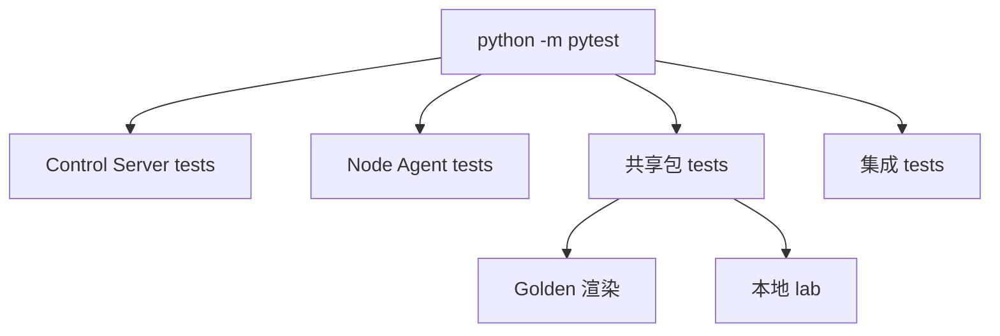

# 贡献指南

本文讲怎么搭开发环境、跑测试、刷新 golden、代码风格、提 PR，以及**文档维护约定**。系统原理见 [internals/](internals/)。

## 开发环境

需要 Python 3.11+。

```bash
git clone https://github.com/chidakiko/dn42-control-backend.git
cd dn42-control-backend
python -m venv .venv
source .venv/bin/activate

# 一方包 + 应用 + 开发依赖（editable）
pip install \
  -e packages/dn42_common \
  -e packages/dn42_schemas \
  -e packages/dn42_runtime \
  -e packages/dn42_templates \
  -e apps/control-server \
  -e apps/node-agent \
  -e ".[dev]"
```

也可 `pip install -e .[dev]`，若导入子包报错则设 `PYTHONPATH`（见 [tutorials/01-quickstart.md](tutorials/01-quickstart.md#1-装依赖只做一次)）。

## 跑测试

`pyproject.toml` 已配 `testpaths` 与 `pythonpath`：

```bash
python -m pytest                 # 全部（共享包 + control-server + node-agent）
python -m pytest tests/unit      # 仅共享包单测
python -m pytest tests/unit/test_desired_state_schema.py -q   # 指定文件
python -m compileall apps packages tests                      # 语法/导入检查
```

### 测试分层



| 层 | 目录 | 覆盖 |
| --- | --- | --- |
| Control Server | `apps/control-server/app/tests/` | health、DB repositories、注册、Bearer/WS 鉴权、admin CRUD、token/健康 |
| Node Agent | `apps/node-agent/agent/tests/` | config、naming、CLI、持久化、orchestrator、watch、planner、apply backends、convergence、collectors |
| 共享包 | `tests/unit/` | 校验器、labels/naming/communities、schemas、canonical IO、templates、runtime、agent 协议、导入、lab 示例 |
| 集成 | `tests/integration/` | `test_three_node_control_plane.py`：真实多节点闭环（provision → 注册 → WS → reconcile → 上报） |

Control Server 用 FastAPI `TestClient` + 临时 SQLite + WS test client；Node Agent 用 fake controller/docker/executor + `tmp_path`，多数单测不需 Docker。

### Golden 渲染回归

`tests/unit/test_golden_rendered_hkg1.py` 把 `build_hkg1_example_state()` 的渲染产物与 `examples/rendered-hkg1/` **逐字节**对比，保护模板输出不被意外改变。**只有**在 schema 默认值、模板或 runtime 输出**有意**改变时才刷新：

```bash
python -c "from pathlib import Path; from dn42_schemas.testing import build_hkg1_example_state; from dn42_templates import render_desired_state; from dn42_runtime import write_rendered_files; write_rendered_files(render_desired_state(build_hkg1_example_state()), Path('examples/rendered-hkg1'))"
python -m pytest tests/unit/test_golden_rendered_hkg1.py -q
```

### 访问 Docker 的命令

多数单测不需 Docker。下面会连 Docker Engine（没起 Docker 时可能因连不上 socket/named pipe 失败）：

```bash
python -m agent.main --plan-only --state-dir .agent-state
python -m agent.main --once --state-dir .agent-state --desired-state state.json
```

## 代码风格

- `ruff`（行宽 100）：`ruff check .` / `ruff format .`。
- 公共 API 写 docstring；面向用户的文档放 `docs/`。

## 提交 PR

1. 从 `main` 切分支。
2. 提交信息用约定式前缀（`feat:` / `fix:` / `docs:` / `chore:` / `refactor:` …）。
3. 确保 `python -m pytest` 全绿。
4. 开 PR，说明动机与改动点。
5. **协议模型是 Pydantic `StrictModel`（`extra=forbid`）**：增删字段注意 agent↔server 的**锁步发布**顺序——加字段先升控制面、删字段先升 agent（见 [guides/upgrades-and-migrations.md](guides/upgrades-and-migrations.md#控制面--agent-锁步升级)）。

## 文档维护约定

文档与代码同等重要，改了行为就改文档。

1. **单一事实源**：每主题只在一处详写，余处链接：
   - 配置 / env / CLI → [reference/configuration.md](reference/configuration.md) + [reference/cli-and-scripts.md](reference/cli-and-scripts.md)
   - API → [reference/api.md](reference/api.md)
   - schema 字段 → [reference/desired-state.md](reference/desired-state.md)
   - 表结构 → [reference/database.md](reference/database.md)
2. **分层放置**（Diátaxis）：手把手入门放 `tutorials/`；任务步骤放 `guides/`；查得到的事实放 `reference/`；为什么/怎么运转放 `internals/`。导航在 [README.md](README.md)。
3. **与代码同步**：改接口/配置/表/运行模式/schema → 同步对应参考文档；能力状态变化 → 同步 [ROADMAP.md](ROADMAP.md)；schema/模板变化 → 刷新 golden。
4. **示例可执行**：命令能在仓库根直接复制运行（PowerShell 为主，节点侧 bash）；脱敏（不放真实 IP/密钥）。
5. **交叉引用代码**：用 `path:line` 指向源码。
6. **链接用相对路径**，新增文档记得加进 [README.md](README.md) 导航表。
