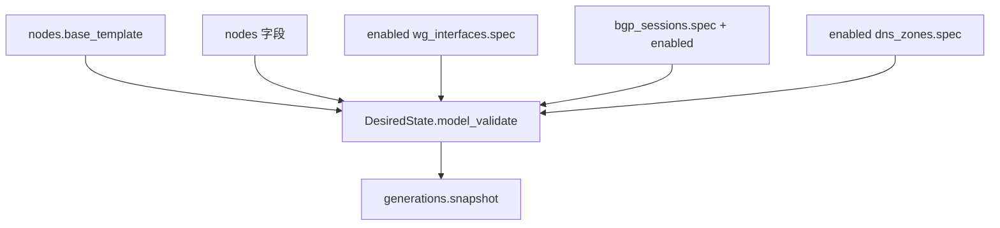

# DesiredState

`DesiredState` 是 Control Server 和 Node Agent 之间的主协议。它描述一个节点应该具备的网络身份、runtime 服务、接口、BGP session、DNS 配置、looking glass 配置和模板版本。

模型定义在：

```text
packages/dn42_schemas/dn42_schemas/desired_state.py
```

相关子模型：

```text
packages/dn42_schemas/dn42_schemas/network.py
packages/dn42_schemas/dn42_schemas/runtime.py
packages/dn42_schemas/dn42_schemas/routing.py
packages/dn42_schemas/dn42_schemas/dns.py
packages/dn42_schemas/dn42_schemas/lookglass.py
```

## 顶层结构

```json
{
  "schema_version": "v1",
  "generation": 1,
  "node": {},
  "runtime": {},
  "bird": {},
  "interfaces": [],
  "bgp_sessions": [],
  "dns": null,
  "lookglass": null,
  "templates": {}
}
```

| 字段 | 类型 | 说明 |
| --- | --- | --- |
| `schema_version` | string | 协议版本，当前为 `v1` |
| `generation` | integer | 节点内递增的发布世代，每次发布新状态时加一 |
| `node` | `NodeSpec` | 节点身份、ASN、router ID、prefix 和 loopback |
| `runtime` | `RouterRuntimeSpec` | underlay、RPKI、Dockerfile 和 runtime services（容器编排的唯一数据源） |
| `bird` | `Bird2ConfigSpec` | BIRD 模板需要的高层路由配置 |
| `interfaces` | `InterfaceSpec[]` | 需要在节点上存在的网络接口 |
| `bgp_sessions` | `BgpSessionSpec[]` | 需要由 BIRD 建立的 BGP session |
| `dns` | `DnsSpec` 或 `null` | CoreDNS 配置；`null` 表示不部署 DNS 配置 |
| `lookglass` | `LookglassSpec` 或 `null` | looking glass 配置；启用后会补充 runtime services |
| `templates` | `TemplateSetSpec` | 渲染器使用的模板集版本 |

## NodeSpec

`node` 描述节点自己的网络身份。

```json
{
  "node_id": "edge1",
  "site": "hkg",
  "region": "asia-east",
  "asn": 4242420000,
  "router_id": "172.20.0.62",
  "ipv4_prefixes": ["172.20.0.0/26"],
  "ipv6_prefixes": ["fdce:1111:2222::/48"],
  "loopback_ipv4": "172.20.0.62",
  "loopback_ipv6": "fdce:1111:2222:9500::1"
}
```

| 字段 | 说明 |
| --- | --- |
| `node_id` | 节点稳定 ID，也用于 token 绑定、本地目录和 Docker project 派生 |
| `site` | 站点或机房标识 |
| `region` | DN42 origin region community |
| `asn` | 节点所属 ASN |
| `router_id` | BIRD router ID，通常是稳定 IPv4 地址 |
| `ipv4_prefixes` | 节点拥有并可宣告的 IPv4 prefix |
| `ipv6_prefixes` | 节点拥有并可宣告的 IPv6 prefix |
| `loopback_ipv4` | 节点 loopback IPv4，必须属于 `ipv4_prefixes` |
| `loopback_ipv6` | 节点 loopback IPv6，必须属于 `ipv6_prefixes` |

## RouterRuntimeSpec

`runtime` 描述 Agent 应该部署哪些服务，以及它们如何接入网络。

```json
{
  "project_name": "dn42-edge1",
  "underlay": {
    "name": "router_underlay",
    "subnet": "10.254.42.0/24",
    "gateway": "10.254.42.1"
  },
  "rpki": {
    "enabled": true,
    "cache_url": "https://dn42.burble.com/roa/dn42_roa_46.json",
    "listen_host": "10.254.42.3",
    "listen_port": 8282
  },
  "router_dockerfile": {
    "base_image": "debian:13-slim",
    "debian_mirror": "deb.debian.org"
  },
  "wireguard_port_range": {
    "start": 38000,
    "end": 38020,
    "host_start": 38000
  },
  "services": [
    {
      "name": "dn42-router-netns",
      "role": "router-netns",
      "image": "debian:13-slim",
      "enabled": true
    },
    {
      "name": "dn42-wg-gateway",
      "role": "wg-gateway",
      "network_mode": "service:dn42-router-netns",
      "depends_on": ["dn42-router-netns"],
      "command": ["/opt/dn42/scripts/wg/start-wg-gateway.sh"],
      "volumes": [
        {"source": "./scripts", "target": "/opt/dn42/scripts", "readonly": true},
        {"source": "./wireguard", "target": "/etc/wireguard", "readonly": true}
      ],
      "enabled": true
    }
  ]
}
```

重要字段：

| 字段 | 说明 |
| --- | --- |
| `project_name` | runtime 项目名（容器/网络名前缀）；为空时通常由节点 ID 派生 |
| `underlay` | 容器之间使用的 underlay 网络 |
| `rpki` | RPKI cache 参数 |
| `router_dockerfile` | 路由器镜像 Dockerfile 模板参数 |
| `wireguard_port_range` | 节点允许 WireGuard 使用并对外发布的 UDP 端口范围 |
| `services` | runtime 服务列表 |

常见 `services[].role`：

| role | 说明 |
| --- | --- |
| `router-netns` | 共享 network namespace |
| `wg-gateway` | 应用 WireGuard 配置 |
| `bird-router` | 运行 BIRD 2 |
| `rpki-cache` | 提供 RPKI/ROA 数据 |
| `dns` | 运行 CoreDNS |
| `debug-shell` | 调试容器 |
| `looking-glass-proxy` | BIRD 查询代理 |
| `looking-glass-frontend` | looking glass 前端 |

## InterfaceSpec

`interfaces` 描述节点上应该存在的接口。当前常用类型是 `dummy` 和 `wireguard`。

```json
{
  "name": "wg-example",
  "kind": "wireguard",
  "mtu": 1420,
  "addresses": ["172.20.0.62/32"],
  "peer_routes": ["172.20.0.1/32"],
  "listen_port": 51820,
  "private_key_ref": "secret://edge1/wg-example/private",
  "wireguard_peer": {
    "public_key": "+aFW7xRRTwOZ6w0EmrvqN4ng2QcFA0/9Wdu9GkdwJgQ=",
    "allowed_ips": ["172.20.0.1/32"],
    "endpoint": "peer.example:51820",
    "persistent_keepalive_seconds": 25
  }
}
```

| 字段 | 说明 |
| --- | --- |
| `name` | Linux 接口名，最长 15 个字符 |
| `kind` | 接口类型，例如 `dummy` 或 `wireguard` |
| `mtu` | 接口 MTU |
| `addresses` | 配置到接口上的地址，使用 CIDR 写法 |
| `peer_routes` | 与该接口对端相关的路由 |
| `listen_port` | WireGuard 监听端口 |
| `private_key_ref` | WireGuard 私钥引用 |
| `wireguard_peer` | 对端公钥、endpoint、allowed IPs 和 keepalive |

`kind = "wireguard"` 时必须提供 `private_key_ref` 和 `wireguard_peer`。

WireGuard 的 `listen_port` 与节点的 `runtime.wireguard_port_range` 配合使用：

| 规则 | 说明 |
| --- | --- |
| `listen_port` 必须唯一 | 同一节点上两个启用的 WireGuard 接口不能使用相同监听端口 |
| 配置了 `wireguard_port_range` 时必须落在范围内 | 例如范围是 `38000-38020`，则 `listen_port = 38021` 会被拒绝 |
| 端口范围发布在 `router-netns` | 生成 runtime 时会给 `router-netns` 添加类似 `38000-38020:38000-38020/udp` 的端口映射 |
| `host_start` 可改变宿主机起始端口 | `start=38000,end=38020,host_start=39000` 会生成 `39000-39020:38000-38020/udp` |

## BgpSessionSpec

`bgp_sessions` 描述 BIRD 要建立的 BGP session。

```json
{
  "name": "example-v4",
  "remote_asn": 4242420099,
  "neighbor": "172.20.0.1",
  "source_address": "172.20.0.62",
  "address_family": "ipv4",
  "interface": "wg-example",
  "policy": "dnpeers",
  "import_mode": "filter",
  "export_mode": "filter",
  "protocol_suffix": "_v4",
  "extended_next_hop": false,
  "bfd": {
    "enabled": true,
    "interval_ms": 1000,
    "multiplier": 5
  },
  "route_reflector_client": false,
  "enabled": true
}
```

| 字段 | 说明 |
| --- | --- |
| `name` | BGP session 名称，节点内唯一 |
| `remote_asn` | 对端 ASN |
| `neighbor` | 对端地址，可带 IPv6 zone，例如 `fe80::1%wg0` |
| `source_address` | 本端建连源地址 |
| `address_family` | `ipv4`、`ipv6` 或模板支持的地址族 |
| `interface` | 关联接口名 |
| `policy` | 模板策略名，常用 `dnpeers` 或 `internal` |
| `protocol_suffix` | 追加到 BIRD protocol 名后的后缀 |
| `bfd` | BFD 参数；为 `null` 时不生成 BFD 配置 |
| `enabled` | 是否启用该 session |

`interface` 如果非空，必须指向 `interfaces[].name` 中已存在的接口。

## DnsSpec

`dns` 描述 CoreDNS 配置。

```json
{
  "enabled": true,
  "bind_addresses": ["172.20.0.62"],
  "cache_ttl_seconds": 300,
  "zones": [
    {
      "zone": "0.20.172.in-addr.arpa",
      "primary_ns": "ns1.example.dn42.",
      "admin_email": "hostmaster.example.dn42.",
      "default_ttl": 3600,
      "records": [
        {"name": "62", "type": "PTR", "value": "edge1.example.dn42."}
      ]
    }
  ],
  "forwards": [
    {"zone": "dn42", "upstreams": ["172.20.0.53"]}
  ]
}
```

`records` 非空时必须提供 `primary_ns` 和 `admin_email`，用于生成 SOA。

## TemplateSetSpec

```json
{
  "bird": "config-bird2/v1",
  "wireguard": "config-wireguard/v1",
  "coredns": "config-coredns/v1",
  "docker": "config-docker/v1",
  "scripts": "config-scripts/v1"
}
```

模板字段决定 `dn42_templates` 和 `dn42_runtime` 渲染时选择哪套模板。当前实现主要使用默认值。

## 校验规则

`DesiredState.model_validate(...)` 会执行这些关键校验：

| 规则 | 目的 |
| --- | --- |
| 顶层和子模型禁止未知字段 | 防止拼写错误静默进入协议 |
| `interfaces[].name` 唯一 | 避免同一节点出现重复接口 |
| `bgp_sessions[].name` 唯一 | 避免 BIRD protocol 名冲突 |
| BGP `interface` 必须引用已有接口 | 防止模板生成无效邻居 |
| 一个 WireGuard interface 不承载多个外部 remote ASN | 避免把不同 eBGP 对端混到同一隧道 |
| enabled runtime services 必须包含 `router-netns`、`wg-gateway`、`bird-router` | 保证基础路由 runtime 存在 |
| `depends_on` 必须指向 enabled service | 保证服务依赖可解析 |
| `network_mode: service:<name>` 必须指向 enabled service | 保证共享网络命名空间可解析 |
| 同一个 host port 不允许被多个 service 发布 | 避免 Docker 端口冲突 |
| 同一节点上 WireGuard `listen_port` 不允许重复 | 避免多个 WireGuard 接口争用同一个 UDP 监听端口 |
| 配置了 `runtime.wireguard_port_range` 时，WireGuard `listen_port` 必须位于范围内 | 保证接口监听端口与宿主机对外发布端口一致 |
| 渲染文件路径不能是绝对路径、不能包含 `..` 或 NUL | 防止写盘越界 |

## Control Server 如何生成 DesiredState



合成规则：

1. `Node.base_template` 提供 `runtime`、`bird`、`templates`、`lookglass` 和 `dns` 顶层骨架。
2. `Node` 表字段覆盖 `snapshot.node`。
3. enabled `WgInterface` 写入 `interfaces`。
4. `BgpSession` 写入 `bgp_sessions`，行级 `enabled` 覆盖 `spec.enabled`。
5. enabled `DnsZone` 写入 `dns.zones`；如果 `base_template.dns` 不是对象，则 `dns` 为 `null`。
6. `DesiredState.model_validate(...)` 校验完整结构。
7. 通过后写入 `generations.snapshot`。

## 渲染结果

`dn42_templates.render_desired_state(state)` 输出 `RenderedFile[]`，常见文件包括：

```text
bird/bird.conf
bird/dn42_peers.conf
bird/ospf.conf
bird/rpki.conf
wireguard/*.conf
scripts/bird/*.sh
scripts/wg/*.sh
coredns/Corefile
coredns/zones/db.*
```

命令行渲染：

```bash
python -m dn42_templates render --state state.json --out ./rendered
```

只计算写盘计划：

```bash
python -m dn42_templates apply --state state.json --out ./rendered --dry-run --prune
```
