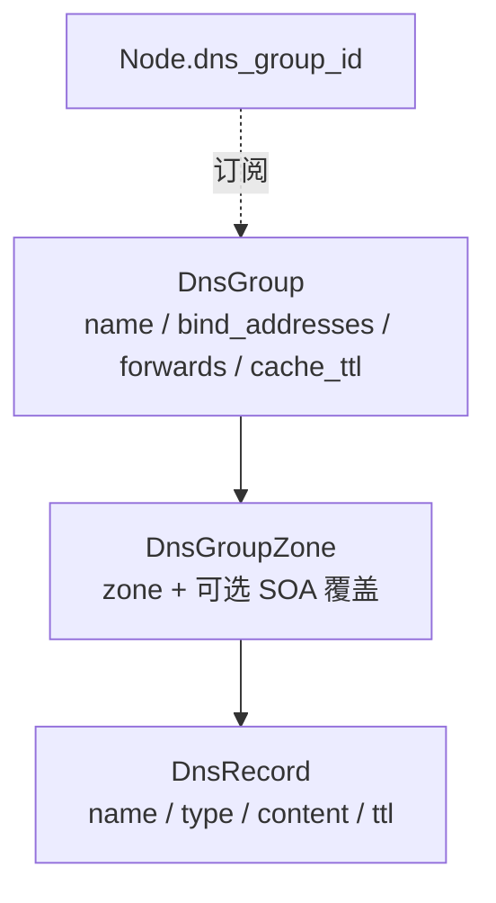

# DNS 与任播

本文讲怎么用共享 DNS 组提供权威 DNS，以及多节点订阅同组如何构成 anycast。模型从节点级 `dns_zones` 演进为**共享 `dns_groups`**——节点经 `Node.dns_group_id` 订阅一个组。表结构见 [../reference/database.md](../reference/database.md#共享-dns)，schema 见 [../reference/desired-state.md](../reference/desired-state.md)。

> 所有 `/api/v1/admin/*` 调用需携带 admin token，示例省略。

## 三层模型



| 层 | 字段要点 |
| --- | --- |
| **DnsGroup** | `name`、`bind_addresses`（任播服务地址，**任播单一真源**）、`forwards`（上游转发）、`cache_ttl_seconds`、`enabled` |
| **DnsGroupZone** | `zone`（声明权威 zone，自动 SOA）、可选 SOA 覆盖（primary_ns / admin_email / refresh…）、`default_ttl` |
| **DnsRecord** | 扁平模型 `name` / `type` / `content` / `ttl`（A/AAAA/CNAME/NS/PTR/TXT/MX/SRV/CAA）；`comment` 仅 UI 不进 zone 文件 |

## 启用 DNS（订阅组）

1. 建组、加 zone、加 record：

   ```bash
   curl -s -X POST "http://127.0.0.1:8000/api/v1/admin/dns-groups" \
     -H "Content-Type: application/json" \
     -d '{"name":"ng-anycast","bind_addresses":["172.20.0.57","fdce:1111:2222:56::53"]}'

   curl -s -X POST "http://127.0.0.1:8000/api/v1/admin/dns-groups/1/zones" \
     -H "Content-Type: application/json" -d '{"zone":"example.dn42"}'

   curl -s -X POST "http://127.0.0.1:8000/api/v1/admin/dns-groups/1/zones/1/records" \
     -H "Content-Type: application/json" \
     -d '{"name":"ns1","type":"A","content":"172.20.0.57"}'
   ```

2. 让节点订阅该组（分配即启用）：

   ```bash
   curl -s -X PUT "http://127.0.0.1:8000/api/v1/admin/nodes/edge1/dns-group" \
     -H "Content-Type: application/json" -d '{"dns_group_id":1}'
   ```

订阅后 materialize 会把组的 zone/record 合进该节点 `DesiredState.dns`，agent 渲染 CoreDNS（`coredns/Corefile` + `zones/db.<zone>`）并注入 `dns` 容器（与 router-netns 共享网络）。接口见 [../reference/api.md](../reference/api.md#dns-组)，Web 操作见 [web-ui.md](web-ui.md)。

## 任播（anycast）

**多个节点订阅同一个组 = anycast**：它们宣告相同的 `bind_addresses`，客户端就近命中。

任播地址由 `bind_addresses` **单一真源派生**（`_normalize_dns_anycast`）：

- 派生出受管 `dns-anycast` dummy 接口，把 bind 地址挂为 `/32`（v4）/ `/128`（v6）。
- 该接口 `track_service=true`，BIRD 起源对应任播前缀进 BGP。
- 这是全项目最干净的"副本→派生"范例，见 [../reference/addressing-model.md](../reference/addressing-model.md#第-4-层任播服务地址--影响半径跨节点共享--注册表)。

> 历史上任播地址曾各存一份在每节点 `dn42-lo`，已用 `deploy/dns_anycast_lo_cleanup.py` 迁到共享 `dns-anycast` dummy 并剥重复（见 [../reference/cli-and-scripts.md](../reference/cli-and-scripts.md)）。

任播服务地址应落在专门的任播分区（如 `172.20.0.56/29` + `:56::/64`），与节点单播 loopback 不重叠，见 [addressing-and-renumber.md](addressing-and-renumber.md)。

## rDNS（反向解析）

反向 zone 同样建为组内 zone（如 `0/26.0.20.172.in-addr.arpa`），PTR 用 `DnsRecord` 加。批量创建 `/26` 反向可用 `scripts/tools/create_rdns_26.py`（见 [../reference/cli-and-scripts.md](../reference/cli-and-scripts.md)）。renumber 后必须同步 PTR，见 [addressing-and-renumber.md](addressing-and-renumber.md)。

## 验证

```bash
dig @172.20.0.57 example.dn42 SOA
dig @172.20.0.57 ns1.example.dn42 A
docker exec dn42-edge1-dn42-bird-router-1 birdc show route where net ~ [ 172.20.0.57/32 ]
```

CoreDNS 变更后若旧节点未带 `reload`，大 zone 变动可能需重启 `dns` 容器。
