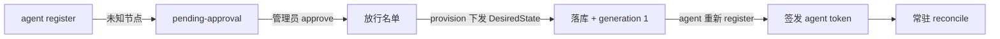

# 节点接入

本文讲怎么把一个节点接进 fleet：四种接入方式、注册审批闸门、token 生命周期、节点退役。安全模型见 [../internals/security.md](../internals/security.md)，接口细节见 [../reference/api.md](../reference/api.md)。

> 所有 `/api/v1/admin/*` 调用需携带 `-H "Authorization: Bearer <DN42_CONTROL_ADMIN_TOKEN>"`，示例省略。

## 接入方式总览

| 方式 | 适用 | 入口 |
| --- | --- | --- |
| 存量配置导入 | 已有传统方式配好的节点（bird/wireguard 文件） | `scripts/tools/import_node_config.py` |
| 整节点 provision | 已有完整 `DesiredState` JSON | `POST /api/v1/admin/provision` |
| 逐资源 CRUD | 从零精细搭建 | `POST /admin/nodes` + peerings/interfaces/… |
| demo seed | 本地开发练手 | `DN42_CONTROL_SEED_BOOTSTRAP_NODE=1` |

## 完整接入流程（新机器）

控制面不认识的新机器第一次注册不会被直接放行，而是进入待审批队列（安全闸门，见 [../internals/security.md](../internals/security.md#注册审批闸门)）：



1. **agent 注册**：新机器 agent 调 `/agent/register`（带 enrollment token）→ 控制面记入待审批，返回 `pending-approval`。
2. **管理员审批**：

   ```bash
   curl -s "http://127.0.0.1:8000/api/v1/admin/registrations?status=pending"
   curl -s -X POST "http://127.0.0.1:8000/api/v1/admin/registrations/3/approve" \
     -H "Content-Type: application/json" -d '{"note": "确认是我的机器"}'
   ```

3. **批准 ≠ 直接能用**：还需下发配置（下面任一接入方式）。
4. **下发后**：该节点 agent 下次注册即返回 `accepted` 并拿 token，开始正常工作。

## 存量节点导入

把一台已有节点的配置文件一次性"读"进控制面（走 HTTP，不直接碰数据库）：

```bash
python scripts/tools/import_node_config.py <配置目录> \
  --node-id edge1 \
  --controller-url http://127.0.0.1:8000 \
  --agent-token my-secret-token
```

| 参数 | 含义 |
| --- | --- |
| `<配置目录>` | 现有 bird / wireguard 配置文件所在文件夹 |
| `--node-id` | 给这台机器起的唯一名字 |
| `--controller-url` | 控制面地址；填了就走 `POST /admin/provision` |
| `--agent-token` | 给该节点配的固定 token |
| `--wg-port-range` | WireGuard 监听端口范围（默认 `51800-51899`），入站 peer 必须落在范围内 |
| `--dry-run` | 只解析、打印，不写入 |

先 `--dry-run` 检查解析出的 `DesiredState`，再正式导入。

## 整节点 provision

已有完整 `DesiredState` JSON 时，直接灌入：

```bash
curl -s -X POST "http://127.0.0.1:8000/api/v1/admin/provision" \
  -H "Content-Type: application/json" \
  -d @edge1-desired-state.json
```

provision 是幂等的（整节点落库 + materialize），被 seed、导入脚本、本接口共用。响应含 generation 与下发情况。字段见 [../reference/api.md](../reference/api.md#provision)。

## 逐资源 CRUD

从零精细搭建：先 `POST /admin/nodes` 建节点，再逐个加 peering / 接口 / BGP 会话 / DNS 组订阅。每次写入都触发 materialize 与门铃。用 Web UI 的「一键互联」向导最省事，见 [peering.md](peering.md) 与 [web-ui.md](web-ui.md)。

## Token 生命周期

token 安全模型见 [../internals/security.md](../internals/security.md#token-哈希模型)，接口见 [../reference/api.md](../reference/api.md#token)。常用操作：

```bash
# 签发（可设 7 天过期）；响应里的 secret 只出现这一次
curl -s -X POST "http://127.0.0.1:8000/api/v1/admin/nodes/edge1/agent-tokens" \
  -H "Content-Type: application/json" -d '{"ttl_seconds": 604800}'

# 查元信息（无 secret）
curl -s "http://127.0.0.1:8000/api/v1/admin/nodes/edge1/agent-tokens"

# 轮换 / 撤销
curl -s -X POST "http://127.0.0.1:8000/api/v1/admin/agent-tokens/<token_id>/rotate"
curl -s -X DELETE "http://127.0.0.1:8000/api/v1/admin/agent-tokens/<token_id>"
```

轮换后把新 secret 更新到节点 `identity.json`（或删除 identity 让 agent 重新注册，401 自愈也会触发重注册）。

**Enrollment token** 是另一种凭证（一次性注册用，可绑定节点）：`GET/POST/DELETE /admin/enrollment-tokens`，见 [../reference/api.md](../reference/api.md#enrollment-token)。

## 节点退役

直接 `DELETE` 一个**已发布过、仍在运行**的节点会留孤儿（容器、隧道、BGP 会话还在宣告路由，但控制面已不认识）。因此退役分两步：

1. **先退役收敛**：

   ```bash
   curl -s -X POST "http://127.0.0.1:8000/api/v1/admin/nodes/edge1/decommission"
   ```

   控制面标记 `decommissioned` 并下发**空对端** `DesiredState`（`interfaces=[]` / `bgp_sessions=[]` / `dns=null`）。agent 下一轮 reconcile 拆除所有隧道、撤掉所有 BGP 会话——**节点停止宣告任何路由**。核心容器（router-netns / wg-gateway / bird-router）保留惰性空转（schema 强制这三个角色必须在）。子表配置保留，可 `recommission` 撤销恢复。

2. **确认收敛后再删**：通过 `/admin/nodes/{id}/health` 确认 agent 已应用退役态，再：

   ```bash
   curl -s -X DELETE "http://127.0.0.1:8000/api/v1/admin/nodes/edge1"
   ```

   未退役的 active 节点直接 DELETE 会被拒（409），提示先 decommission。从未发布过（`current_generation == 0`）的节点没有部署，可直接删除。

> 物理下线：节点停止宣告路由后，惰性核心容器随宿主机一并下线即可（停 agent、`docker rm`），不影响 fleet。

节点不健康 / 缺路由的排错见 [monitoring-and-troubleshooting.md](monitoring-and-troubleshooting.md)。
