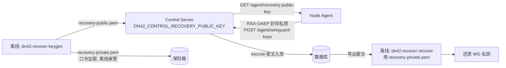

# 密钥托管与恢复

本文讲 WireGuard 私钥的托管（escrow）模型，以及节点丢失时怎么用离线工具恢复私钥。安全设计见 [../internals/security.md](../internals/security.md#私钥处理wireguard-escrow)，工具参数见 [../reference/cli-and-scripts.md](../reference/cli-and-scripts.md#离线恢复工具-toolsdn42-recover)。

## 为什么需要 escrow

节点 WireGuard 私钥**在节点本地生成、永不上传明文**——这很安全，但也意味着节点磁盘损坏 = 私钥永久丢失，对端 peer 全部要重配。escrow 在"不暴露私钥给控制面"和"灾难可恢复"之间取平衡：私钥用一把**离线恢复公钥**加密后才上报，密文存控制面；只有持有离线恢复**私钥**的人（不在控制面、不在节点）才能解开。



## 一、离线生成恢复密钥对（只做一次）

在一台**离线、可信**的机器上（**不是**控制面，**不是**节点）：

```bash
python tools/dn42-recover/dn42_recover.py keygen \
  --out-dir ./recovery-keys
# 产出：recovery-private.pem（口令加密，离线妥善保管）
#       recovery-public.pem（交给控制面）
```

- `recovery-private.pem` 用口令加密，**离线保管**（保险箱/密管），绝不上传任何服务器。
- `recovery-public.pem` 是公钥，给控制面用。

## 二、把恢复公钥配给控制面

```text
DN42_CONTROL_RECOVERY_PUBLIC_KEY=/etc/dn42-control/recovery-public.pem
# 或直接内联 PEM 文本
```

文件缺失会 fail-fast（见 [../reference/configuration.md](../reference/configuration.md)）。配好后控制面通过 `GET /api/v1/agent/recovery-public-key` 把公钥 + 指纹下发给 agent。

## 三、节点 escrow（agent 首轮自动完成）

agent 首轮处理 WireGuard 私钥时：

1. 本地生成私钥（0600，存状态目录，占位 `secret://`，永不入渲染产物）。
2. 拉取恢复公钥，用 **RSA-OAEP** 把私钥封存为密文。
3. `POST /api/v1/agent/wireguard-keys` 上报**公钥 + escrow 密文**。
4. 控制面校验公钥一致性（不符 409 中止 apply），把密文存库。

若控制面没配恢复公钥，agent 只上报公钥、不做 escrow（恢复能力关闭）。

## 四、灾难恢复

节点磁盘损坏、私钥丢失时：

1. 从控制面数据库导出该节点的 escrow 密文（base64 blob）。
2. 在离线机器上解封：

   ```bash
   python tools/dn42-recover/dn42_recover.py recover \
     --recovery-private ./recovery-keys/recovery-private.pem \
     --ciphertext <escrow-blob 或文件> \
     --expect-public <该节点已知 WG 公钥>   # 可选校验
   ```

3. 把还原出的私钥放回新节点的状态目录（`<state-dir>/nodes/<node_id>/secrets/wireguard/node.key`，0600），agent 即可复用原私钥——**对端 peer 无需重配**。

`--expect-public` 校验解出的私钥确实对应预期公钥，防止恢复错节点。

## 安全要点

- 恢复私钥**永不**出现在控制面或节点；只在离线 `dn42-recover` 里短暂使用。
- 控制面被攻陷也拿不到 WG 私钥明文（库里只有 RSA-OAEP 密文）。
- `dn42_recover.py` 只依赖 `dn42_common.crypto`，与控制面/agent 代码路径隔离。
