# Web 管理界面

面向**用浏览器操作控制面**的运维人员。Web UI 是独立的静态 SvelteKit 应用（`apps/web`），不含服务端逻辑——它把 admin token 存浏览器 localStorage，直接以 `Authorization: Bearer` 调 Admin API。**一份静态构建可指向任意 fleet**，登录页填不同控制面地址即可。托管见 [deployment.md](deployment.md#web-ui-托管)。

> 接口字段只在 [../reference/api.md](../reference/api.md) 维护；本文只讲"界面上怎么点"。

## 启动与访问

```bash
cd apps/web
npm install        # 首次
npm run dev        # 开发模式，默认 http://127.0.0.1:5173
# 或构建静态站托管：
npm run build      # 产物在 apps/web/build/（adapter-static）
```

控制面需开启 CORS 允许该来源（`DN42_CONTROL_CORS_ORIGINS`，见 [../reference/configuration.md](../reference/configuration.md)）。

## 登录

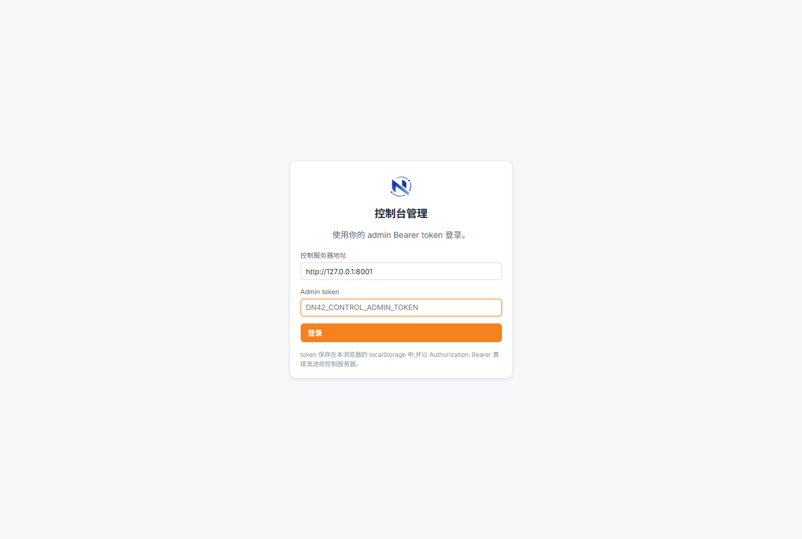

填**控制面地址**（如 `http://127.0.0.1:8000`）与 **admin token**。token 仅存浏览器本地、直发控制面。401 即 token 失效，自动登出。右下角可切换**语言（中/英）**和**主题**。

## 仪表盘

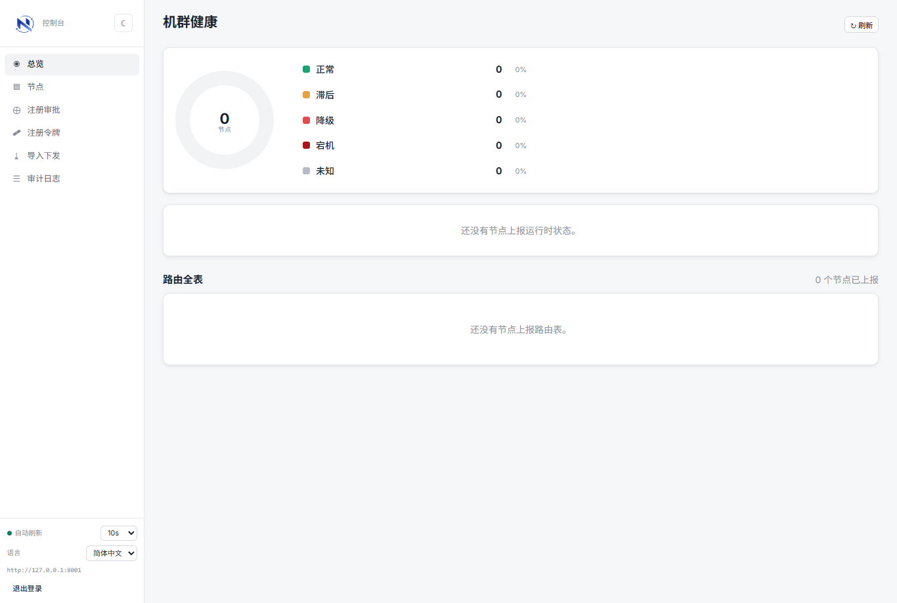

fleet 级健康与路由概览：节点在线/掉线、各节点世代、路由规模。卡片可下钻到节点。健康判定见 [monitoring-and-troubleshooting.md](monitoring-and-troubleshooting.md)。

## 节点列表

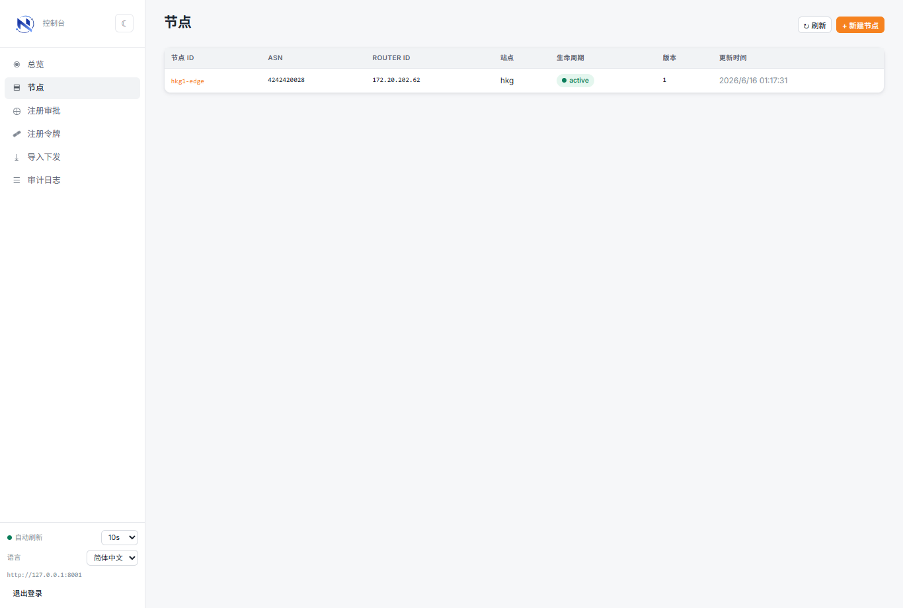

所有节点一览（ASN、loopback、世代、生命周期、健康）。点节点进详情。

## 节点详情

顶部多页签：**概览 / Peering / 接口 / BGP 会话 / 内部互联 / 路由表 / DNS / 版本历史 / 状态事件 / 期望状态 / 令牌**。支持 `?tab=<id>` 深链。

### 概览

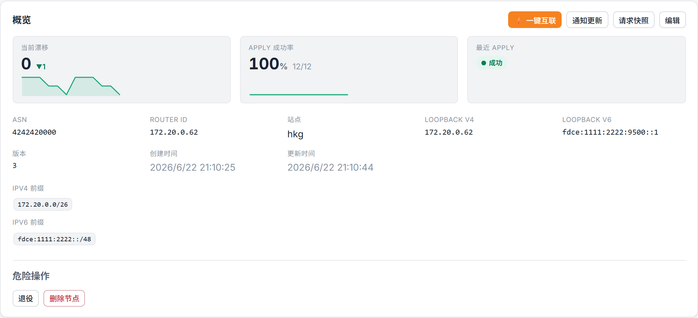

节点身份字段 + 危险操作（退役 / 删除，见 [node-onboarding.md](node-onboarding.md#节点退役)）。右上角：

- **⚡ 一键互联** —— 打开添加 peer 向导（见下），新增对等连接的**唯一入口**。
- **通知更新 / 请求快照** —— 手动给 agent 推事件（节点掉线时禁用）。
- **编辑** —— 改节点身份与 `base_template`（含 `bird.internal_topology`，见 [monitoring-and-troubleshooting.md](monitoring-and-troubleshooting.md#内部互联ibgp--ospf--internal_topology)）。

### Peering / 接口 / BGP 会话

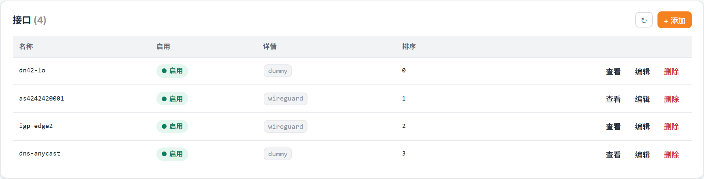

「接口」「BGP 会话」是通用 spec 资源页：列表 + 直接编辑 `spec`（JSON）。「Peering」页是对等关系元信息列表（编辑/删除），**新增走概览的「一键互联」向导**。

### 内部互联（iBGP / OSPF）

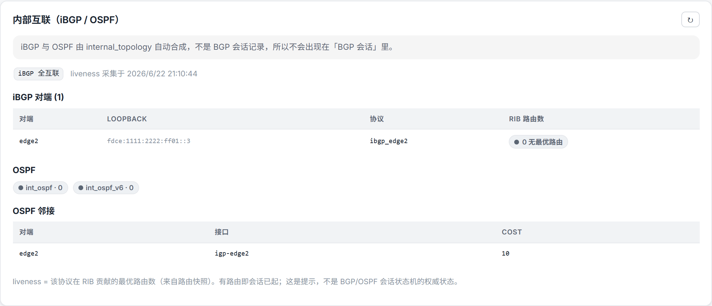

iBGP / OSPF 不是 BGP 会话记录，而由 `internal_topology` 自动合成，单独成页：展示 iBGP 对端、OSPF 协议与邻接，以及来自路由快照的 liveness。排错与不变量见 [monitoring-and-troubleshooting.md](monitoring-and-troubleshooting.md#内部互联ibgp--ospf--internal_topology)。

### 路由表 / DNS

「路由表」页是路由分析（摘要、RPKI、前缀/AS-path 分布、per-peer 过滤前视图、路由搜索）。「DNS」页分配 DNS 组（anycast 成员），见 [dns-and-anycast.md](dns-and-anycast.md)。

## 一键互联向导（添加 peer）

概览页点 **⚡ 一键互联**，四步把建立对等连接所需配置填好——**无需手写 JSON**。提交时 peering + WireGuard 接口 + **首条** BGP 会话走 `provision` 端点**同事务**建立，其余会话随后用返回的 `peering_id` 补建。

**① 基本** —— peer 名、对端 ASN、是否内部、标签/备注。

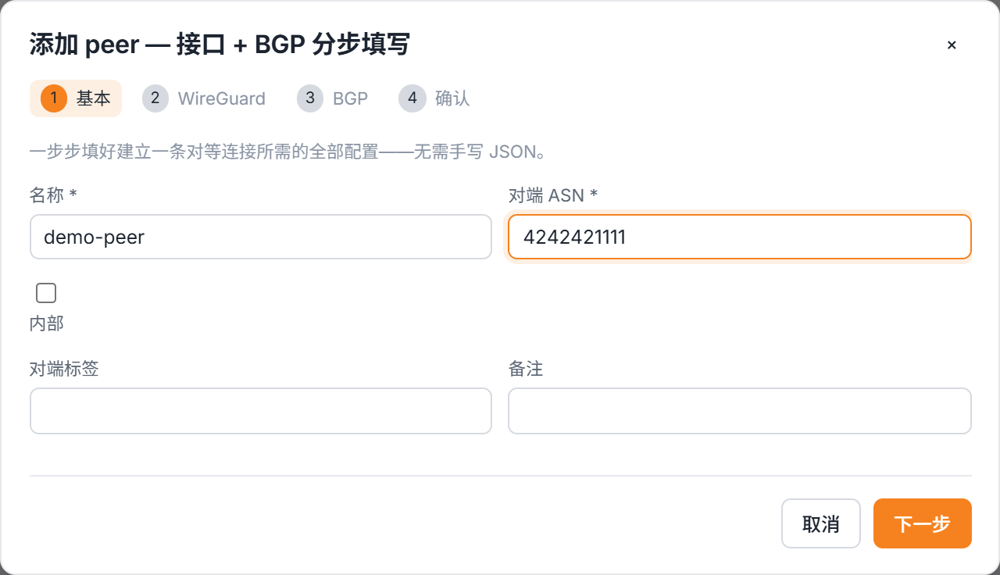

**② WireGuard** —— 接口名、监听端口、MTU、本端地址、私钥引用、对端公钥、endpoint、allowed_ips、keepalive、peer_routes。

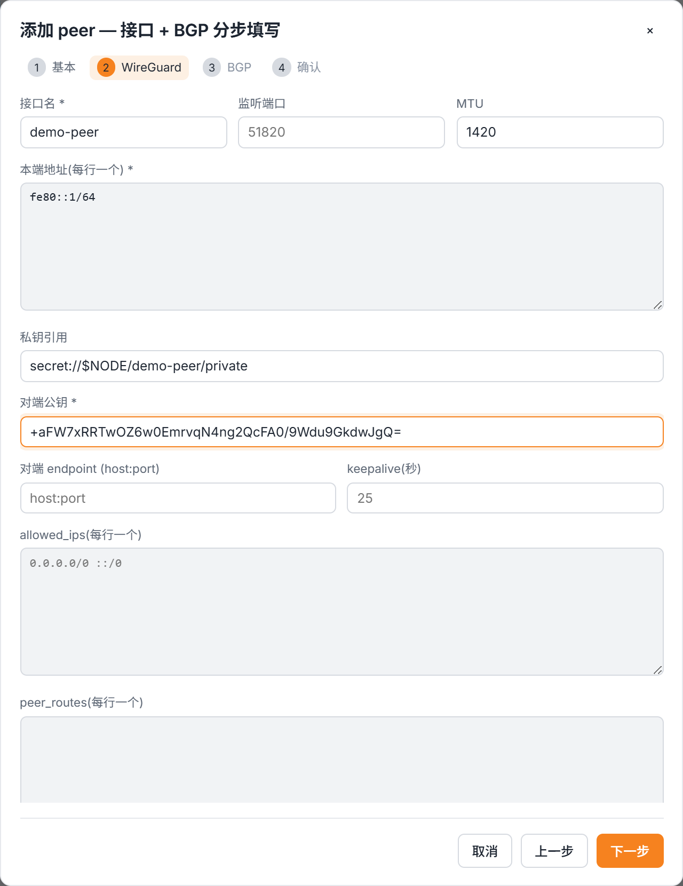

**③ BGP** —— 加 0..N 条会话；预设 **+ IPv4 / + IPv6 链路本地 / + MP-BGP** 各带默认。纯传输 peer 可不加。

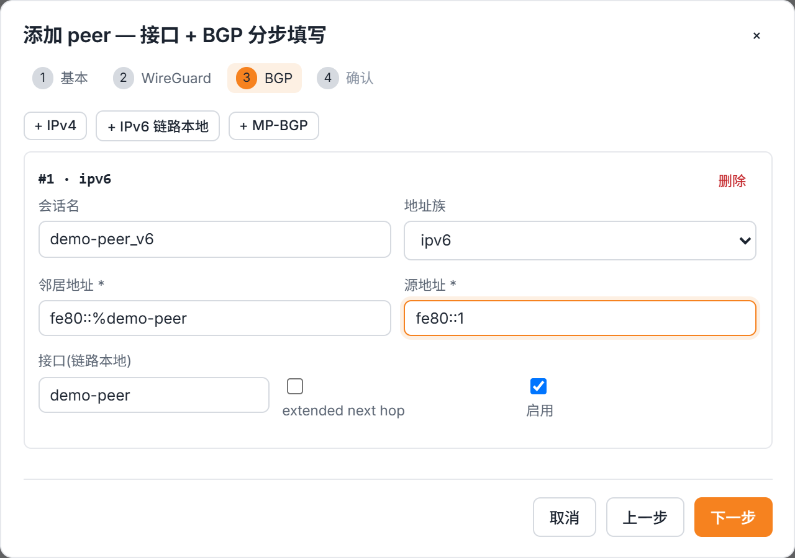

**④ 确认** —— 摘要 + 只读预览，点「创建对等连接」。

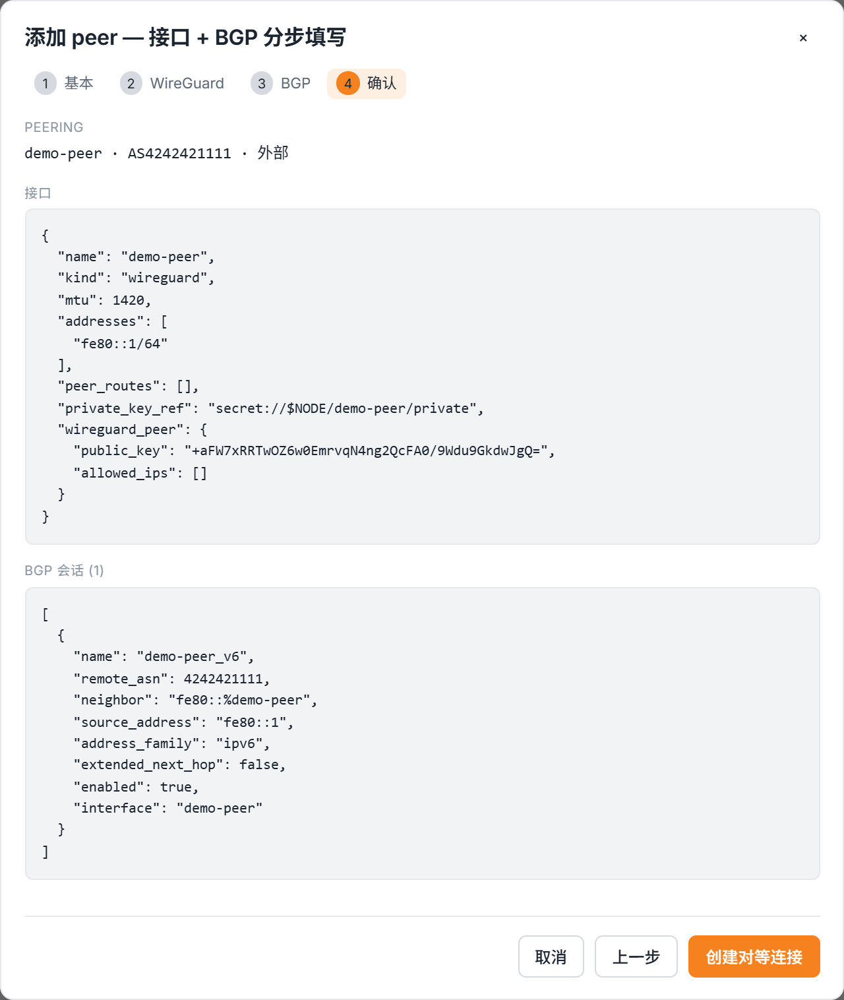

完整 peering 概念见 [peering.md](peering.md)。

## 注册审批

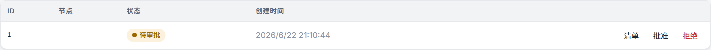

新节点 agent 用 enrollment token 注册后落到「待审批」，在此**批准/拒绝**（per-node 准入闸门，见 [../internals/security.md](../internals/security.md#注册审批闸门)）。

## 注册令牌（enrollment token）

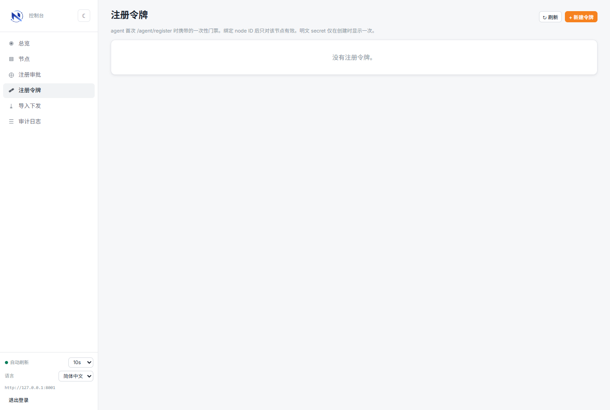

签发 / 吊销 enrollment token，token 明文只在创建时显示一次。

## 导入下发（provision）

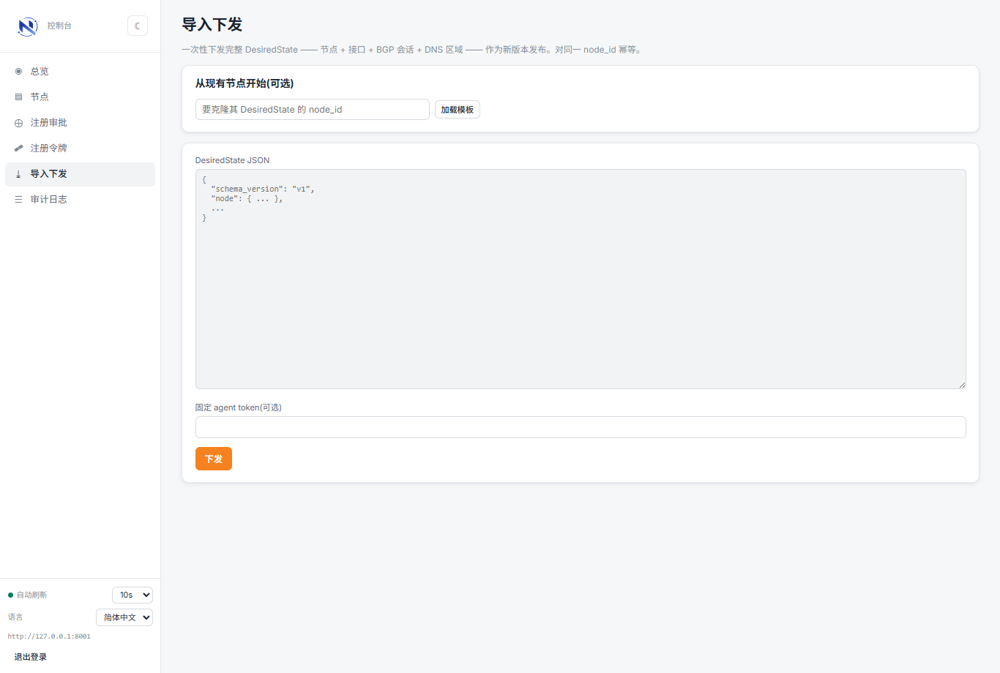

贴一份完整 `DesiredState` JSON 一次性建/覆盖整节点（幂等）。字段见 [../reference/desired-state.md](../reference/desired-state.md)。

## 审计日志

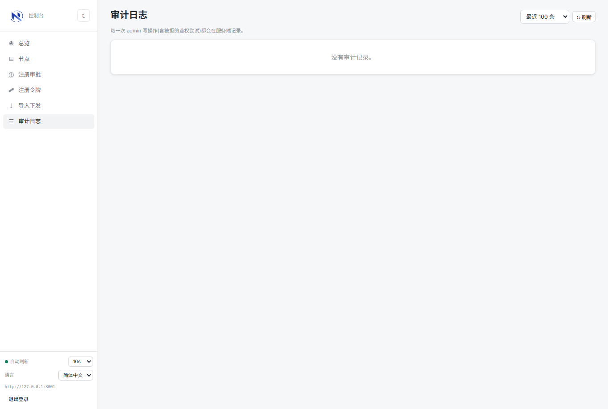

admin 写操作的审计流水（谁、何时、改了什么）。

## 截图怎么再生成

截图由 `apps/web/scripts/doc-shots.mjs`（playwright-core + msedge headless）生成，输出到 `docs/images/`。需本地起 seeded 控制面 + vite 再跑脚本：

```bash
# 终端 1：seeded 控制面
export DN42_CONTROL_ADMIN_TOKEN=dev-admin-token
export DN42_CONTROL_SEED_BOOTSTRAP_NODE=1
export DN42_CONTROL_CORS_ORIGINS=*
export DN42_CONTROL_DATABASE_URL=sqlite+aiosqlite:///./docshots.db
.venv/bin/python -m uvicorn app.main:app --app-dir apps/control-server --host 127.0.0.1 --port 8001
# 终端 2：web
cd apps/web; npm run dev -- --host 127.0.0.1 --port 5174 --strictPort
# 终端 3：截图（端口要与脚本顶部 BASE/API 一致）
cd apps/web; node scripts/doc-shots.mjs
```
