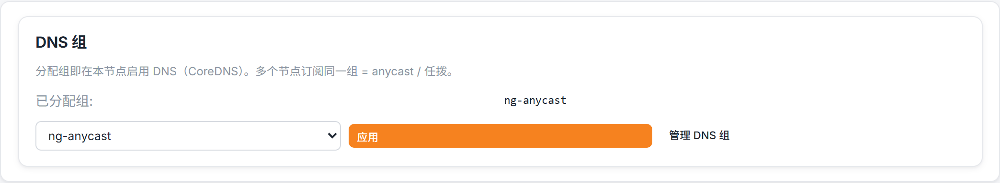
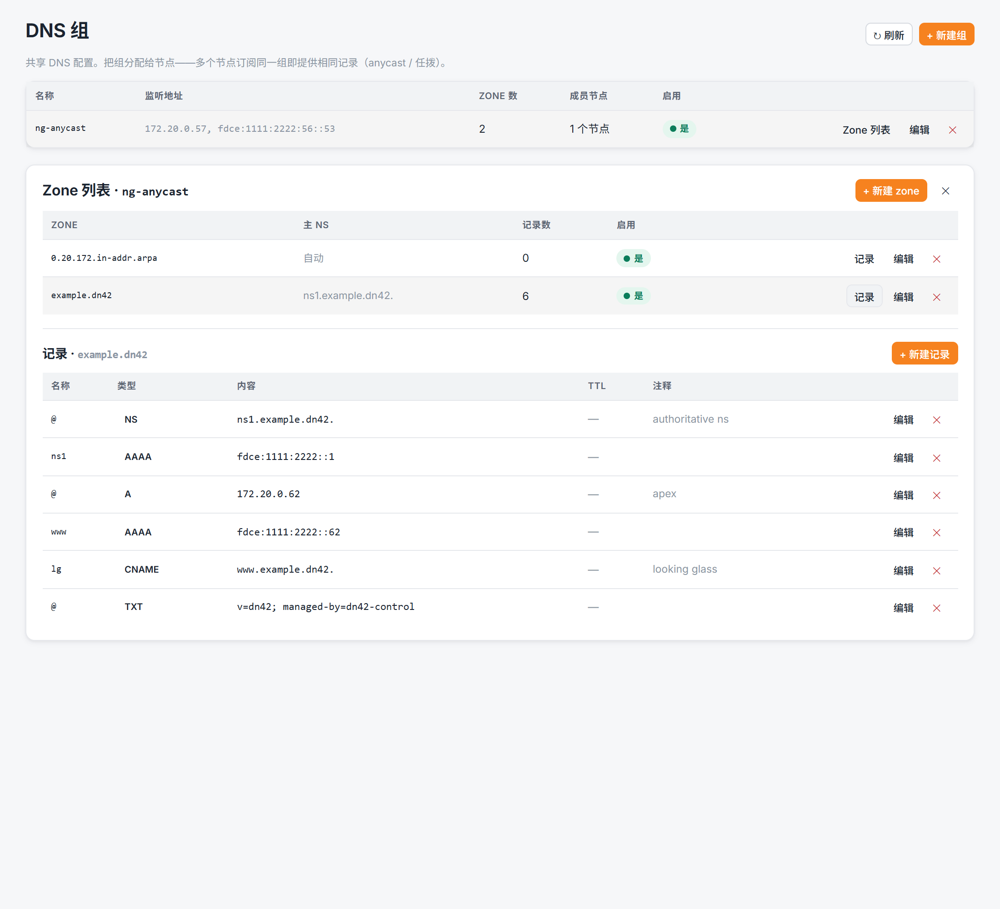

# Web 管理界面

面向**用浏览器操作控制面**的运维人员。Web UI 是独立的静态 SvelteKit 应用（`apps/web`），不含服务端逻辑——它把 admin token 存浏览器 localStorage，直接以 `Authorization: Bearer` 调 Admin API。**一份静态构建可指向任意 fleet**，登录页填不同控制面地址即可。托管见 [deployment.md](deployment.md#web-ui-托管)。

> 接口字段只在 [../reference/api.md](../reference/api.md) 维护；本文只讲"界面上怎么点"。

## 启动与访问

```bash
cd apps/web
npm install        # 首次
npm run dev        # 开发模式，默认 http://127.0.0.1:5173
# 或构建静态站托管：
npm run build      # 产物在 apps/web/build/（adapter-static）
```

控制面需开启 CORS 允许该来源（`DN42_CONTROL_CORS_ORIGINS`，见 [../reference/configuration.md](../reference/configuration.md)）。

## 登录


填**控制面地址**（如 `http://127.0.0.1:8000`）与 **admin token**。token 仅存浏览器本地、直发控制面。401 即 token 失效，自动登出。右下角可切换**语言（中/英）**和**主题**。

## 仪表盘


页首 hero 是**机群拓扑世界地图**：节点按物理站点落在等距投影地图上，以真实内部 WG 链路（OSPF 邻接）用大圆弧相连；右上 KPI 显示「正常 / 总数」，可按 **华南 / 华东 / 东亚 / 全球** 切换视图——所选区域同时**筛选下方节点表**。健康判定见 [monitoring-and-troubleshooting.md](monitoring-and-troubleshooting.md)。

下方节点表每行是一个节点：健康、**能力图标**（DNS / RPKI / BIRD / WireGuard，悬浮看全称）、世代对（期望/已观测）、上报/应用状态、漂移与最近快照时间，可下钻到节点。

紧随其后是 **机群路由全表**：全 fleet 路由总量与 IPv4/IPv6、RPKI 有效率的统计条 + 半环仪表，外加按节点拆分的明细。


页面末尾是 **流量趋势** 卡片（示例数据）：仿 Cloudflare Radar 流量趋势的多序列折线——总流量 / HTTP 流量两条实线 + 「之前 7 天」虚线对比，Y 轴从 0 起，悬浮看每点读数。

## 节点列表


所有节点一览（ASN、loopback、世代、生命周期、健康）。点节点进详情。

## 节点详情

顶部是**两级页签**——5 个顶层分组，每组下挂相关子页，子页以药丸式二级导航呈现：

- **概览**（无子页）
- **互联**：Peering · 接口 · BGP 会话 · 内部互联
- **路由**：路由表 · 路由调优
- **DNS**（无子页）
- **运维**：版本历史 · 状态事件 · 期望状态 · 令牌

支持 `?tab=<id>` 深链（直接落到对应子页并展开其分组）。

### 概览


顶部是从上报历史派生的**趋势小卡**（当前漂移 + 走势、apply 成功率、最近一次 apply 状态）与 **agent 自观测**（CPU / 内存 / 采集耗时等，加载时以骨架屏占位），下面是节点身份字段。页内操作归整成两块清晰分区：

- **常用操作** —— **⚡ 一键互联**（打开添加 peer 向导，见下，新增对等连接的**唯一入口**）、**通知更新 / 请求快照**（手动给 agent 推事件，节点掉线时禁用）、**编辑**（改节点身份与 `base_template`，含 `bird.internal_topology`，见 [monitoring-and-troubleshooting.md](monitoring-and-troubleshooting.md#内部互联ibgp--ospf--internal_topology)）。
- **危险操作** —— 退役 / 删除（见 [node-onboarding.md](node-onboarding.md#节点退役)）。

### Peering / 接口 / BGP 会话


「接口」「BGP 会话」是通用 spec 资源页：列表 + 直接编辑 `spec`（JSON）。「Peering」页是对等关系元信息列表（编辑/删除），**新增走概览的「一键互联」向导**。

### 内部互联（iBGP / OSPF）


iBGP / OSPF 不是 BGP 会话记录，而由 `internal_topology` 自动合成，单独成页：展示 iBGP 对端、OSPF 协议与邻接，以及来自路由快照的 liveness。排错与不变量见 [monitoring-and-troubleshooting.md](monitoring-and-troubleshooting.md#内部互联ibgp--ospf--internal_topology)。

### 路由表


对该节点 BIRD 全表的分析视图：路由总量与 IPv4/IPv6、本地起源计数；**族分布 / RPKI 有效率 / 过滤前被拒**三枚甜甜圈（上图）；前缀长度与 AS-path 长度分布、**Radar 风格的路由表规模趋势图**（Y 轴紧贴数据缩放、悬浮读数）与 churn；过滤前（import-table）per-peer 统计 + 无效 / 被拒路由明细；以及可按族 / 范围 / 关键字筛选、点开看每条路径（AS-path + community）的前缀表。数据来自 agent 周期上报的路由快照，独立于对账。

### DNS



给节点分配 / 取消 **DNS 组**：分配即在本节点启用 CoreDNS，多个节点订阅同一组就是 anycast / 任播。组本身（zone、记录、bind 地址）在「DNS 组」页维护，见下与 [dns-and-anycast.md](dns-and-anycast.md)。

## 一键互联向导（添加 peer）

概览页点 **⚡ 一键互联**，四步把建立对等连接所需配置填好——**无需手写 JSON**。提交时 peering + WireGuard 接口 + **首条** BGP 会话走 `provision` 端点**同事务**建立，其余会话随后用返回的 `peering_id` 补建。

**① 基本** —— peer 名、对端 ASN、是否内部、标签/备注。


**② WireGuard** —— 接口名、监听端口、MTU、本端地址、私钥引用、对端公钥、endpoint、allowed_ips、keepalive、peer_routes。


**③ BGP** —— 加 0..N 条会话；预设 **+ IPv4 / + IPv6 链路本地 / + MP-BGP** 各带默认。纯传输 peer 可不加。


**④ 确认** —— 摘要 + 只读预览，点「创建对等连接」。


完整 peering 概念见 [peering.md](peering.md)。

## 注册审批


新节点 agent 用 enrollment token 注册后落到「待审批」，在此**批准/拒绝**（per-node 准入闸门，见 [../internals/security.md](../internals/security.md#注册审批闸门)）。

## 注册令牌（enrollment token）


签发 / 吊销 enrollment token，token 明文只在创建时显示一次。

## 导入下发（provision）


贴一份完整 `DesiredState` JSON 一次性建/覆盖整节点（幂等）。字段见 [../reference/desired-state.md](../reference/desired-state.md)。

## DNS 组（共享 / anycast）



集中维护**共享 DNS 配置**：一个组带 bind 地址（任播服务地址）+ 缓存 TTL + 转发，组下声明权威 **zone**（可覆盖 SOA，留空自动派生），zone 下是扁平**记录**（name / type / content / TTL / 注释，含 PTR 反向助手）。把组分配给节点即在该节点起 CoreDNS；多个节点订阅同一组就是 anycast。点组的「Zone 列表」展开它的 zone，再点 zone 的「记录」展开记录面板。概念与任播地址派生见 [dns-and-anycast.md](dns-and-anycast.md)。

## 审计日志


admin 写操作的审计流水（谁、何时、改了什么）。

## 截图怎么再生成

本页配图都**聚焦到所介绍的组件**（卡片 / 面板 / 对话框），不截整窗、不含侧栏，由 `apps/web/scripts/doc-shots.mjs`（playwright-core + msedge headless，2× 高清）生成，按 CSS 选择器对单个元素截图，输出到 `docs/images/`。

路由 / 趋势 / 机群路由 / DNS 等新功能页依赖 agent 上报的观测，光起控制面是空态，所以**先用 `apps/web/scripts/seed_docshots.py` 注入演示数据**（它 provision 出 `edge1`、喂入多轮对账 / apply、路由快照、DNS 组 + zone + 记录、enrollment token 与一条待审批注册）。生产 `lifespan` 不再自动播种，故这一步必需。

需三个终端（端口 / 令牌须与 `doc-shots.mjs` 顶部一致）：

```bash
# 终端 1：控制面（空库即可，演示数据由 seeder 注入）
export DN42_CONTROL_ADMIN_TOKEN=dev-admin-token
export DN42_CONTROL_CORS_ORIGINS=*
export DN42_CONTROL_DATABASE_URL=sqlite+aiosqlite:///./docshots.db
.venv/bin/python -m uvicorn app.main:app --app-dir apps/control-server --host 127.0.0.1 --port 8001

# 终端 2：注入演示数据 + 起 web
DN42_DOCSHOTS_API=http://127.0.0.1:8001 DN42_CONTROL_ADMIN_TOKEN=dev-admin-token \
  python apps/web/scripts/seed_docshots.py
cd apps/web; npm run dev -- --host 127.0.0.1 --port 5174 --strictPort

# 终端 3：截图
cd apps/web; node scripts/doc-shots.mjs
```

> Windows 下控制面 / seeder 改用 `.venv/Scripts/python.exe`。
