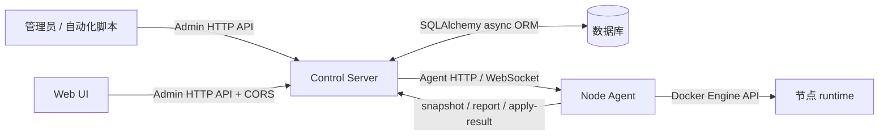
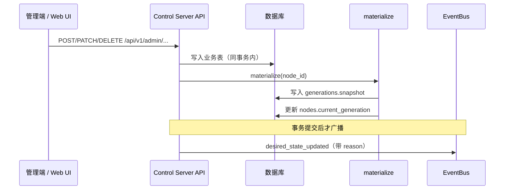
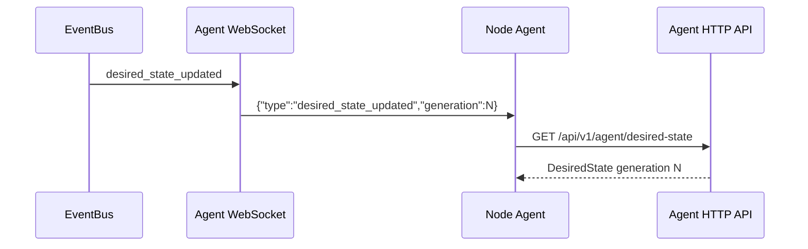
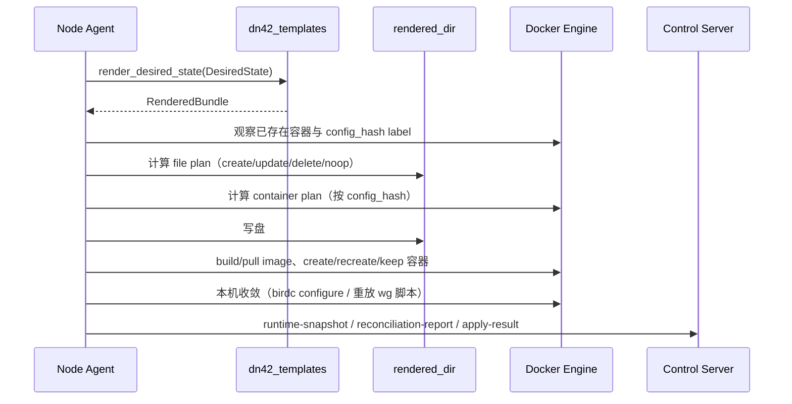
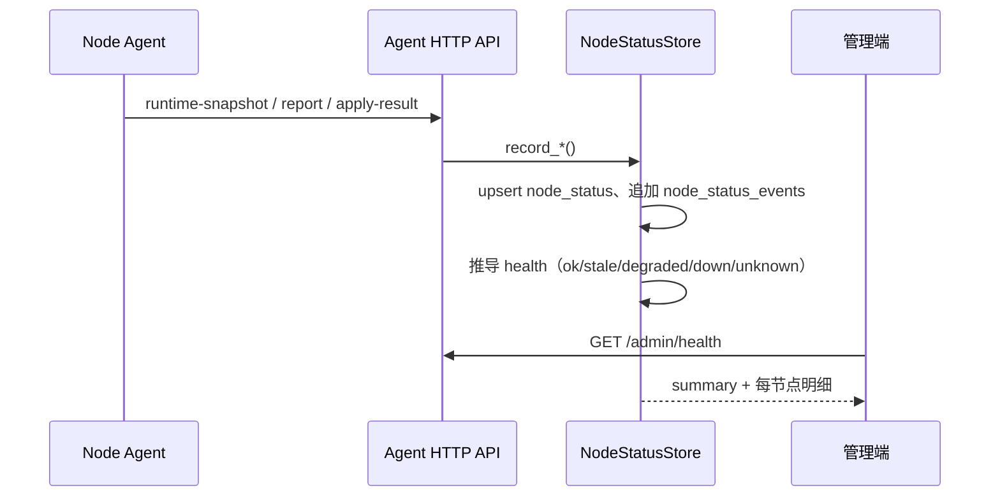
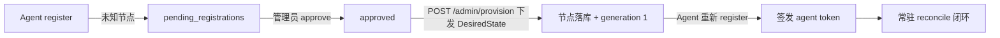
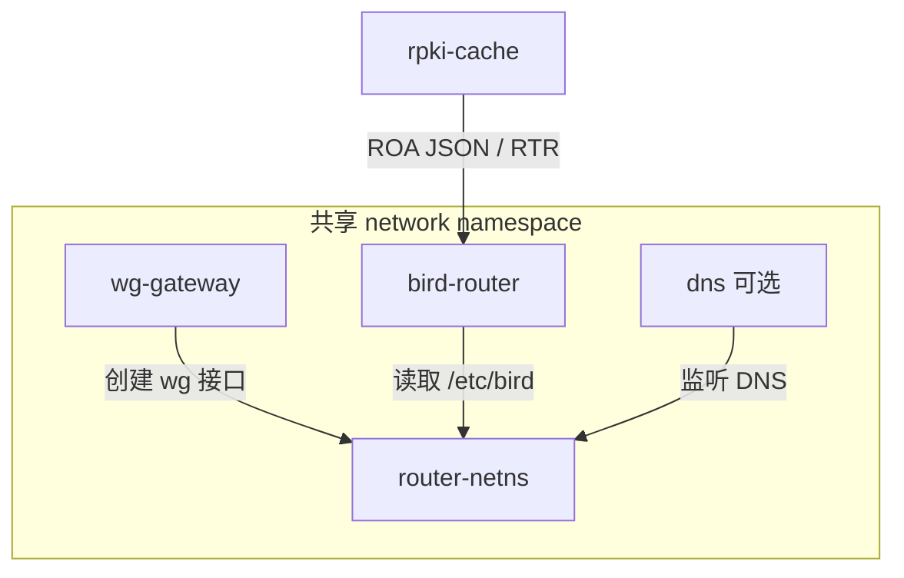

# 架构

本文说明系统如何把控制平面的数据库记录变成节点上的 Docker、WireGuard、BIRD、RPKI 和 DNS runtime，以及节点状态如何回流到控制面。读完你会理解"组件—边界—数据流—变更闭环"的全貌。各组件内部细节见 [control-server.md](control-server.md)、[node-agent.md](node-agent.md)、[shared-packages.md](shared-packages.md)。

## 组件职责

| 组件 | 位置 | 职责 |
| --- | --- | --- |
| Control Server | `apps/control-server` | HTTP / WebSocket API、数据库记录、token、`DesiredState` generation、事件通知、注册审批、健康与路由视图 |
| Node Agent | `apps/node-agent` | 节点常驻守护进程：拉取 `DesiredState`、渲染配置、规划执行本机变更、上报结果 |
| Web UI | `apps/web` | SvelteKit 单页管理界面，独立托管，经 CORS + Bearer 直连 Admin API |
| Database | 外部服务或本地 SQLite | 节点、接口、BGP、DNS、token、generation 快照、节点状态、路由 |
| `dn42_schemas` | `packages/dn42_schemas` | 跨组件传输的数据结构 |
| `dn42_templates` | `packages/dn42_templates` | 把 `DesiredState` 渲染为配置文件和脚本 |
| `dn42_runtime` | `packages/dn42_runtime` | 渲染文件类型、写盘计划、router Dockerfile 渲染 |
| `dn42_common` | `packages/dn42_common` | 公共校验、命名、label、community、crypto 工具 |

## 系统边界

Control Server 内部包含 API 路由、`TokenStore`、`EnrollmentTokenStore`、`DesiredStateStore`、`NodeStatusStore`、`RoutingStore`、`PendingRegistrationStore`、`AuditLogStore`、`materialize()` / `provision_node_from_state()` 和 `EventBus`——这些不是外部服务。Node Agent 内部包含配置加载、身份缓存、controller client、渲染、planner、部署 backend、本机收敛、采集器和对账器——也不是外部服务。

## 数据流

### 一：管理端写入变更

业务表包括 `nodes`、`peerings`、`wg_interfaces`、`bgp_sessions`、`dns_groups` / `dns_group_zones` / `dns_records`、`agent_tokens`、`enrollment_tokens`。`generations` 保存已发布给 Agent 的完整状态快照。校验失败（schema 不过）返回 422，业务表写入随事务一起回滚。详见 [control-server.md](control-server.md#materialize)。

### 二：Agent 接收新状态

WebSocket 只传**事件门铃**，不传业务数据。Agent 收到门铃后通过 HTTP 拉取完整 `DesiredState`。

### 三：Agent 本地部署

Docker backend 先准备镜像、再删需重建的旧容器，避免构建失败时先破坏现有部署。容器**不用 docker-compose**，由 Agent 直接通过 Docker Engine API 创建；容器名固定 `<project>-<service>-1` 后缀。详见 [node-agent.md](node-agent.md)。

### 四：状态回流与健康视图

健康为**五态**，由上报状态 + 漂移计数 + generation 差推导，再叠加时间阈值覆盖（`stale_after` / `down_after`）。判定逻辑见 [control-server.md](control-server.md#健康推导五态)。

Agent 另有两条**旁路任务**独立于 reconcile 闭环：周期采集路由表（直连 BIRD 控制 socket，`POST /agent/routing-table`）、周期重解析 WireGuard endpoint 域名（自愈对端动态 IP 漂移，`POST /agent/wireguard-reresolve`）。见 [node-agent.md](node-agent.md#旁路任务)。

### 新节点接入生命周期

approve 只是放行名单；真正能工作取决于 provision 是否下发了 `DesiredState`。完整步骤见 [../guides/node-onboarding.md](../guides/node-onboarding.md)。

## 节点 runtime

| role | 作用 |
| --- | --- |
| `router-netns` | 提供共享 network namespace（其它服务 `network_mode` 共享它） |
| `wg-gateway` | 应用 WireGuard 配置、创建隧道接口 |
| `bird-router` | 运行 BIRD 2，承载 BGP、OSPF、静态路由和过滤策略 |
| `rpki-cache` | 为 BIRD 提供 DN42 RPKI/ROA 数据 |
| `dns` | 运行 CoreDNS（订阅 DNS 组时注入） |
| `debug-shell` | 可选调试容器 |

> **internal_topology 一致性不变量**：同一 AS 内多节点的 iBGP/OSPF 由 `DesiredState.bird.internal_topology` 合成（不是 `bgp_sessions`）。所有节点的 `routers`+`hosts` 必须是同一份完整集合，否则会隐蔽缺路由。设计、加节点 checklist 与 postmortem 见 [../guides/monitoring-and-troubleshooting.md](../guides/monitoring-and-troubleshooting.md)。

## 最小扰动设计

系统刻意采用**电平触发（level-based）+ 内容寻址**而不是"控制面推送 delta"（边沿触发）：事件丢失、乱序、agent 重启都不影响正确性，每轮 reconcile 都从最新全量状态推导出最小动作集。

| 层 | 机制 | 效果 |
| --- | --- | --- |
| 容器 | 身份 = `dn42.config_hash`（服务 spec + underlay + 构建参数的哈希） | generation 递增不重建任何容器；只有容器定义本身变化才重建 |
| 渲染产物 | 不携带 generation，跨代逐字节稳定 | 无实质变化时 file plan 全 noop |
| 配置文件 | file plan（SHA-256 对比）算出精确差异 | agent 本地就知道"到底变了什么" |
| 数据面 | 定向收敛：`birdc configure` 热重载、按接口 WireGuard 同步/拆除 | 加一个 peer 只拉起一条隧道，其余 BGP 会话零扰动 |
| 事件 | WS 门铃 + 防抖合并 + 兜底周期 | 突发批量变更合并为一次 reconcile |

控制面在事件里附带 `reason` 供日志排错，但 agent 的收敛判定完全基于本地观测对比——"该收敛什么"永远以事实为准。

## 并发与一致性

| 场景 | 保障 |
| --- | --- |
| 并发 admin 写同一节点 | `materialize` 对节点行加 `SELECT ... FOR UPDATE`，generation 严格单调；`UNIQUE(node_id, generation)` 兜底 |
| 事件先发、事务后回滚 | materialize 不发事件；路由层在事务提交后才广播 |
| WS 事件丢失 / 队列溢出 | agent 兜底周期 reconcile 拉平 |
| 突发批量变更 | agent 防抖窗口合并；每次 reconcile 拉取的都是最新全量状态，中间代次天然被跳过 |
| agent 重复 reconcile | 幂等：file plan 全 noop、容器 plan 全 keep、收敛零动作 |
| 同节点多 agent 实例 | 不支持，部署约定每节点单实例（systemd 模板单元天然如此） |

生产建议 PostgreSQL（真正的行级锁）；SQLite 适合开发与单管理员。

## 变更闭环

这条闭环保证系统不是"远程执行命令"，而是"发布期望状态、节点本地收敛、回报观察结果"。Control Server 不提供远程 shell 或任意命令执行接口（见 [security.md](security.md#禁止的控制模型)）。
