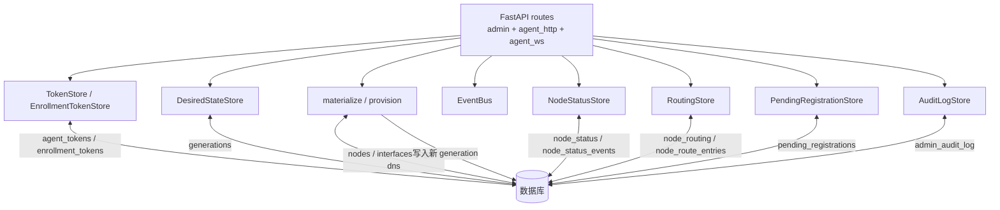

# Control Server 内部

本文讲 Control Server（`apps/control-server`）的内部结构：它怎么把数据库事实合成 `DesiredState`、怎么推导健康、怎么管 token 与注册、怎么通过 WebSocket 通知 Agent。API 清单见 [../reference/api.md](../reference/api.md)，表结构见 [../reference/database.md](../reference/database.md)。

## 内部结构

| 内部组件 | 职责 | 代码 |
| --- | --- | --- |
| `materialize()` | 读规范化表，合成完整 `DesiredState`，校验后写入新 generation | `app/services/materializer.py:33` |
| `provision_node_from_state()` | 接受完整 `DesiredState`，整节点幂等落库 + materialize | `app/db/provision.py` |
| `DesiredStateStore` | 按 `node_id` 读最新 generation；`bump()` 触发重新 materialize | `app/services/desired_state.py` |
| `TokenStore` | Agent Bearer token 签发、哈希存储、解析、过期校验、轮换、撤销 | `app/services/tokens.py` |
| `EnrollmentTokenStore` | 一次性 / 绑定节点的注册凭证 | `app/services/enrollment.py` |
| `NodeStatusStore` | 持久化上报、推导五态健康 | `app/services/node_status.py` |
| `RoutingStore` | 路由快照入库（哈希门控写）、聚合查询 | `app/services/routing.py` |
| `PendingRegistrationStore` | 注册审批流转 | `app/services/pending_registrations.py` |
| `AuditLogStore` | 记录所有 admin 写操作（含失败） | `app/services/audit.py` |
| `EventBus` | 进程内按 `node_id` 的发布/订阅队列，向 WS 推门铃；队满丢弃 | `app/core/events.py` |

## materialize

`materialize(node_id)`（`app/services/materializer.py:33`）是控制面的核心，把数据库里的规范化事实合成为一份完整、经校验的 `DesiredState`：

1. **锁节点行**（`with_for_update`）串行化并发 admin 写。
2. **递增 generation**：`new = (current_generation or 0) + 1`。
3. **加载子表**：interfaces、bgp_sessions（按 `sort_order, id`）、订阅的 DNS 组（`Node.dns_group_id` → 组 + 启用 zone + 启用 record）。
4. **组装快照**（`_assemble_snapshot`）：以 `node.base_template` 为底，注入 `schema_version`、`generation`、`node` payload（DB 列覆盖 base_template）。
   - **退役态**（`lifecycle=decommissioned`）：清空 interfaces / bgp / dns，核心 runtime 服务保留空转——agent 收敛即拆隧道、撤会话、停宣告。
   - **活跃态**：逐接口 `_interface_payload`，逐会话 `_bgp_payload`，DNS 来自订阅组。
5. **两类单一真相源派生注入**（`_interface_payload`，`materializer.py:214`）：
   - **节点 LLA**：对外部 eBGP WG 接口（`peering.is_internal=False`），把 `NodeSpec.link_local` 派生为 `<link_local>/64` 注入 `addresses`（去重）。
   - **内部对端 WG 公钥**：对内部互联接口，从对端 `Node.wireguard_public_key` 派生注入 `wireguard_peer.public_key`，而非存 spec 副本。
6. **校验**：`DesiredState.model_validate(snapshot)`——拒绝任何 schema 漂移（admin 路由把它转 422）。
7. **写 generation** + 更新 `nodes.current_generation`。
8. **修剪旧 generation**：保留最近 `DEFAULT_GENERATION_RETENTION`（默认 100）代。

派生注入是"把副本变派生"的两个落地范例，见 [../reference/addressing-model.md](../reference/addressing-model.md)。

## Peering 聚合根

`Peering` 是 `WgInterface` + `BgpSession` 之上的聚合根：一条逻辑互联聚合其下的接口与会话，可关联远端节点（`remote_node_id`）。组合读 + 全量 PUT + backfill 归并端点的设计见 [../reference/database.md](../reference/database.md#网络配置) 与 [../guides/peering.md](../guides/peering.md)。索引列（`name/kind/remote_asn/enabled`）由 `apply_spec()` 从校验过的 spec JSON 单源投影，避免双写漂移。

## 健康推导（五态）

`NodeStatusStore`（`app/services/node_status.py`）在每次 `record_snapshot/report/apply` 后重算健康。`_derive_health()` 按顺序：

1. report、apply 都没有 → `unknown`
2. report 或 apply 为 `failed` → `degraded`
3. `drift_count > 0` → `degraded`
4. report 或 apply 为 `degraded` → `degraded`
5. `desired_generation != observed_generation`（都已知且不同）→ `stale`
6. 否则 → `ok`

**时间阈值覆盖**（读取时叠加，`_row_to_dict`）：

- 静默超过 `down_after_seconds`（默认 3600）→ 覆盖为 `down`（`unknown` 除外）。
- 否则 `ok` 且静默超过 `stale_after_seconds`（默认 900）→ 覆盖为 `stale`。

阈值可配（`DN42_CONTROL_HEALTH_STALE_AFTER` / `_DOWN_AFTER`，见 [../reference/configuration.md](../reference/configuration.md)）。读取时叠加意味着改阈值无需改库。`node_status_events` 按 (node, kind) 各保留最近若干条，自动修剪防膨胀。

## token 与注册

- **Agent token**：DB 只存 sha256 哈希；格式 `<id>.<secret>` 或固定字面量（`literal_token_id` 取哈希派生 id）；明文只在签发响应里出现一次。`resolve()` 校验未撤销、未过期；`rotate()` 撤旧签新。
- **Enrollment token**：同哈希模型；`node_id` 为空 = 任意节点可用，非空 = 仅该节点；一次性（`used_at`）。
- **注册审批闸门**（`agent_http.py` register）：查 `pending_registrations` 状态——`rejected` 直接 403；`pending` 返回 `PENDING_APPROVAL`（不消费 enrollment token，agent 重试）；未知节点记为 pending；已落库且有 generation 才签发 token。

完整安全模型见 [security.md](security.md)。

## WebSocket 通知

`/api/v1/agent/ws/{node_id}`（`app/api/v1/agent_ws.py`）：

1. **握手**：`Authorization: Bearer` → `TokenStore.resolve()`；校验 `principal.node_id == URL node_id`（不符 4403，无效 4401）。
2. **连接即发 hello**（带当前 generation，供 agent 追赶）。
3. **事件泵**：reader 检测断连，writer 从 `EventBus` 队列取门铃。
4. **发布**：admin 写 + materialize + **事务提交后** `bus.publish(node_id, event)`。
5. **队列上限 64**，满则丢——agent 兜底周期 reconcile 补偿。

事件类型：`hello`、`desired_state_updated`、`snapshot_request`（见 `app/schemas/events.py`）。WS 只传门铃，业务数据走 HTTP 拉取。

## 启动与配置

`app/main.py:create_app()` 装配 FastAPI、lifespan（初始化 DB + Redis 缓存、可选 seed、装配 service）、`/healthz` DB 探针、以及审计 admin 写的中间件。后端栈是 **PostgreSQL + Redis**：DB 经 `DN42_CONTROL_DATABASE_URL`，缓存经 `DN42_CONTROL_REDIS_URL`（`services/cache.py`，未配置 / 不可用即全程 no-op 回落 DB，缓存是旁路）。启动用 `Base.metadata.create_all` 建表（与 `alembic upgrade head` 等价，alembic 链已可从空库跑通）（见 [../guides/upgrades-and-migrations.md](../guides/upgrades-and-migrations.md)）。全部 env 见 [../reference/configuration.md](../reference/configuration.md)。
