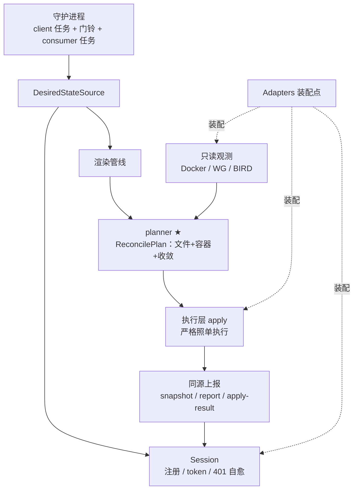

# Node Agent 内部

本文讲 Node Agent（`apps/node-agent`）的内部：运行模式、守护循环、reconcile 六阶段、planner 与本机收敛、采集上报、self-heal 与旁路任务。CLI 参数见 [../reference/cli-and-scripts.md](../reference/cli-and-scripts.md)，配置见 [../reference/configuration.md](../reference/configuration.md)。

## 内部结构

核心是 `run_once(config, adapters)`：一轮做六阶段管线 **source → render → observe → plan → execute → report**。planner 一次性产出唯一权威的 `ReconcilePlan`，执行层照单执行、上报与之同源。默认运行方式是 `run_watch(config)` 常驻守护进程。

| 子系统 | 模块 | 职责 |
| --- | --- | --- |
| 入口 | `agent/main.py` | CLI 解析、模式分发 |
| 守护循环 | `agent/watch.py` | WS 订阅、门铃、consumer、两条旁路任务 |
| 编排 | `agent/orchestrator.py` | `ReconcileOrchestrator`、六阶段 |
| 身份 | `agent/session.py`、`core/identity.py` | 注册、token、401 自愈、`identity.json` |
| client | `agent/client/controller.py` | 强类型 controller HTTP client |
| 渲染 | `agent/render/pipeline.py` | 调 `dn42_templates.render_desired_state` |
| 决策 | `agent/planner/` | file_plan、container_plan、convergence_plan、reconcile_plan |
| 执行 | `agent/apply/` | writer、docker_api、convergence、definition_store |
| 观测 | `agent/collectors/` | docker、bird_socket、network、routing、inventory、snapshot |
| 对账 | `agent/health/reconcile.py` | 漂移检测、`ReconciliationReport` |
| 密钥 | `agent/secrets/wireguard.py` | WG 私钥生成、escrow、注入 |

## 运行模式

| 模式 | 触发 | 行为 |
| --- | --- | --- |
| 守护（默认） | 无 `--once/--plan-only/--doctor` | 启动 reconcile 一次 → 连 WS → 收门铃再 reconcile |
| `--once` | 诊断 | 跑一轮后退出，输出 JSON 摘要 |
| `--plan-only` | 诊断 | `--once --mode plan-only`，只规划不写不部署 |
| `--doctor` | 诊断 | 自检（配置/状态目录/身份/控制面/Docker/指标）后退出 |
| `--mode write-rendered` | 守护或单次 | 只写渲染文件，不碰容器 |

## 守护循环

`run_watch()` 用**门铃 + 最新优先**两任务模型（`agent/watch.py`）：

- **client 任务** `_client_loop`：连 `ws://controller/api/v1/agent/ws/{node_id}`，指数退避重连（1s→30s）。事件 → 摇门铃：
  - `hello`：控制面 generation 比本地已应用的新 → 摇（hello 追赶）。
  - `desired_state_updated`：generation > 已应用 → 摇。
  - `snapshot_request`：总是摇。
  - 去重：按磁盘 `applied_generation` 跳过陈旧代次。
- **consumer 任务** `_consumer_loop`：**唯一的 reconcile 触发点**。等门铃或兜底超时，防抖窗口（默认 0.3s）合并突发，排空所有原因后触发一次 reconcile。优雅退出：停止信号 + 门铃同时置位时跑完最后一轮再退。

**共享 Adapters**：`run_watch()` 启动时建一次（HTTP 连接池 + Docker client），跨所有 reconcile 复用，finally 关闭。

## planner 与本机收敛

planner 把"想要什么"对比"观测到什么"，产出三层计划合成的 `ReconcilePlan`：

1. **file plan**（`build_file_plan`，`prune=True`）：每个渲染文件 create/update/delete/noop（SHA-256 对比）。prune 让被删资源的孤儿 `.conf` 也被清除（隧道删除后配置不残留）。
2. **container plan**（按 `config_hash`）：
   - 哈希不变且在跑 → KEEP（零扰动）。
   - 哈希变 / 不在跑 → RECREATE。
   - 不在期望集合的受管容器 → 删除（孤儿清理）。
   - 拓扑序处理，依赖传播。
3. **convergence plan**（数据面定向收敛）：
   - bird conf 变了且 bird 容器**未**重建 → `BIRD_RELOAD`（`birdc configure`）。
   - WG：容器重建则全量重同步；否则按文件变化粒度同步/拆除单个接口。

执行层（`agent/apply/`）照单执行：writer 原子写盘并 chmod 脚本；docker_api 先准备镜像、删旧、建网、建容器；convergence 逐条 `docker exec` 收敛。`apply_status` = deploy 成功 ∧ 文件无错 ∧ 收敛成功，否则 `failed`（收敛失败不推进 generation）。

容器身份与 `-1` 后缀、声明式 underlay（`ipv6_subnet` 纳入 `config_hash`）等不变量见 [architecture.md](architecture.md#最小扰动设计)。

## 采集与上报

| 采集器 | 来源 | 上报到 |
| --- | --- | --- |
| docker | 容器 label / 状态 / config_hash | runtime-snapshot |
| network | `wg show all dump`、`birdc show protocols` | runtime-snapshot |
| routing | 直连 BIRD 控制 socket（`/run/bird/bird.ctl`），`show route ... all` + ROA 表 RFC6811 校验 + import-table 过滤前 RPKI 分布 | routing-table（旁路） |
| inventory | 主机能力 | register |

观测三态 `NOT_OBSERVED` / `UNAVAILABLE` / `OBSERVED`，避免把"没采到"误判成"没有"。对账器（`health/reconcile.py`）比对期望与观测，按 INFO/WARNING/CRITICAL 分级，有 CRITICAL 时把 apply 成功降级为 `degraded`。

## WireGuard 私钥与 escrow

一节点一把私钥，本地生成于 `<state-dir>/.../secrets/wireguard/node.key`（0600），永不写进渲染产物（占位 `secret://`）。公钥上报控制面；私钥用控制面下发的恢复公钥 RSA-OAEP 封存上报（escrow）。收敛前通过 Docker API `put_archive` 注入容器。控制面对公钥一致性严格校验（不符 409 中止 apply）。完整模型见 [../guides/secret-recovery.md](../guides/secret-recovery.md)。

## self-heal 与旁路任务

- **401 自愈**：`Session.call()` 遇 401 → 清 token、重新注册、重试一次，对调用方透明。
- **旁路任务**（独立于 reconcile，失败只记日志不中断）：
  - **routing 采集** `_routing_loop`：间隔 `routing_interval_seconds`（默认 300s），采集路由表 POST 控制面。
  - **WG endpoint 重解析** `_reresolve_loop`：间隔 `reresolve_interval_seconds`（默认 45s）。握手过期（>135s）且 endpoint 是域名时，`wg set ... endpoint <domain:port>` 重解析，自愈对端动态 DNS IP 漂移。**不触发 reconcile、不动 `applied_generation`**，有变化才上报。

## 错误分层

`AgentError` 基类下：`ConfigError`、`ControllerError`（含可重试的 `BootstrapPendingError` 与致命的 `BootstrapRejectedError`）、`DesiredStateError`、`RenderError`、`ApplyError`。`--doctor` 自检区分 critical 与 informational 检查项。
