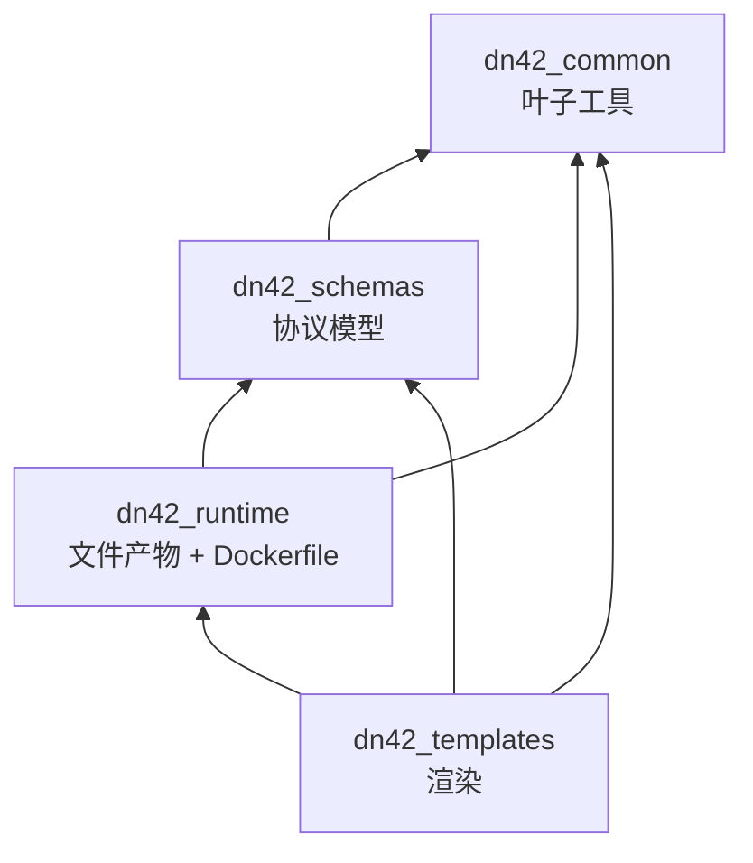

# 共享包

四个一方包 `packages/dn42_*` 是 Control Server 与 Node Agent 共用的地基：协议模型、渲染、文件产物、公共工具。本文讲它们的分层、依赖方向与各自职责。字段细节见 [../reference/desired-state.md](../reference/desired-state.md)。

## 依赖方向

`dn42_common` 是无上游依赖的叶子。`dn42_schemas` 只依赖 common。`dn42_templates` 依赖三者（产出 `RenderedFile`）。无循环依赖。Control Server 用 schemas（校验/合成）；Node Agent 用全部四个（渲染 + 规划 + 执行）。

## dn42_schemas —— 协议模型

所有跨组件传输的数据结构，基于 Pydantic v2。基类 `StrictModel`（`base.py`）：`extra="forbid"`（拒未知字段）+ `frozen=True`（不可变）+ `canonical_json()` / `canonical_sha256()`（稳定序列化，用于内容寻址）。

| 文件 | 内容 |
| --- | --- |
| `desired_state.py` | `DesiredState` 顶层 + `validate_references` + 四个 `_normalize_*` 钩子（端口发布、bird socket、DNS runtime、DNS anycast） |
| `network.py` | `NodeSpec`（含 `link_local` 单源）、`InterfaceSpec`、`WireGuardPeerSpec` |
| `routing.py` | `BgpSessionSpec`、`BfdSpec`、`Bird2ConfigSpec`、`InternalTopologySpec`、`BirdHostSpec`、`DummyInterfaceSpec`、`BgpLargeCommunitySpec` |
| `dns.py` | `DnsSpec`、`DnsZoneSpec`、`DnsRecordSpec`、`DnsForwardSpec` |
| `runtime.py` | `RouterRuntimeSpec`、`RuntimeServiceSpec`、`UnderlayNetworkSpec`、`PortPublishSpec`、`WireGuardPortRangeSpec`、`RpkiSpec` 等容器编排模型 |
| `agent.py` | Agent 协议：注册请求/响应、`RuntimeSnapshot`、`ReconciliationReport`、`ApplyResult`、各 `Observed*` |
| `enums.py` | `InterfaceKind`、`ServiceRole`、`AddressFamily`、`ApplyStatus`、`BootstrapStatus`、`NodeHealth`、`ObservationStatus` 等 |
| `testing.py` | 示例 builder（hkg1、本地多节点），供测试与渲染 golden 用 |

`DesiredState` 的字段、校验规则、normalize 钩子是单独的参考主题，见 [../reference/desired-state.md](../reference/desired-state.md)。

## dn42_templates —— 渲染

把 `DesiredState` 渲染为节点上的配置文件与脚本。入口 `render_desired_state(state) -> list[RenderedFile]`（`desired_state.py`）。

| 产出 | 模板 |
| --- | --- |
| `bird/*.conf` | `config-bird2/`（community_filters、custom_filters、rpki、anycast_services、bird.conf、dn42_peers、ibgp、ospf、ospf_interfaces） |
| `wireguard/<iface>.conf` | `config-wireguard/interface.conf.j2` |
| `coredns/Corefile` + `coredns/zones/db.<zone>` | `config-coredns/`（DNS 启用时） |
| `scripts/bird/*`、`scripts/wg/*` | `config-scripts/`（apply / start 脚本） |

`bird2.py` 的 `build_config_bird2_context` 把 `DesiredState` 翻译成 BIRD 模板上下文（`ownip`、`ownnets*_ipset`、`bird_hosts`、`wg_peers`、`large_communities`、`route_collectors`、`rpki_ip` 等）——这里就是"loopback / prefixes → OWNIP / ipset"等**派生**发生的地方（见 [../reference/addressing-model.md](../reference/addressing-model.md)）。Jinja 环境用 `StrictUndefined`（缺变量即报错）+ `shell_quote` / `yaml_quote` 过滤器。

router 容器的 Dockerfile **不渲染成文件**，由 agent 在内存里从 `runtime.router_dockerfile` 经 Docker Engine API 生成。

## dn42_runtime —— 文件产物与 Dockerfile

| 文件 | 内容 |
| --- | --- |
| `types.py` | `RenderedFile`（不可变；路径强校验：禁 `..`、NUL、绝对路径、Windows 盘符） |
| `docker.py` | `render_router_dockerfile()`（多阶段 router 镜像模板） |
| `paths.py` | 模板目录发现 |

写盘计划的执行（原子写 + 删除）由此包提供，被 agent 的 writer 调用。

## dn42_common —— 公共工具

无上游依赖的叶子，被其余三包与两个 app 共用。

| 模块 | 内容 |
| --- | --- |
| `validators/` | IP / 网络 / link-local、DN42 地址空间（`172.20.0.0/14`、`fd00::/8`、anycast 段）、ASN、WireGuard key / endpoint、域名、ISO8601、agent token |
| `labels.py` | 容器/网络 label 单源：`dn42.managed`、`dn42.node_id`、`dn42.config_hash`、`dn42.component` |
| `naming.py` | `node_project_name`、`service_container_name`（`<project>-<service>-1`）、`agent_id_for` |
| `communities.py` | DN42 origin region community 编码、国家代码映射 |
| `serialization.py` | `canonical_json_dumps` / `canonical_sha256_hex`（内容寻址哈希） |
| `jinja.py` | `create_environment`、`shell_quote`、`yaml_quote` |
| `io.py` | `atomic_write_text` / `atomic_write_json` |
| `crypto.py` | WireGuard 密钥生成、恢复密钥 seal / unseal（escrow） |

`labels.py` 与 `serialization.py` 一起支撑了**内容寻址**：容器 `config_hash` 来自容器定义 payload 的 canonical SHA-256，是最小扰动设计的基础（见 [architecture.md](architecture.md#最小扰动设计)）。
