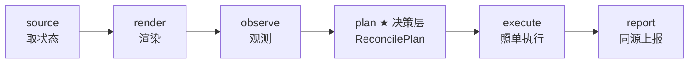
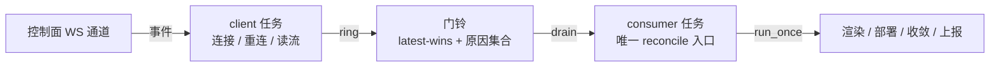
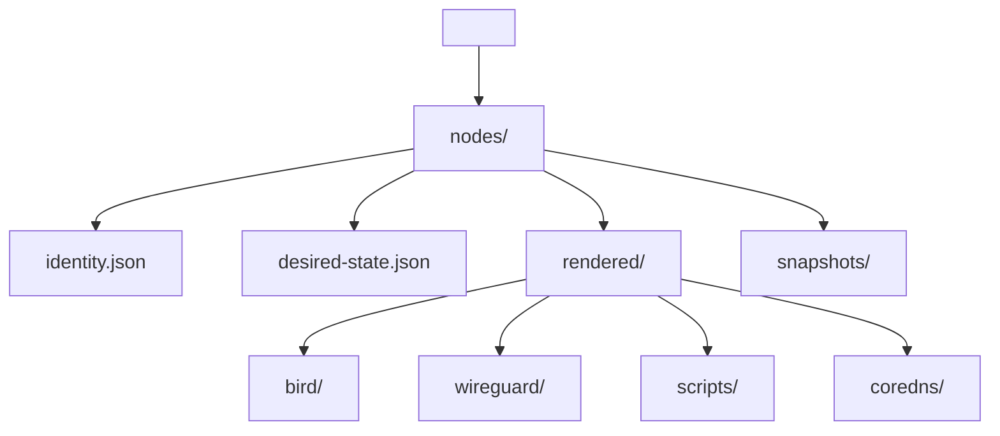

# Node Agent

Node Agent 运行在 DN42 路由节点上。它不保存控制平面业务数据，只保存本机运行所需的 identity、最近一次 `DesiredState` 缓存和渲染产物。它的唯一输入是 `DesiredState`、本地配置和本机观察结果；**它不接受远程 shell 命令**。

## 架构：一个 Plan、一个会话状态机、一个装配点

agent 的一次 reconcile 是显式的六阶段管线，**决策与执行严格分离**：



- **ReconcilePlan 是唯一权威决策产物**（`agent/planner/`）：文件动作（含
  prune 孤儿清理）、容器动作（内容寻址 + 依赖传播）、收敛动作（由前两者
  推导）一次成型。执行层照单执行、禁止二次决策；上报从同一份计划 + 真实
  执行结果派生——"计划说什么、执行做什么、上报报什么"由构造保证一致，
  `--plan-only` 展示的就是 apply 将要做的事。
- **Session 状态机**（`agent/session.py`）：注册、token 持久化、401 自愈
  （token 被轮换/撤销 → 作废本地凭据 → 凭 enrollment 重新注册 → 重试），
  agent 不会砖死在失败循环里。
- **Adapters 装配点**（`agent/adapters.py`）：全部副作用边界（HTTP client、
  Docker 观察、部署后端、命令执行器）的单一装配入口；守护进程装配一次、
  跨 reconcile 复用连接池，测试装配假实现。

## 代码结构与模块边界

| 路径 | 负责 | 不负责 |
| --- | --- | --- |
| `agent/main.py` | CLI 参数解析、运行模式分发 | 业务逻辑 |
| `agent/watch.py` | 常驻守护循环：client 任务 + 门铃 + consumer 任务 | 单次 reconcile 细节 |
| `agent/orchestrator.py` | 薄协调器：把六阶段按序串起来 | 任何具体决策 / 执行 |
| `agent/adapters.py` | ★ 副作用边界的单一装配点 | 业务逻辑 |
| `agent/session.py` | ★ 会话状态机：注册 / token 生命周期 / 401 自愈 | 收敛逻辑 |
| `agent/sources.py` | ★ `DesiredStateSource`：controller / 本地文件 / 内置示例 | 状态校验 |
| `agent/planner/` | ★ 决策层：`ReconcilePlan`（文件 + 容器 + 收敛） | 执行变更 |
| `agent/apply/` | 执行层：严格照单写盘 / 部署 / 收敛 | 任何决策 |
| `agent/collectors/` | 只读观测：主机、Docker、WireGuard、BIRD | 判断 drift |
| `agent/health/reconcile.py` | 根据 desired 和 observed 生成 drift 报告 | 修改 runtime |
| `agent/render/pipeline.py` | 调用 `dn42_templates` 渲染 | 文件落盘 |
| `agent/client/controller.py` | Control Server HTTP 调用（错误携带状态码） | token 生命周期 |
| `agent/desired_state/` | 本地文件加载和缓存 | schema 定义 |
| `agent/core/` | 配置、路径、identity、命令执行、日志、错误类型 | HTTP、Docker、模板 |

决策层 `agent/planner/` 内部：

| 文件 | 内容 |
| --- | --- |
| `reconcile_plan.py` | `ReconcilePlan` 聚合入口：三层计划一次成型 |
| `file_plan.py` | 文件动作（create/update/delete/noop，含 prune） |
| `container_plan.py` | 容器动作：定义哈希内容寻址 + 依赖传播 + REMOVE 孤儿清理 |
| `definition.py` | ★ `ContainerDefinition`：即将发给 Engine API 的最终 payload，哈希输入与执行载体同源 |
| `convergence_plan.py` | 收敛动作：BIRD reload / 按接口 WG 同步与拆除 / 整体重放 |

执行层 `agent/apply/` 内部：

| 文件 | 内容 |
| --- | --- |
| `writer.py` | 严格按 `FilePlan` 写入/删除，返回真实结果（上报数据源） |
| `docker_api.py` | Docker SDK backend：严格按 `ContainerPlan` 落地，KEEP 一概不碰，镜像只为 (re)create 服务准备 |
| `executor.py` | `ApplyExecutor`：可注入的部署边界，把计划交给 docker-api backend |
| `convergence.py` | 把 `ConvergencePlan` 照单翻译成容器内 exec（Docker API，best-effort） |

## 配置

全部配置项、环境变量、TOML 格式见 [configuration.md](configuration.md#node-agent)。优先级：默认值 < TOML < 环境变量 < CLI 参数。

## 运行模式

运行方式由两个正交维度决定：

- **跑多久**：默认常驻守护进程；`--once` / `--plan-only` 单次运行后退出（诊断）。
- **跑多深**（`--mode` / `DN42_AGENT_MODE` / TOML `mode`，默认 `apply`）：

| mode | 写渲染文件 | 部署容器 | 本机收敛 | 适用 |
| --- | --- | --- | --- | --- |
| `apply`（默认） | ✔ | ✔ | ✔ | 真实节点 |
| `write-rendered` | ✔ | ✘ | ✘ | 无 Docker 的演示 / 联调（如三节点 lab） |
| `plan-only` | ✘ | ✘ | ✘ | 排错演练，仅单次模式可用 |

常用组合：

| 你想干嘛 | 命令 |
| --- | --- |
| 正常长期运行（默认） | `python -m agent.main --controller-url ...` |
| 只跑一次完整部署后退出 | 加 `--once` |
| 只演练不动手（排错用） | 加 `--plan-only`（≡ `--once --mode plan-only`） |
| 常驻但只渲染不碰容器 | `--mode write-rendered`（或 `DN42_AGENT_MODE=write-rendered`） |

### 常驻守护进程模式（默认）

生产部署的默认运行方式（systemd 托管见 [operations.md](operations.md#systemd-生产部署)）。

```bash
python -m agent.main --config /etc/dn42-control/agent.toml
```

守护进程内部是 **client 与 runtime 解耦的两任务结构**（实现见 `agent/watch.py`），
中间用"门铃"（latest-wins 脏标志）衔接：



- **client 任务**：连接 WS 私有通道 `/api/v1/agent/ws/{node_id}`（token 放在
  `Authorization: Bearer` 头；控制面校验 token 的 `node_id` 与路径一致，不一致
  close `4403`，token 无效/缺失 close `4401`）。它只读不算，立即回到 recv——
  **reconcile 再慢也不会让控制面发送队列背压堆积**。断线按指数退避重连
  （初始 1 秒翻倍、上限 30 秒，成功后重置）。事件判定（保守去重，宁多勿漏）：
  - `hello`：携带控制面当前 generation，**领先本地已应用值即按门铃追赶**——
    断线期间漏掉的变更在重连瞬间补偿，而不是等兜底周期；
  - `desired_state_updated`：generation 不高于本地已应用值时去重跳过；
    缺 generation 一律响铃；
  - `snapshot_request`：永远响铃（控制面要的是新鲜快照）。
- **consumer 任务**：唯一的 reconcile 入口，天然串行（绝无两次 reconcile
  并发竞争本机资源）。门铃响后静等防抖窗口（默认 0.3 秒）合并批量 admin
  写入的突发；**reconcile 运行期间**到达的任意多声门铃由 latest-wins 语义
  合并，结束后恰好补一次收敛——不丢、不放大。退出与最后一声门铃竞争时，
  先收敛再退出。
- 启动先 reconcile 一次（拿到/刷新身份）再拉起两个任务。
- 长时间无门铃按兜底间隔（默认 300 秒）再 reconcile 一次防漂移——兜底
  **独立于 WS 连接状态**：事件队列溢出丢门铃、断线期间漏推、甚至首次注册
  失败（控制面暂不可达），都由它持续补偿重试。
- 事件携带控制面附带的 `reason`（这次为什么变），仅用于日志排错；收敛
  正确性不依赖它（门铃不带业务数据，每次 reconcile 都拉最新全量状态）。
- reconcile 在线程池中执行，避免阻塞事件循环；单次失败只记日志，不退出守护进程。

### 单次部署 `--once`（诊断 / 手动）

注册、拉取 `DesiredState`、部署一次后退出，输出 JSON 摘要。部署失败时退出码为 1。

```bash
python -m agent.main \
  --controller-url http://127.0.0.1:8000 \
  --enrollment-token enroll-token \
  --requested-node-id edge1 \
  --state-dir .agent-state \
  --once
```

### 只规划 `--plan-only`（诊断）

不写盘、不部署，只校验 / 渲染 / 规划并输出 JSON 摘要。注意它仍会观察 Docker runtime，本机没有 Docker 时容器计划会退化为空观察。

```bash
python -m agent.main --plan-only --state-dir .agent-state
```

状态来源按配置自动选择：

| 来源 | 条件 | summary 中的 `source` |
| --- | --- | --- |
| Control Server | 配置了 `controller_url` | `controller` |
| 本地文件 | 配置了 `--desired-state path.json` | `local-file` |
| 内置 hkg1 示例 | 两者都没配 | `built-in-example` |

内置示例（`dn42_schemas.testing.build_hkg1_example_state()`）适合快速自检模板渲染和文件计划，不依赖任何外部服务。

### 自检 `--doctor`（诊断）

不改任何状态，一次性把"这个节点能不能正常收敛"摊开：配置是否自洽、状态目录是否可写、本地身份/注册是否就绪、控制面是否可达、Docker 是否可用、最近 reconcile 指标如何。输出 JSON 报告；只有 *critical* 项（config / state_dir / controller / docker）决定退出码（全过 0，否则 1），身份与指标是信息项不参与判定。

```bash
python -m agent.main --doctor --state-dir .agent-state
```

### reconcile 指标

常驻守护进程每跑完一次 reconcile，就把结果累计写入 `<node_dir>/metrics.json`：总次数、累计失败、连续失败、最近一次状态/时长/世代/时间。这是 `--doctor` 与外部探针读取 agent 自身健康的数据源——无需额外开端口。写入走原子替换，崩溃不留半截文件；文件损坏或缺字段时容错按零值起算，绝不阻断 reconcile。

## 本地目录



`identity.json` 示例：

```json
{
  "node_id": "edge1",
  "agent_id": "edge1-agent",
  "agent_token": "agt_3f2a1b.5kJh...",
  "applied_generation": 3,
  "last_apply_status": "succeeded",
  "last_apply_at": "2026-06-08T07:04:04+00:00"
}
```

`desired-state.json` 保存最近一次成功加载的 `DesiredState`，用于调试和恢复。identity 与缓存都使用临时文件 + 原子替换写入。

## 一次 run_once 的逻辑

```mermaid
gantt
    title Node Agent 单次 reconcile
    dateFormat X
    axisFormat %s
    section 输入
    加载配置与 identity      :0, 1
    注册或拉取 DesiredState  :1, 1
    section 规划
    渲染配置文件             :2, 1
    计算文件计划             :3, 1
    观察容器并计算容器计划   :4, 1
    section 执行
    按模式写盘或部署         :5, 2
    本机收敛                 :7, 1
    section 反馈
    采集 RuntimeSnapshot     :8, 1
    生成 ReconciliationReport:9, 1
    上报并缓存本地状态       :10, 1
```



详细步骤（六阶段）：

1. **source**：按配置选择状态来源（Control Server / 本地文件 / 内置示例）。
   controller 模式下 Session 负责注册（`pending-approval` / `rejected` 抛对应
   错误等待审批）与 **401 自愈**（token 被轮换/撤销 → 作废本地凭据 → 重新
   注册 → 重试一次）。
2. **render**：`dn42_templates.render_desired_state()` 生成 `RenderedBundle`。
3. **observe**：Docker observer 读取带 `dn42.managed=true` 且属于本节点的容器。
4. **plan**（决策层一次成型 `ReconcilePlan`）：
   - `FilePlan`：对比 `rendered_dir`，含 prune——被删除资源的孤儿文件列为 delete；
   - `ContainerPlan`：先构建每个服务的 `ContainerDefinition`（即将发给
     Engine API 的最终 payload），对其 canonical JSON 取哈希、与容器
     `dn42.config_hash` label 比对，判定 create/recreate/keep；观察到的
     受管容器不在期望集合 → **remove**（孤儿清理）。再做**依赖传播**
     （依赖被重建的服务级联 recreate）。身份哈希的输入是最终 payload
     而非 schema 序列化：schema 重构与重建解耦，generation 递增不触发
     重建。有上次定义记录（`<node>/containers/*.json`）时，recreate 的
     reason 是字段级 diff（如 `definition changed: ports`）；
   - `ConvergencePlan`：由前两者推导（BIRD reload / 按接口 WG 同步与拆除 /
     容器重建后的整体重放）。
5. **execute**：按 mode 深度严格照单执行——`plan-only` 到此为止；
   `write-rendered` 只执行文件计划；`apply` 再按 `ContainerPlan` 部署容器
   （KEEP 一概不碰、REMOVE 真实删除、(re)create 严格照 step 携带的
   `ContainerDefinition` 物化），成功后落盘定义记录，且
   `local_convergence` 开启时照单执行收敛动作。
6. **report**：重新观察容器并经 docker exec 采集 WG/BIRD，生成
   `RuntimeSnapshot` 与 `ReconciliationReport`；controller 模式下经 Session
   上报 snapshot / report / apply-result——上报的 `plan_summary` 与
   `applied_files` 与计划/真实执行**同源**。最后写入 `identity.json` 和
   `desired-state.json`。

## 输出摘要

`--once` / `--plan-only` 会输出 JSON 摘要：

```json
{
  "node_id": "edge1",
  "generation": 3,
  "source": "controller",
  "mode": "apply",
  "rendered_files": 23,
  "runtime_services": 7,
  "interfaces": 4,
  "bgp_sessions": 3,
  "dns_enabled": true,
  "plan_summary": {"create": 0, "update": 4, "delete": 0, "noop": 19},
  "container_plan": [
    {
      "service": "dn42-wg-gateway",
      "container": "dn42-edge1-dn42-wg-gateway-1",
      "action": "recreate",
      "reason": "definition changed: ports"
    }
  ],
  "apply_status": "succeeded",
  "report": {
    "node_id": "edge1",
    "desired_generation": 3,
    "observed_generation": 3,
    "status": "succeeded",
    "drift": []
  }
}
```

## 部署方式（Docker Engine API）

agent 与 Docker 的全部交互——部署、观测、容器内 exec、密钥文件推送——都
通过 Python Docker SDK 直连 Engine API（只需 socket，不需要 docker /
docker compose CLI 二进制）。部署执行顺序：

1. 只为计划要 (re)create 的服务准备镜像：本地构建（定义携带的
   Dockerfile 内容经 `fileobj` 内存构建）或拉取（本地已有镜像直接复用）。
2. 确认 underlay network 存在且 IPAM 配置一致，不一致且无外部端点时重建。
3. 删除计划列为 REMOVE 的孤儿容器。
4. 按 `depends_on` 拓扑逆序删除要 recreate 的旧容器。
5. 按拓扑正序、严格照 `ContainerDefinition.payload` 创建并启动新容器，
   写入 `dn42.managed`、`dn42.node_id`、`dn42.config_hash`、`dn42.component` labels。

判定哪些容器要动**不在执行层**：内容寻址决策全部发生在 planner（见上文
plan 阶段），执行端照单执行。

容器编排完全由数据驱动：渲染产物中不存在任何编排文件，容器定义以
`DesiredState.runtime` 的结构化数据从数据库经控制面直达 agent 的
Engine API 后端。

## 本机收敛（local convergence）

部署成功后，agent 把数据面**定向**收敛到期望态——收敛动作由 file plan 的
差异驱动，绝不做无差别全量刷新（实现见 `agent/apply/convergence.py`）：

| 差异 | 动作 | 扰动范围 |
| --- | --- | --- |
| 无任何差异 | 什么都不做 | 零 |
| `bird/*` 变化且 bird-router 未重建 | `birdc configure` 热重载 | 零（BIRD 增量加载） |
| `wireguard/<iface>.conf` 新增/变化 | 只对该接口执行 `apply-<iface>.sh` | 仅该隧道 |
| `wireguard/<iface>.conf` 被删除 | `ip link del <iface>` 拆除 | 仅该隧道 |
| wg-gateway / router-netns 被 (re)create | 整体重放 `apply-*.sh`（netns 内隧道已全部丢失） | 该节点全部隧道 |
| bird-router 被重建 | 跳过 `birdc configure`（启动即加载新配置） | — |

配合内容寻址的容器身份，日常变更（加 peer、改 BGP 会话、改 DNS）只会
热加载对应配置，**不重建容器、不触碰无关隧道**，BGP 会话不再被无关变更
打断。

设计上是**尽力而为**：任何一步失败只记警告，不会让整个 apply 失败。默认开启，可用 `DN42_AGENT_LOCAL_CONVERGENCE=0` 关闭。

## RuntimeSnapshot 和 ReconciliationReport

`RuntimeSnapshot` 表示 Agent 在节点上观察到的实际状态，包含容器、接口、WireGuard、BIRD/BGP 和采集错误。

WireGuard 与 BIRD/BGP 维度默认在生产路径采集：观察到受管容器在场时，agent 通过 `docker exec` 进入对应容器执行 `wg show all dump`（wg-gateway）和 `birdc show protocols`（bird-router）。BIRD protocol 名与 BGP 会话名通过同一套规范化函数（`dn42_templates.bird_protocol_name`）互相对应，保证反查映射与渲染永远一致。采集失败（无 Docker、容器不在、命令非零退出）时对应维度退化为空，**不会**产生误报 drift——全新节点或纯演示环境不受影响。

`ReconciliationReport` 表示期望状态与实际状态的差异。常见 drift：

| drift | 严重级别 | 含义 |
| --- | --- | --- |
| container missing | critical | 应存在的容器不存在 |
| container not running | critical | 容器存在但未运行 |
| config hash drift | warning | 容器 `dn42.config_hash` 与计划期望（定义哈希）不符 |
| unmanaged extra container | warning | 出现多余受管容器 |
| wireguard interface missing | critical | WireGuard 接口缺失 |
| wireguard listen_port mismatch | warning | 监听端口与期望不符 |
| wireguard zero peers | warning | 接口存在但没有 peer |
| BGP protocol not established | warning | BGP session 未建立 |

apply 成功但存在 critical drift 时，报告状态升级为 `degraded`。

## 路由全表观测（RoutingTableSnapshot）

除了 reconcile 闭环，常驻 agent 还跑一个**独立的旁路任务**周期采集 BIRD 路由
全表（`birdc show route ... all`，按 `master4` / `master6` 合并），解析出每条路由的
`prefix` / `origin_asn` / `as_path` / `next_hop` / 来源 protocol / 是否最优 / 是否本地起源，
并按 BIRD 的 ROA 表（`dn42_roa` / `dn42_roa_v6`）做 RFC 6811 起源校验
（`valid` / `invalid` / `not-found` / `unknown`），全量上报 `POST /agent/routing-table`
供控制面做 Radar 式分析。

**本地起源路由**（无 AS path 的 static / direct，如 loopback /32 /128、自有网段）只标
`local=true`，**不参与 RPKI、不改写起源**——它们不对外宣告，对自有 ROA 做校验只会把
更具体的主机路由误判为 invalid。只有外部学到的路由才做 RPKI。

这条路径**刻意与 reconcile 完全隔离**：只读采集、HTTP 上报，绝不触发 apply、不
影响 `applied_generation`、不参与"唯一 reconcile 入口"。采集失败只记日志、不拖垮
守护进程，沿用三态观测语义（采集失败标 `unavailable`，控制面保留上一份全表）。

采集间隔由 `routing_interval_seconds`（CLI 无开关，走 TOML
`routing_interval_seconds` 或 `DN42_AGENT_ROUTING_INTERVAL_SECONDS`，默认 300 秒，
设 0 关闭）控制。仅在常驻 + 接入控制面时启用。

## 错误分层

| 错误类别 | 典型原因 | 处理方式 |
| --- | --- | --- |
| 配置错误（`ConfigError`） | TOML 字段未知、超时不是数字 | 修正配置后重跑 |
| Controller 错误（`ControllerError`） | token 无效、desired-state 不存在 | 检查 Control Server 和 token |
| 注册挂起/拒绝（`BootstrapPendingError` / `BootstrapRejectedError`） | 节点未 provision 或被拒 | 走管理员审批 + provision 流程 |
| 渲染错误（`RenderError`） | schema 与模板不匹配 | 修复 schema 或模板 |
| 写盘错误 | 权限不足、路径不可写 | 修复 `state_dir` 权限 |
| 部署错误（`ApplyError`） | Docker 不可用、镜像构建失败 | 检查 Docker 和渲染目录 |
| 对账 drift | 容器缺失、generation 落后、BGP 未建立 | 根据 report 定位节点 runtime |

## Python API

```python
from pathlib import Path
from agent import AgentConfig, run_once

result = run_once(
    AgentConfig(
        controller_url="http://127.0.0.1:8000",
        enrollment_token="enroll-token",
        requested_node_id="edge1",
        state_dir=Path(".agent-state"),
        mode="plan-only",
    )
)

print(result.summary())
```

## 相关文档

| 文档 | 内容 |
| --- | --- |
| [configuration.md](configuration.md) | 全部配置项与环境变量 |
| [architecture.md](architecture.md) | 系统整体架构 |
| [api.md](api.md) | Agent API 契约 |
| [operations.md](operations.md) | 部署与运维 |
| [testing.md](testing.md) | Agent 测试 |
| [security.md](security.md) | Agent 安全边界 |
