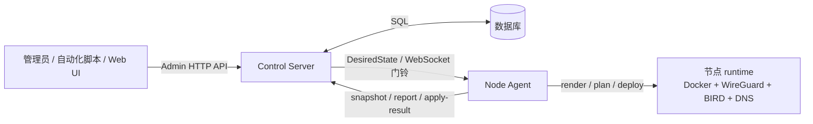
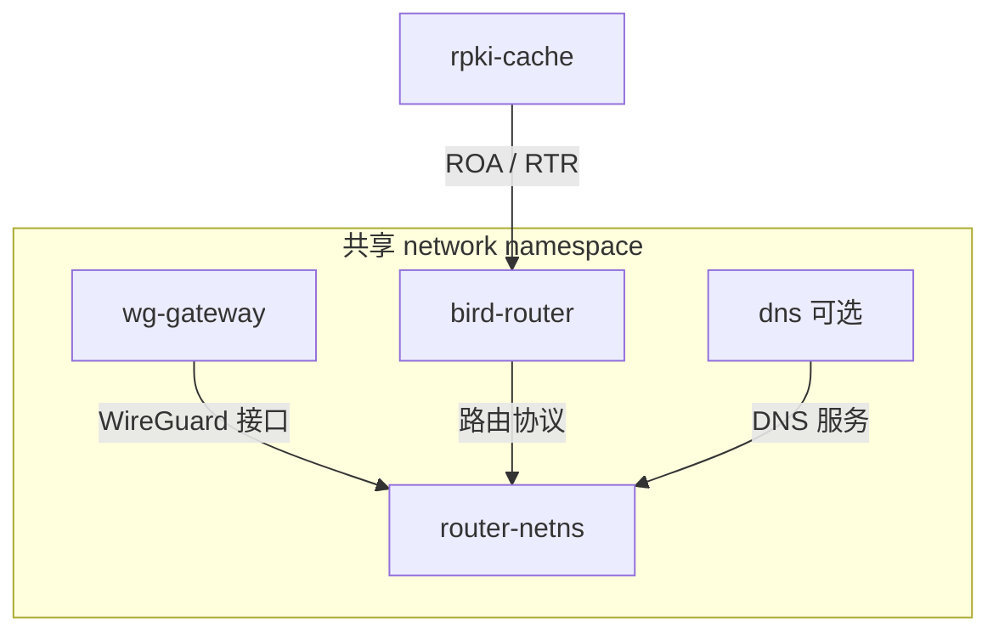

# 系统概览

本文用最短的篇幅讲清楚 `dn42-control-backend` 是什么、解决什么问题、由哪些部分组成，并给出一份**核心概念词汇表**——后续文档默认读者已掌握这些词。

## 一句话

`dn42-control-backend` 是一套面向 [DN42](https://dn42.dev/) 路由节点的**控制平面 + 节点执行器**：把"一个节点应该运行什么配置"表达成 `DesiredState`，由 **Control Server** 保存与发布，由每个节点上的 **Node Agent** 在本机渲染、规划、部署并回报结果。

## 它解决什么问题

手工运维一组 DN42 节点意味着到处 ssh、改 `bird.conf`、拉 WireGuard 隧道、对齐 iBGP/OSPF、改 DNS——容易漂移、容易漏改、出事难回溯。本系统把这件事变成一个**持续运转的闭环**：

1. 管理端通过 **Admin API**（或 Web UI / provision / 导入脚本）写入节点、peering、接口、BGP 会话、DNS、token 等**事实数据**。
2. Control Server 把数据库里的事实**合成（materialize）**为一份完整的 `DesiredState`，存为递增的 **generation**，并通过节点私有 WebSocket 通道**摇一下门铃**通知对应 Agent。
3. Node Agent 拉取 `DesiredState`，渲染本地配置文件，对比当前文件与容器状态，按需写盘、重建容器、热重载服务，并把**快照 / 对账 / 应用结果**回报。
4. Control Server 持久化上报，推导每个节点的**健康**（`ok` / `stale` / `degraded` / `down` / `unknown`）供管理端查询。

## 核心安全姿态

系统的控制模型是 **"发布期望状态、节点本地收敛、回报观察结果"** ——Control Server **不提供**远程 shell 或任意命令执行接口。控制面能做的只有"声明期望状态"，怎么达成完全由节点本地的 Agent 基于本机观测决定。详见 [internals/security.md](internals/security.md)。

## 节点 runtime 目标形态

每个节点的 runtime 使用**共享 network namespace**：`router-netns` 提供网络命名空间，`wg-gateway` 在其中建 WireGuard 隧道，`bird-router` 在同一网络视图里跑 BIRD 2，`dns` 可选跑 CoreDNS，`rpki-cache` 为 BIRD 提供 RPKI/ROA 数据。容器**不用 docker-compose**，由 Agent 直接通过 Docker Engine API 按 `DesiredState` 创建/重建。

## 组成部分

| 组件 | 路径 | 职责 | 详见 |
| --- | --- | --- | --- |
| Control Server | `apps/control-server` | FastAPI 控制服务：Admin/Agent API、数据库、token、`DesiredState` 合成与发布、WebSocket 事件、注册审批、健康与路由视图 | [internals/control-server.md](internals/control-server.md) |
| Node Agent | `apps/node-agent` | 节点常驻执行器：注册、拉取、渲染、规划、部署、本机收敛、采集与上报 | [internals/node-agent.md](internals/node-agent.md) |
| Web UI | `apps/web` | SvelteKit 单页管理界面（独立托管，经 CORS + Bearer 直连 Admin API） | [guides/web-ui.md](guides/web-ui.md) |
| `dn42_schemas` | `packages/dn42_schemas` | 跨组件传输的 Pydantic 模型（`DesiredState`、Agent 协议等） | [internals/shared-packages.md](internals/shared-packages.md) |
| `dn42_templates` | `packages/dn42_templates` | 把 `DesiredState` 渲染为 BIRD / WireGuard / CoreDNS / 脚本 | 同上 |
| `dn42_runtime` | `packages/dn42_runtime` | 渲染文件类型、写盘计划、router Dockerfile 渲染 | 同上 |
| `dn42_common` | `packages/dn42_common` | 公共校验、命名、label、community、Jinja、crypto 工具 | 同上 |

## 核心概念词汇表

| 术语 | 含义 |
| --- | --- |
| **DesiredState** | "一个节点应运行什么"的完整声明式输入（schema `v1`）。控制面发布它、Agent 消费它。字段见 [reference/desired-state.md](reference/desired-state.md)。 |
| **generation** | `DesiredState` 的递增版本号。每次 materialize 产出一个新 generation 快照存进 `generations` 表。 |
| **materialize** | 把数据库里的规范化事实（节点/接口/BGP/DNS…）合成为一份完整、经校验的 `DesiredState` 并写入新 generation 的过程。见 [internals/control-server.md](internals/control-server.md)。 |
| **provision** | 用一份完整 `DesiredState` 整节点幂等落库 + materialize。被 seed、`POST /admin/provision`、导入脚本复用。 |
| **reconcile（收敛）** | Agent 的一轮"拉取 → 渲染 → 观测 → 规划 → 执行 → 上报"。每轮都从最新全量状态推导出**最小动作集**。 |
| **ReconcilePlan** | planner 一次性产出的唯一权威计划（文件计划 + 容器计划 + 收敛计划）；执行层照单执行。 |
| **门铃（doorbell）** | 守护进程里的"该 reconcile 了"信号。WebSocket 收到事件即摇门铃，多次事件合并为一次 reconcile。 |
| **config_hash** | 容器身份 = 服务 spec + underlay + 构建参数的 SHA-256（取前 16 位），写进容器 label `dn42.config_hash`。哈希不变就不重建容器。 |
| **Peering（聚合根）** | 一条逻辑互联，聚合其下的 WireGuard 接口与 BGP 会话；可关联远端节点（`remote_node_id`）。见 [reference/database.md](reference/database.md)。 |
| **internal_topology** | 同一 AS 内多节点的 iBGP/OSPF 由 `DesiredState.bird.internal_topology` 合成（不是 `bgp_sessions`）。**各节点的 routers+hosts 必须是同一份完整集合**，否则隐蔽缺路由。见 [guides/monitoring-and-troubleshooting.md](guides/monitoring-and-troubleshooting.md)。 |
| **DNS 组（dns_group）** | 共享的 DNS 配置单元。节点经 `Node.dns_group_id` 订阅一个组；多节点订阅同组即构成 **anycast**。见 [guides/dns-and-anycast.md](guides/dns-and-anycast.md)。 |
| **源 / 派生 / 副本** | 地址（及其它值）的三种存在方式。重构北极星是把"副本"变"派生"。见 [reference/addressing-model.md](reference/addressing-model.md)。 |
| **enrollment token / agent token** | 前者是一次性注册凭证，后者是节点长期持有的 Bearer token。见 [internals/security.md](internals/security.md)。 |
| **escrow（私钥托管）** | 节点本地生成 WireGuard 私钥，用离线恢复公钥 RSA-OAEP 封存上报，便于灾难恢复。见 [guides/secret-recovery.md](guides/secret-recovery.md)。 |
| **健康五态** | `ok` / `stale` / `degraded` / `down` / `unknown`，由上报状态 + 漂移计数 + generation 差 + 时间阈值推导。见 [internals/control-server.md](internals/control-server.md)。 |

## 下一步

- 想动手：[tutorials/01-quickstart.md](tutorials/01-quickstart.md)
- 想理解原理：[internals/architecture.md](internals/architecture.md)
- 想查东西：[reference/](reference/)
