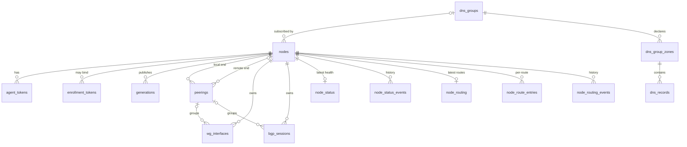

# 数据库 Schema 参考

本文是控制面数据库 schema 的单一事实源——表、字段、关系、写入路径、迁移。

所有表定义于 `apps/control-server/app/db/models/`，共享同一个 SQLAlchemy 声明性基类
`Base`（`apps/control-server/app/db/base.py:20`）。`Base.metadata` 注入了统一的命名约定
（`NAMING_CONVENTION`，`base.py:11`），保证索引 / 外键 / 唯一键 / 主键名跨数据库稳定一致：

| 类型 | 模板 |
| --- | --- |
| 索引 `ix` | `ix_%(table_name)s_%(column_0_N_name)s` |
| 唯一键 `uq` | `uq_%(table_name)s_%(column_0_N_name)s` |
| 检查 `ck` | `ck_%(table_name)s_%(constraint_name)s` |
| 外键 `fk` | `fk_%(table_name)s_%(column_0_N_name)s_%(referred_table_name)s` |
| 主键 `pk` | `pk_%(table_name)s` |

引擎装配在 `apps/control-server/app/db/engine.py`：`Database` 封装一个异步
`AsyncEngine` + `async_sessionmaker`（`expire_on_commit=False`，`pool_pre_ping=True`）。
对 SQLite 有两处特殊处理：

- `check_same_thread=False`（`engine.py:28`）——异步多任务下放开 same-thread 限制。
- 每个新连接执行 `PRAGMA foreign_keys=ON`（`engine.py:40`）——SQLite 默认外键关闭，不开
  则所有 `ondelete` 子句（如 `Peering.remote_node_id` / `EnrollmentToken.node_id` 的
  `SET NULL`、`AgentToken.node_id` 的 `CASCADE`）变成死字。

时间戳列统一用 `DateTime(timezone=True)`，Python 侧默认 `datetime.now(timezone.utc)`，
DB 侧 `server_default=func.now()`；`updated_at` 列额外带 `onupdate`。

---

## 聚合根与模型概览

数据模型有三个核心组织点：

- **`Node` 是节点的聚合根。** 一行 `nodes` 持有该节点的身份字段（`node_id` 主键、`asn`、
  `router_id`、loopback、前缀）、`base_template`（DesiredState 中不来自子表的部分）以及
  `current_generation`（已发布的最新世代号）。它的子表（`agent_tokens`、`peerings`、
  `wg_interfaces`、`bgp_sessions`、`generations`）全部 `cascade="all, delete-orphan"`，
  删节点连带删子行。WG 节点身份（公钥 + 私钥托管密文）也是节点级事实，落在 `nodes` 上。
- **`Peering` 是网络对等关系的聚合根。** 一条 peering 对应 0..1 条 `WgInterface` + 0..N 条
  `BgpSession`（均 `cascade="all, delete-orphan"`）。`local_node_id` 指本端节点
  （`CASCADE`），`remote_node_id` 可空、指向另一受管节点（`SET NULL`）——materializer 据此
  现取现填对端 WG 公钥并区分内外部互联（见「Materialize 写入路径」）。
- **`DnsGroup` 是共享模型，节点通过 `Node.dns_group_id` 订阅。** DNS 不再按节点保存；多个
  节点指向同一组即拿到同一份配置 = anycast / 任播。组被删时 `Node.dns_group_id` 置 NULL
  （节点停跑 DNS，不连带删节点）。

关系一览（→ 表示外键指向；括号内为 `ondelete`）：

```
nodes (聚合根)
 ├─ agent_tokens.node_id            → nodes.node_id   (CASCADE)
 ├─ enrollment_tokens.node_id       → nodes.node_id   (SET NULL)
 ├─ generations.node_id             → nodes.node_id   (CASCADE)   UNIQUE(node_id, generation)
 ├─ peerings.local_node_id          → nodes.node_id   (CASCADE)   UNIQUE(local_node_id, name)
 ├─ peerings.remote_node_id         → nodes.node_id   (SET NULL)
 ├─ wg_interfaces.node_id           → nodes.node_id   (CASCADE)   UNIQUE(node_id, name)
 │   └─ wg_interfaces.peering_id    → peerings.id     (SET NULL)
 ├─ bgp_sessions.node_id            → nodes.node_id   (CASCADE)   UNIQUE(node_id, name)
 │   └─ bgp_sessions.peering_id     → peerings.id     (SET NULL)
 ├─ node_status.node_id             → nodes.node_id   (CASCADE)   (PK)
 ├─ node_status_events.node_id      → nodes.node_id   (CASCADE)
 ├─ node_routing.node_id            → nodes.node_id   (CASCADE)   (PK)
 ├─ node_route_entries.node_id      → nodes.node_id   (CASCADE)
 ├─ node_routing_events.node_id     → nodes.node_id   (CASCADE)
 └─ nodes.dns_group_id              → dns_groups.id   (SET NULL)

dns_groups (共享聚合根)
 └─ dns_group_zones.dns_group_id    → dns_groups.id   (CASCADE)   UNIQUE(dns_group_id, zone)
     └─ dns_records.dns_group_zone_id → dns_group_zones.id (CASCADE)

admin_audit_log   （独立，无外键）
```



`WgInterface` / `BgpSession` 采用「索引列 + `spec` JSON」双层结构：少量字段（`name` /
`node_id` / `peering_id` / `enabled` / `kind` / `remote_asn`）做查询 / 约束，完整的 Pydantic
schema dump 放 `spec` 列，后端不必随 schema 演进改表（`peering.py:6`）。索引列由
`apply_spec()` 从校验过的 spec 派生投影，杜绝列与 JSON 漂移。

---

## 节点与身份

### nodes

节点聚合根。`apps/control-server/app/db/models/node.py:31`。

| 列 | 类型 | 约束/默认 | 说明 |
| --- | --- | --- | --- |
| `node_id` | String(64) | PK | 节点稳定字符串 ID（如 `edge1`）。 |
| `site` | String(32) | 可空 | 站点标识。 |
| `asn` | Integer | NOT NULL | 节点 ASN。 |
| `router_id` | String(64) | NOT NULL | BGP router-id。 |
| `loopback_ipv4` | String(64) | 可空 | 身份 loopback v4。 |
| `loopback_ipv6` | String(64) | 可空 | 身份 loopback v6。 |
| `ipv4_prefixes` | JSON | NOT NULL，默认 `[]` | 宣告的 v4 前缀列表。 |
| `ipv6_prefixes` | JSON | NOT NULL，默认 `[]` | 宣告的 v6 前缀列表。 |
| `inventory` | JSON | NOT NULL，默认 `{}` | agent 注册带来的可读元信息。 |
| `labels` | JSON | NOT NULL，默认 `{}` | 标签。 |
| `base_template` | JSON | NOT NULL，默认 `{}` | DesiredState 去掉 `generation`/`interfaces`/`bgp_sessions`/`dns` 后的部分（runtime / bird / templates / schema_version 等）。 |
| `current_generation` | Integer | NOT NULL，默认 `0` | 已发布最新世代号；0 = 尚未发布。 |
| `lifecycle` | String(16) | NOT NULL，默认 `active`，server_default `active` | `active` / `decommissioned`。退役态 materialize 产空 interfaces/bgp/dns。 |
| `dns_group_id` | Integer | FK→`dns_groups.id`（SET NULL），可空，index | 订阅的共享 DNS 组；NULL = 不部署 DNS。 |
| `wireguard_public_key` | String(64) | 可空 | 节点 WG 公钥（agent 上报，注册一致性校验的权威事实，传播进对端 peer 配置）。 |
| `wireguard_private_key_escrow` | Text | 可空 | 节点 WG 私钥经恢复公钥 RSA-OAEP 封装的密文；控制面只存不解。 |
| `created_at` / `updated_at` | DateTime(tz) | server_default now，`updated_at` 带 onupdate | 时间戳。 |

关系：`agent_tokens` / `peerings`（`foreign_keys=Peering.local_node_id`）/ `wg_interfaces` /
`bgp_sessions` / `generations` 均 `cascade="all, delete-orphan"`；`dns_group` 为 joined 只读。

### agent_tokens

长期 Bearer token，绑定具体节点。`node.py:148`。

| 列 | 类型 | 约束/默认 | 说明 |
| --- | --- | --- | --- |
| `token` | String(128) | PK | 非机密查找键 id（形如 `agt_xxxx`），明文 secret 永不落库。 |
| `token_hash` | String(128) | NOT NULL，unique，index | 完整 Bearer 的 sha256；校验只走它。 |
| `node_id` | String(64) | FK→`nodes.node_id`（CASCADE），NOT NULL，index | 绑定节点。 |
| `agent_id` | String(128) | NOT NULL | agent 标识。 |
| `issued_at` | DateTime(tz) | server_default now | 签发时刻。 |
| `expires_at` | DateTime(tz) | 可空 | 非空即会过期。 |
| `revoked_at` | DateTime(tz) | 可空 | 吊销时刻。 |

### enrollment_tokens

一次性注册 token。`node.py:123`。与 `AgentToken` 同安全模型。

| 列 | 类型 | 约束/默认 | 说明 |
| --- | --- | --- | --- |
| `token` | String(128) | PK | 非机密查找键 id（`ent_*`）。 |
| `token_hash` | String(128) | NOT NULL，unique，index | sha256；校验只走它。 |
| `node_id` | String(64) | FK→`nodes.node_id`（SET NULL），可空 | 空 = 尚未指定节点（管理员预生成）。 |
| `description` | String(256) | 可空 | 备注。 |
| `expires_at` | DateTime(tz) | 可空 | 过期时刻。 |
| `used_at` | DateTime(tz) | 可空 | 非空 = 已消费（一次性语义）。 |
| `created_at` | DateTime(tz) | server_default now | 创建时刻。 |

### pending_registrations

待审批的 agent 注册请求。`node.py:173`。

| 列 | 类型 | 约束/默认 | 说明 |
| --- | --- | --- | --- |
| `id` | Integer | PK，autoincrement | 主键。 |
| `requested_node_id` | String(64) | NOT NULL，index | 请求的节点 ID（重复注册刷新同一行）。 |
| `hostname` | String(255) | 可空 | 主机名。 |
| `inventory` | JSON | NOT NULL，默认 `{}` | 上报的硬件 / 系统信息。 |
| `status` | String(16) | NOT NULL，默认 `pending`，index | `pending` / `approved` / `rejected`。 |
| `note` | String(256) | 可空 | 审批备注。 |
| `created_at` / `updated_at` | DateTime(tz) | server_default now，`updated_at` 带 onupdate | 时间戳。 |

---

## 期望状态发布

### generations

每节点的已发布 DesiredState 世代快照。`apps/control-server/app/db/models/generation.py:31`。

| 列 | 类型 | 约束/默认 | 说明 |
| --- | --- | --- | --- |
| `id` | Integer | PK，autoincrement | 主键。 |
| `node_id` | String(64) | FK→`nodes.node_id`（CASCADE），NOT NULL，index | 所属节点。 |
| `generation` | Integer | NOT NULL | 世代号，节点内严格单调递增。 |
| `snapshot` | JSON | NOT NULL | 控制面渲染好的完整 DesiredState JSON，agent 直接读。 |
| `reason` | String(256) | 可空 | 发布原因备注。 |
| `published_at` | DateTime(tz) | server_default now | 发布时刻。 |

唯一约束 `UNIQUE(node_id, generation)`（`uq_generations_node_id_generation`）。当前世代由
`Node.current_generation` 指向。

---

## 网络配置

### peerings

对等关系聚合根。`apps/control-server/app/db/models/peering.py:40`。

| 列 | 类型 | 约束/默认 | 说明 |
| --- | --- | --- | --- |
| `id` | Integer | PK，autoincrement | 主键。 |
| `local_node_id` | String(64) | FK→`nodes.node_id`（CASCADE），NOT NULL，index | 本端节点。 |
| `remote_node_id` | String(64) | FK→`nodes.node_id`（SET NULL），可空，index | 对端受管节点（外部对等留空）；materializer 据此取对端 WG 公钥。 |
| `name` | String(64) | NOT NULL | peering 名。 |
| `remote_asn` | Integer | NOT NULL | 对端 ASN。 |
| `remote_label` | String(128) | 可空 | 对端标签。 |
| `is_internal` | Boolean | NOT NULL，默认 `False` | 内部互联（iBGP/OSPF）标志；影响 LLA 注入。 |
| `enabled` | Boolean | NOT NULL，默认 `True` | 启用标志。 |
| `notes` | String(512) | 可空 | 备注。 |
| `created_at` / `updated_at` | DateTime(tz) | server_default now，`updated_at` 带 onupdate | 时间戳。 |

唯一约束 `UNIQUE(local_node_id, name)`（`uq_peerings_local_node_id_name`）。关系：
`wg_interfaces` / `bgp_sessions` 均 `cascade="all, delete-orphan"`（selectin）；`local_node`
与 `remote_node` 用各自的 `foreign_keys` 消歧。

### wg_interfaces

节点接口资源（WireGuard / GRE / dummy 等）。`peering.py:93`。

| 列 | 类型 | 约束/默认 | 说明 |
| --- | --- | --- | --- |
| `id` | Integer | PK，autoincrement | 主键。 |
| `node_id` | String(64) | FK→`nodes.node_id`（CASCADE），NOT NULL，index | 所属节点。 |
| `peering_id` | Integer | FK→`peerings.id`（SET NULL），可空，index | 空 = 纯节点级接口（dummy lo、IGP 隧道等）。 |
| `name` | String(64) | NOT NULL | 接口名（`apply_spec` 从 spec 派生）。 |
| `kind` | String(32) | NOT NULL | 接口种类（`apply_spec` 从 `spec.kind` 派生）。 |
| `enabled` | Boolean | NOT NULL，默认 `True` | 控制面列；disabled 接口不进 snapshot。 |
| `spec` | JSON | NOT NULL | 完整 `InterfaceSpec` 的 Pydantic dump。 |
| `sort_order` | Integer | NOT NULL，默认 `0` | 排序键（materializer 按 `sort_order, id` 取）。 |

唯一约束 `UNIQUE(node_id, name)`（`uq_wg_interfaces_node_id_name`）。`apply_spec(InterfaceSpec)`
（`peering.py:121`）投影 `name` / `kind` / `spec`；`enabled` 由调用方单独维护。

### bgp_sessions

节点上的一条 BGP 会话。`peering.py:134`。

| 列 | 类型 | 约束/默认 | 说明 |
| --- | --- | --- | --- |
| `id` | Integer | PK，autoincrement | 主键。 |
| `node_id` | String(64) | FK→`nodes.node_id`（CASCADE），NOT NULL，index | 所属节点。 |
| `peering_id` | Integer | FK→`peerings.id`（SET NULL），可空，index | 关联 peering。 |
| `name` | String(64) | NOT NULL | 会话名（从 spec 派生）。 |
| `remote_asn` | Integer | NOT NULL | 对端 ASN（从 spec 派生）。 |
| `enabled` | Boolean | NOT NULL，默认 `True` | 从 spec 派生；disabled 会话仍进 snapshot 但 `enabled=False`。 |
| `spec` | JSON | NOT NULL | 完整 `BgpSessionSpec` 的 Pydantic dump。 |
| `sort_order` | Integer | NOT NULL，默认 `0` | 排序键。 |

唯一约束 `UNIQUE(node_id, name)`（`uq_bgp_sessions_node_id_name`）。`apply_spec(BgpSessionSpec)`
（`peering.py:158`）投影 `name` / `remote_asn` / `enabled` / `spec`；materializer 读取时
`_bgp_payload` 把列 `enabled` 投影回 spec。

---

## 共享 DNS

记录为中心的共享 DNS 三级模型（`apps/control-server/app/db/models/dns.py`）。节点经
`Node.dns_group_id` 订阅；materializer 把 组→zone→记录 组装成 `DnsSpec`。

### dns_groups

共享 DNS 组：一份可被多节点订阅的配置。`dns.py:39`。

| 列 | 类型 | 约束/默认 | 说明 |
| --- | --- | --- | --- |
| `id` | Integer | PK，autoincrement | 主键。 |
| `name` | String(255) | NOT NULL，unique | 组名。 |
| `bind_addresses` | JSON | NOT NULL，默认 `[]` | 提供 DNS 服务的 IP（anycast 监听地址）。 |
| `cache_ttl_seconds` | Integer | NOT NULL，默认 `300` | 缓存 TTL。 |
| `forwards` | JSON | NOT NULL，默认 `[]` | 转发（递归 resolver）配置；纯权威留空。 |
| `enabled` | Boolean | NOT NULL，默认 `True` | 禁用则订阅节点不部署 DNS。 |
| `created_at` / `updated_at` | DateTime(tz) | server_default now，`updated_at` 带 onupdate | 时间戳。 |

关系：`zones` `cascade="all, delete-orphan"`。

### dns_group_zones

组声明的权威 zone + 可选 SOA 覆盖。`dns.py:70`。

| 列 | 类型 | 约束/默认 | 说明 |
| --- | --- | --- | --- |
| `id` | Integer | PK，autoincrement | 主键。 |
| `dns_group_id` | Integer | FK→`dns_groups.id`（CASCADE），NOT NULL，index | 所属组。 |
| `zone` | String(255) | NOT NULL | 权威 zone（正向 `example.dn42` / 反向 `20.172.in-addr.arpa`）。 |
| `primary_ns` | String(255) | 可空 | SOA 主 NS（留空自动 `ns.<zone>`）。 |
| `admin_email` | String(255) | 可空 | SOA 管理邮箱（留空自动 `hostmaster.<zone>`）。 |
| `soa_refresh` | Integer | 可空 | SOA refresh（留空默认）。 |
| `soa_retry` | Integer | 可空 | SOA retry。 |
| `soa_expire` | Integer | 可空 | SOA expire。 |
| `soa_minimum` | Integer | 可空 | SOA minimum。 |
| `default_ttl` | Integer | 可空 | 默认 TTL。 |
| `enabled` | Boolean | NOT NULL，默认 `True` | 禁用 zone 不输出。 |
| `created_at` / `updated_at` | DateTime(tz) | server_default now，`updated_at` 带 onupdate | 时间戳。 |

唯一约束 `UNIQUE(dns_group_id, zone)`（`uq_dns_group_zones_group_id_zone`）。关系：`records`
`cascade="all, delete-orphan"`。

### dns_records

扁平 DNS 资源记录。`dns.py:117`。

| 列 | 类型 | 约束/默认 | 说明 |
| --- | --- | --- | --- |
| `id` | Integer | PK，autoincrement | 主键。 |
| `dns_group_zone_id` | Integer | FK→`dns_group_zones.id`（CASCADE），NOT NULL，index | 所属 zone。 |
| `name` | String(255) | NOT NULL | zone 内主机名（相对 / `@` / FQDN）。 |
| `type` | String(16) | NOT NULL | 记录类型（rDNS 即反向 zone 下 `PTR`）。 |
| `content` | Text | NOT NULL | 记录值。 |
| `ttl` | Integer | 可空 | 记录 TTL。 |
| `comment` | Text | 可空 | 仅供 WebUI，不进 zone 文件。 |
| `enabled` | Boolean | NOT NULL，默认 `True` | disabled 记录不输出。 |
| `sort_order` | Integer | NOT NULL，默认 `0` | 排序键。 |
| `created_at` / `updated_at` | DateTime(tz) | server_default now，`updated_at` 带 onupdate | 时间戳。 |

---

## 运行状态

### node_status

每节点最新运行时健康，随上报 upsert。`apps/control-server/app/db/models/node_status.py:33`。

| 列 | 类型 | 约束/默认 | 说明 |
| --- | --- | --- | --- |
| `node_id` | String(64) | PK，FK→`nodes.node_id`（CASCADE） | 主键即外键。 |
| `desired_generation` | Integer | 可空 | 控制面已发布的期望世代。 |
| `observed_generation` | Integer | 可空 | agent 实际观测到的世代。 |
| `last_report_status` | String(32) | 可空 | 最近对账状态（`succeeded`/`degraded`/`failed`/`skipped`）。 |
| `last_apply_status` | String(32) | 可空 | 最近 apply 状态。 |
| `drift_count` | Integer | NOT NULL，默认 `0` | 漂移计数。 |
| `health` | String(16) | NOT NULL，默认 `unknown` | 派生健康：`ok`/`degraded`/`stale`/`unknown`。 |
| `last_snapshot` / `last_report` / `last_apply` | JSON | 可空 | 最近一次完整 payload（面板下钻）。 |
| `last_snapshot_at` / `last_report_at` / `last_apply_at` | DateTime(tz) | 可空 | 对应时刻。 |
| `updated_at` | DateTime(tz) | server_default now，带 onupdate | 更新时刻。 |

### node_status_events

append-only 上报历史。`node_status.py:72`。写入按节点+种类裁剪到最近 `_HISTORY_KEEP` 条。

| 列 | 类型 | 约束/默认 | 说明 |
| --- | --- | --- | --- |
| `id` | Integer | PK，autoincrement | 主键。 |
| `node_id` | String(64) | FK→`nodes.node_id`（CASCADE），NOT NULL，index | 所属节点。 |
| `kind` | String(16) | NOT NULL，index | `snapshot` / `report` / `apply`。 |
| `generation` | Integer | 可空 | 关联世代。 |
| `status` | String(32) | 可空 | 状态。 |
| `payload` | JSON | NOT NULL | 完整上报 payload。 |
| `created_at` | DateTime(tz) | server_default now，index | 写入时刻。 |

---

## 路由

agent 周期上报的 `RoutingTableSnapshot` 持久化在这里，与 reconcile 健康分开
（`apps/control-server/app/db/models/routing.py`）。

### node_routing

每节点最新路由全表 + 预聚合，随上报 upsert。`routing.py:30`。

| 列 | 类型 | 约束/默认 | 说明 |
| --- | --- | --- | --- |
| `node_id` | String(64) | PK，FK→`nodes.node_id`（CASCADE） | 主键即外键。 |
| `observation` | String(16) | NOT NULL，默认 `not-observed` | 采集状态（`observed`/`unavailable`/`not-observed`）。 |
| `captured_at` | DateTime(tz) | 可空 | 采集时刻。 |
| `route_count` | Integer | NOT NULL，默认 `0` | 唯一前缀数（按最优路径去重）。 |
| `route_count_v4` / `route_count_v6` | Integer | NOT NULL，默认 `0` | 分族计数。 |
| `rpki_valid` / `rpki_invalid` / `rpki_not_found` | Integer | NOT NULL，默认 `0` | RPKI 分布计数（`rpki_unknown` 已被迁移 `a3b4c5d6e7f8` 删除）。 |
| `aggregates` | JSON | 可空 | 预聚合（origins / prefix_lengths / as_path_lengths / peers / routes_hash）。 |
| `updated_at` | DateTime(tz) | server_default now，带 onupdate | 更新时刻。 |

> 历史的 `routes` 单 JSON 列已由迁移 `f2a3b4c5d6e7` 删除，明细改存 `node_route_entries`。

### node_route_entries

逐路由明细，每路由一行。`routing.py:64`。前缀检索走 SQL `WHERE` + 索引 + `LIMIT`；写入按
内容哈希门控（哈希不变则跳过整表重写）。

| 列 | 类型 | 约束/默认 | 说明 |
| --- | --- | --- | --- |
| `id` | Integer | PK，autoincrement | 主键。 |
| `node_id` | String(64) | FK→`nodes.node_id`（CASCADE），NOT NULL | 所属节点（不单独建 index，由复合索引最左前缀覆盖）。 |
| `prefix` | String(64) | NOT NULL | 路由前缀。 |
| `is_v6` | Boolean | NOT NULL，默认 `False`，server_default `0` | 地址族（按 prefix 是否含冒号预判）。 |
| `local` | Boolean | NOT NULL，默认 `False`，server_default `0` | 本地起源（static/direct/device），供 scope 过滤。 |
| `primary` | Boolean | NOT NULL，默认 `False`，server_default `0` | 是否最优路径。 |
| `origin_asn` | Integer | 可空 | 起源 AS。 |
| `protocol` | String(128) | 可空 | 协议来源。 |
| `rpki` | String(16) | 可空 | RPKI 状态。 |
| `next_hop` | String(128) | 可空 | 下一跳。 |
| `as_path` / `communities` / `large_communities` | JSON | 可空 | 路径与团体属性。 |

复合索引（均以 `node_id` 打头）：`ix_node_route_entries_node_v6 (node_id, is_v6)`、
`ix_node_route_entries_node_local (node_id, local)`、
`ix_node_route_entries_node_prefix (node_id, prefix)`。

### node_routing_events

append-only 路由表时间序列（每次全表快照一条 + churn）。`routing.py:101`。按节点裁剪到最近
`_HISTORY_KEEP` 条。

| 列 | 类型 | 约束/默认 | 说明 |
| --- | --- | --- | --- |
| `id` | Integer | PK，autoincrement | 主键。 |
| `node_id` | String(64) | FK→`nodes.node_id`（CASCADE），NOT NULL，index | 所属节点。 |
| `captured_at` | DateTime(tz) | 可空 | 采集时刻。 |
| `route_count` / `route_count_v4` / `route_count_v6` | Integer | NOT NULL，默认 `0` | 表规模计数。 |
| `rpki_valid` / `rpki_invalid` / `rpki_not_found` | Integer | NOT NULL，默认 `0` | RPKI 计数（`rpki_unknown` 已被迁移 `a3b4c5d6e7f8` 删除）。 |
| `announced` / `withdrawn` | Integer | NOT NULL，默认 `0` | 相对上次快照的 churn（新增 / 撤销前缀数）。 |
| `created_at` | DateTime(tz) | server_default now，index | 写入时刻。 |

---

## 审计

### admin_audit_log

append-only Admin 写操作记录。`apps/control-server/app/db/models/audit.py:17`。无外键。每条
对应一次到达 `/api/v1/admin` 的变更类请求（POST/PUT/PATCH/DELETE），无论鉴权是否通过。

| 列 | 类型 | 约束/默认 | 说明 |
| --- | --- | --- | --- |
| `id` | Integer | PK，autoincrement | 主键。 |
| `actor` | String(64) | 可空，index | 鉴权通过的主体（当前单 token 模型为 `admin`）；失败时空。 |
| `method` | String(8) | NOT NULL | HTTP 方法。 |
| `path` | String(512) | NOT NULL，index | 请求路径。 |
| `status_code` | Integer | NOT NULL | 响应状态码。 |
| `detail` | JSON | NOT NULL，默认 `{}` | 详情。 |
| `created_at` | DateTime(tz) | server_default now，index | 写入时刻。 |

---

## Materialize 写入路径

控制面采用「normalized 表 → DesiredState 快照」的物化模型。入口有二：

- **Provision**：`provision_node_from_state`（`apps/control-server/app/db/provision.py:74`）
  把整份 `DesiredState` 落库。`_split_base_template` 切出 `Node.base_template`（剥掉
  `interfaces` / `bgp_sessions` / `generation`；`dns` 整段置 None——DNS 改共享组模型；并剥掉
  node 块里的身份字段 `node_id`/`asn`/`router_id`/loopback/prefixes，因为它们是 `nodes` 列的
  权威值，materialize 时由 `_node_payload` 无条件覆盖，避免存陈旧副本）。子表逐行 `apply_spec`
  写入。该函数幂等：节点已存在时覆盖 base_template、删并重建子表，再 materialize。
- **Admin 写**：管理员对 peerings / wg / bgp / dns 等表的增改删，提交前调用 `materialize`
  发布新世代。

`materialize(session, node_id, ...)`（`apps/control-server/app/services/materializer.py:33`）
流程：

1. `session.get(Node, node_id, with_for_update=True)` 行级锁住节点，让并发 admin 写在此处
   串行化，保证 generation 严格单调、不撞 `UNIQUE(node_id, generation)`（Postgres/MySQL 走
   `SELECT ... FOR UPDATE`；SQLite 忽略该子句，靠单写者 + UNIQUE 兜底）。
2. `new_generation = (current_generation or 0) + 1`。
3. `_assemble_snapshot` 把 `base_template` 叠加子表内容组装成完整 DesiredState dict：
   - `_node_payload`：DB 节点身份字段优先覆盖，base_template.node 兜底（提供 region 等非 DB
     字段）。
   - `_load_interfaces` / `_load_sessions`：按 `sort_order, id` 取子行。
   - **enabled 语义**：`InterfaceSpec` 无 `enabled` 字段，disabled 接口直接不进 snapshot；
     `BgpSessionSpec` 有 `enabled`，disabled 会话仍在 snapshot 但 `enabled=False`。
   - **对端 WG 公钥派生**（`_load_peer_public_keys` + `_interface_payload`）：对端是另一受管
     节点的接口（`peering.remote_node_id` 非空），取对端 `Node.wireguard_public_key` 现取现填
     进 `wireguard_peer.public_key`——真相源是对端节点的公钥，不再依赖 spec 副本。
   - **LLA 派生**：节点级 `NodeSpec.link_local` 注入到**外部 eBGP** WG 接口的 `addresses`
     （`fe80::X/64`），条件为接口是 WIREGUARD、`peering` 存在且 `is_internal=False`。内部互联
     用各自接口的 LL。
   - **DNS 派生**（`_load_dns_group`）：节点未分配组 / 组不存在 / 组禁用 ⇒ `dns=None`；否则按
     组→enabled zone→enabled 记录 组装 `DnsSpec`（每 zone 内联 records，SOA 留空自动生成）。空
     zone 不输出；无任何 zone 且无 forwards ⇒ None。多节点订阅同组拿到同一份 = anycast。
   - **退役处理**：`Node.lifecycle == "decommissioned"` 时，snapshot 的 `interfaces` /
     `bgp_sessions` 置空、`dns` 置 None——agent 收敛即拆所有隧道、撤所有 BGP、停止宣告路由；核心
     runtime 服务（router-netns/wg-gateway/bird-router）按 schema 要求保留为惰性空转。
4. `DesiredState.model_validate(snapshot)` 再走一遍 schema 校验（拒绝任何漂移，不通过即抛、由
   上层回滚事务），保证写入 `generations.snapshot` 的内容总是合法。
5. 写一条新 `Generation`（含 `snapshot` + `reason`），并把 `Node.current_generation` 指过去。
6. **世代保留裁剪**：`keep_generations`（默认 `DEFAULT_GENERATION_RETENTION = 100`，
   `materializer.py:30`）> 0 时，同一事务内删除 `generation <= new_generation - keep` 的旧代，
   防止 `generations` 表无界增长。当前代必然落在保留窗口内。

> materialize **不**触发 EventBus；由调用方在事务提交后决定是否广播事件，避免「事件先发、事务
> 后回滚」让 agent 拉到旧数据。

详见 [控制服务器内部](../internals/control-server.md) 与 [DesiredState 参考](../reference/desired-state.md)。

---

## 迁移（Alembic）

迁移脚本在 `migrations/versions/`，配置见 `alembic.ini`（`script_location = migrations`，
`file_template = %(rev)s_%(slug)s`）。`migrations/env.py` 从环境变量
`DN42_CONTROL_DATABASE_URL` 取 DSN（与运行时共享同一变量），并把 async driver 统一替换为同步
驱动跑迁移（`+aiosqlite`→空、`+asyncpg`→`+psycopg2`、`+asyncmy`→`+pymysql`）；`target_metadata`
= `Base.metadata`。

**后端库是 PostgreSQL**（ASN 等列用 `BigInteger`——DN42 ASN 4242420000+ 超 int32）。schema 由
启动期 `Base.metadata.create_all`（`main.py:55`）或 `alembic upgrade head` 建——**两者现已等价**：
alembic 链补全（初始迁移补建 `node_routing`/`node_routing_events`）后可从空库一路跑通，产出与
`create_all` 逐表逐列一致。

> 历史坑（早期 SQLite + create_all 起库期）：`create_all` 只建「最新模型」、不跑迁移里的数据剥离 /
> 列删除，故破坏性变更（删列）在 create_all 库需手动 `ALTER TABLE`——如迁移 `a3b4c5d6e7f8` 的
> `DROP COLUMN rpki_unknown`。现已迁到 PostgreSQL，新部署 create_all/alembic 任一即可。

迁移历史（按链表顺序）：

| revision | down_revision | slug | 内容 |
| --- | --- | --- | --- |
| `a0043f410bda` | （无，根） | initial_schema | 初始 schema：`nodes` 及核心表。 |
| `b1f2c3d4e5a6` | `a0043f410bda` | node_runtime_status | 新增 `node_status` / `node_status_events` 运行时健康表。 |
| `c2a3b4c5d6e7` | `b1f2c3d4e5a6` | token_hash_pending_registrations | `agent_tokens` 加 `token_hash`/`expires_at`+唯一索引；新增 `pending_registrations`。 |
| `d4e5f6a7b8c9` | `c2a3b4c5d6e7` | admin_audit_enrollment_hash | 新增 `admin_audit_log`；`enrollment_tokens` 改哈希存储（回填 + 收紧非空唯一）。 |
| `e5f6a7b8c9d0` | `d4e5f6a7b8c9` | **wireguard_key_escrow** | `nodes` 加 `wireguard_public_key` + `wireguard_private_key_escrow`（节点级 WG 身份/私钥托管）。 |
| `f6a7b8c9d0e1` | `e5f6a7b8c9d0` | **remove_compose_runtime_fields** | 去 docker-compose：从存量 `base_template`/`snapshot` JSON 剥 `runtime.adapter`/`templates.compose`/`templates.systemd`（strict schema 否则校验失败）。 |
| `a7b8c9d0e1f2` | `f6a7b8c9d0e1` | slim_build_spec | 从存量 DesiredState JSON 剥 `build.context`/`build.dockerfile`（router 镜像改 agent 内存生成）。 |
| `b8c9d0e1f2a3` | `a7b8c9d0e1f2` | node_lifecycle | `nodes` 加 `lifecycle`（active/decommissioned，server_default active）。 |
| `c9d0e1f2a3b4` | `b8c9d0e1f2a3` | **node_route_entries** | 新增 `node_route_entries` 索引表，逐路由明细从 `node_routing.routes` 单 JSON 列拆出；旧列暂保留写 NULL。 |
| `d0e1f2a3b4c5` | `c9d0e1f2a3b4` | **dns_groups** | DNS 从节点级 `dns_zones` 改共享组：新增 `dns_groups`/`dns_group_zones`/`dns_records`，`nodes` 加 `dns_group_id`。 |
| `e1f2a3b4c5d6` | `d0e1f2a3b4c5` | **drop_legacy_compat_shims** | 剥 DB 残留以删运行时垫片：去 `lookglass`/`looking-glass-*` 服务、归一化字符串端口、删 `aggregates` 里 prefilter 的 `unknown` 键（downgrade no-op）。 |
| `f2a3b4c5d6e7` | `e1f2a3b4c5d6` | **drop_node_routing_routes** | 删死列 `node_routing.routes`（明细已迁 `node_route_entries`）。 |
| `a3b4c5d6e7f8` | `f2a3b4c5d6e7` | **drop_rpki_unknown** | 删死列 `node_routing.rpki_unknown` / `node_routing_events.rpki_unknown`（RPKI「未知」三态已移除）。 |

链表当前的 head 为 `a3b4c5d6e7f8`。多处迁移用 `op.batch_alter_table` 以兼容 SQLite（无原生
`DROP COLUMN`）与 Postgres。

升级与迁移操作指引见 [升级与迁移](../guides/upgrades-and-migrations.md)。
