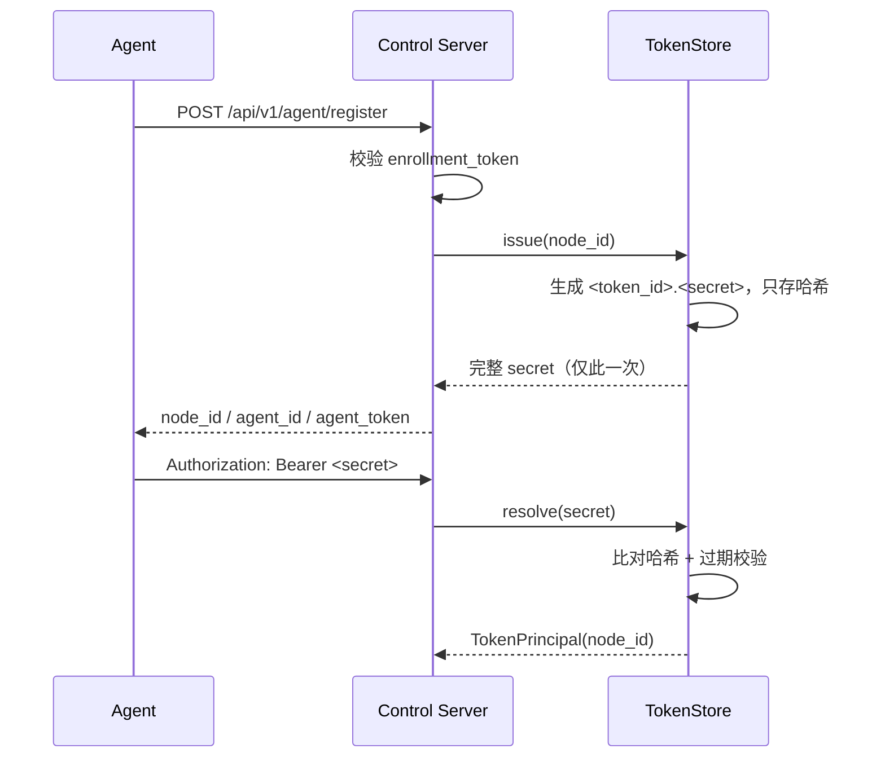
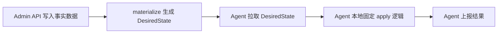

# 安全边界

系统的安全目标是：节点变更必须通过 `DesiredState` 表达，由 Agent 本地固定逻辑执行；Control Server 不提供远程 shell 或任意命令执行接口。

## 需要保护的接口

| 接口范围 | 风险 | 部署要求 |
| --- | --- | --- |
| `/api/v1/admin/...` | 可创建节点、修改接口/BGP/DNS、签发或撤销 token、批准注册、整节点 provision | 内置 Bearer 鉴权（`DN42_CONTROL_ADMIN_TOKEN`，未配置则整体 403 fail-closed）；建议再叠加内网/VPN/网关隔离 |
| `/api/v1/agent/register` | 可用 enrollment token 换取 agent token | enrollment token 需要妥善分发和保存；支持按节点签发的一次性 token |
| `/api/v1/agent/...` | 可拉取节点 `DesiredState` 或上报节点状态 | Bearer token 只能给对应节点 Agent 使用 |
| `/api/v1/agent/ws/{node_id}` | 可订阅节点事件 | 使用 Bearer token；token 与路径节点不一致即拒绝 |

## Agent 认证模型



校验规则：

| API | 规则 |
| --- | --- |
| `GET /api/v1/agent/desired-state` | 只能读取 token 绑定节点 |
| `POST /api/v1/agent/runtime-snapshot` | payload `node_id` 必须等于 token 绑定节点，否则 `403` |
| `POST /api/v1/agent/reconciliation-report` | 同上 |
| `POST /api/v1/agent/apply-result` | 同上 |
| `WS /api/v1/agent/ws/{node_id}` | token 缺失/无效/过期 close `4401`；token 与路径 `node_id` 不一致 close `4403` |

## Agent token 哈希存储

Agent token 的生命周期由 `TokenStore`（`app/services/tokens.py`）管理：

| 性质 | 实现 |
| --- | --- |
| 格式 | 随机签发的 token 为 `<token_id>.<secret>`，`token_id` 形如 `agt_xxxxxx`（非机密），`secret` 为随机 urlsafe base64 |
| 存储 | 数据库只存完整 secret 的 SHA-256（`agent_tokens.token_hash`），明文永不落库 |
| 字面量 token | bootstrap / provision 指定的固定字面量同样只存哈希，主键为从哈希确定性派生的 `agt_*` id（重复 provision 幂等） |
| 字面量形状校验 | 管理面创建端点（`POST /admin/nodes/{id}/agent-tokens`、`POST /admin/enrollment-tokens`）显式指定 `token` 字面量时，强制 base64url 字母表 + ≥22 字符（约 132 bit），不合规直接 `400`，挡掉弱口令 / 被截断的 token |
| 一次性返回 | 原始 secret 只在签发 / 轮换响应中出现一次，之后任何接口都查不到 |
| 解析 | `resolve` 只按哈希查找，没有明文回退路径 |
| 过期 | 可选 `expires_at`（签发时用 `ttl_seconds` 设置），过期 token 解析失败 |
| 轮换 | `POST /admin/agent-tokens/{token_id}/rotate` 撤销旧 token 并签发新 token |
| 撤销 | `DELETE /admin/agent-tokens/{token_id}` |

注意：固定字面量 token 的强度取决于字面量本身（如 `mvp-agent-token` 这种弱字面量），仅适合本地联调；生产应使用随机签发 + `ttl_seconds`。形状校验只覆盖管理面显式指定的字面量；自动生成的 `<id>.<secret>`（含点号）与 bootstrap/provision 路径不经此校验，鉴权侧的统一强制待生产 token 格式落地（见 [TODO.md](TODO.md)）。

## 注册审批闸门

控制面不认识的节点第一次 `register` 时不会被放行，而是写入 `pending_registrations` 进入待审批队列，响应 `pending-approval` 且**不签发 token**。管理员通过 `GET /admin/registrations` 查看、`approve` / `reject` 处理。

审批状态在发 token 前强制校验：

| 状态 | register 行为 |
| --- | --- |
| `rejected` | 一律 `403`，**即使节点已被 provision** |
| `pending` | 不发 token（已 provision 也只返回 `pending-approval`） |
| `approved` 但未 provision | 返回 `pending-approval` 等待 provision，不会被重新顶回 pending 队列 |
| `approved` 且已 provision / 无审批记录（管理员直接 provision） | 签发 agent token |

approve 只是放行名单；节点真正工作还需要 provision 下发 `DesiredState`（见 [operations.md](operations.md#新节点接入与审批)）。这保证了拿到 enrollment token 的未知机器最多能"排队"，不能直接获得任何节点配置或凭据。

## Admin API 保护

所有 `/api/v1/admin/*` 请求必须携带 `Authorization: Bearer <DN42_CONTROL_ADMIN_TOKEN>`。**未配置该环境变量时 admin API 整体 fail-closed（一律 403）**——不存在"忘了配置就裸奔"的状态。比较走 SHA-256 摘要 + 常数时间比较；agent token 不能用于 admin API。

当前是单 token 模型（审计 actor 固定为 `admin`）；RBAC / 多管理员 / 网关集成见 [TODO.md](TODO.md)。纵深防御上仍建议叠加网络层保护：

| 方式 | 说明 |
| --- | --- |
| 只监听 `127.0.0.1` | 仅允许本机脚本调用 |
| 内网监听 | 只暴露给受信网络 |
| VPN | 通过 VPN 访问控制平面 |
| 反向代理认证 | 使用 Basic Auth、OIDC、mTLS 或内部网关 |
| 防火墙 | 禁止公网访问 |

高风险示例：

```text
POST /api/v1/admin/provision
POST /api/v1/admin/nodes/{node_id}/interfaces
POST /api/v1/admin/nodes/{node_id}/bgp-sessions
POST /api/v1/admin/nodes/{node_id}/agent-tokens
POST /api/v1/admin/registrations/{id}/approve
```

这些接口可以改变节点路由配置或签发 Agent token，不能直接暴露给未授权调用方。

## 禁止的控制模型

系统不提供这些接口：

```text
POST /api/v1/agent/exec
POST /api/v1/agent/shell
POST /api/v1/agent/run-script
```

原因：

| 问题 | 说明 |
| --- | --- |
| 绕过 `DesiredState` | 任意命令无法被 schema 校验和 generation 审计 |
| 难以回滚 | 命令副作用不一定能从控制平面恢复 |
| 攻击面过大 | Agent 本机权限较高，远程命令会放大风险 |

正确变更路径：



## 文件写盘安全

渲染文件通过 `RenderedFile` 表达：

```python
RenderedFile(path="bird/bird.conf", content="...")
```

路径校验规则：

| 规则 | 目的 |
| --- | --- |
| 必须是相对路径 | 防止写入任意绝对位置 |
| 不能以 `/` 或 `\` 开头 | 防止 Unix/Windows 绝对路径 |
| 不能包含 Windows 盘符 | 防止 `C:\...` |
| 不能包含 `..` | 防止目录逃逸 |
| 不能包含 NUL | 防止底层文件 API 截断或绕过 |

Agent 写盘目录：

```text
<state_dir>/nodes/<node_id>/rendered
```

推荐生产路径：

```text
/var/lib/dn42-control/nodes/edge1/rendered
```

## Docker 资源边界

Agent 使用 labels 标识受管资源：

| label | 作用 |
| --- | --- |
| `dn42.managed=true` | 标识资源由本系统管理 |
| `dn42.node_id=<node_id>` | 标识资源归属节点 |
| `dn42.config_hash=<sha256[:16]>` | 容器的内容寻址身份：定义该容器的配置输入的哈希，重建判定的唯一依据 |
| `dn42.component=<service.role>` | 标识资源角色，例如 `bird-router` |

Agent 观察和规划容器时按节点过滤，避免误操作其他节点或其他项目的容器。

## Secret 引用与 WireGuard 私钥托管

`DesiredState` 中的私钥字段使用引用，不写明文密钥：

```json
{
  "private_key_ref": "secret://nodes/edge1/wireguard/wg-example/private-key"
}
```

文档、日志、runtime snapshot、reconciliation report 与持久渲染产物（`.conf`）都不输出 WireGuard private key 或 preshared key 明文。WireGuard key 校验器的错误信息也不会回显密钥原文。

### 闭环：本地生成 + 离线公钥托管（一节点一把私钥）

节点对外只有**一个** WireGuard 身份：一把私钥，所有 peer 共用。`secret://` 引用由 agent 在本地兑现，控制面**永不持有 WG 私钥明文**：

1. **本地生成、本地持有**：agent 首次需要时本地生成一把 X25519 密钥对（`dn42_common.crypto`），私钥落 `<state_dir>/nodes/<node>/secrets/wireguard/node.key`（0600），不进渲染产物、不入 file plan、不上报。
2. **托管（escrow）**：agent 用控制面下发的"恢复公钥"对私钥做 RSA-OAEP 封装，连同**公钥**一起上报；控制面把密文存进 `nodes.wireguard_private_key_escrow`，只存不解。只有离线保管的恢复私钥能解封。即便控制面被完整攻陷，DB 里也只有解不开的密文。
3. **apply 注入**：apply 时 agent 经 `docker cp` 把私钥推进 wg 容器的临时文件 `/run/dn42-control/secrets/node.key`（`docker cp` argv 只含路径，私钥不进日志）；`apply-<iface>.sh` 只在喂给 `wg syncconf` 的**临时副本**里把 `secret://` 占位符替换为真实私钥。持久 `/etc/wireguard/<iface>.conf` 永远保留占位符——因此 `config_hash` 跨密钥轮换稳定、不触发重建。

恢复公钥经 `DN42_CONTROL_RECOVERY_PUBLIC_KEY`（内联 PEM 或文件路径）配置，由 `GET /agent/recovery-public-key` 分发（公钥非秘密，真实性靠 TLS，响应附 SHA-256 指纹供核对）。未配置时跳过托管、只做下面的一致性校验。离线恢复私钥的生成与解封用 `tools/dn42-recover`（见 [`secrets/README.md`](../secrets/README.md)）；该私钥须 passphrase 加密、绝不入库、绝不部署到控制面主机。

### 注册一致性校验（公钥不漂移）+ 对端传播

agent 上报的公钥永远派生自它本地真实持有的私钥，因此**公钥比对天然也是持有性证明，无需额外签名**。控制面把 `nodes.wireguard_public_key` 当作节点级权威身份，`POST /agent/wireguard-keys` 严格校验：

| 情况 | 处理 |
| --- | --- |
| 节点首次上报公钥 | 登记（`stored`），并**向对端传播**（见下） |
| 与记录公钥一致 | 放行（`matched`），顺带刷新托管密文——这正是"恢复了原私钥的正确重建" |
| 与记录公钥**不一致** | **409 拒绝**（事务回滚），agent 不得用偏离密钥拉起隧道；要改本端密钥只能走显式轮换 |

这道闸门堵死了"节点重建后导入了错误密钥 → 对端 peer 仍配旧公钥 → 隧道静默断" 这类节点级配置事故。正确的恢复流程是：重建节点 → 用 `tools/dn42-recover` 离线还原原 WG 私钥并导入 → 上报公钥与记录一致 → 隧道无感恢复。

**对端传播**：因为一节点一把公钥，传播无歧义——节点公钥首次登记时，控制面把所有 `peering.remote_node_id == 本节点` 的 WireGuard 接口的 `wireguard_peer.public_key` 回填为该公钥，并重新物化、广播这些对端节点。内部 peering 由此两端自动打通；外部 eBGP peer（`remote_node_id` 为空）不受影响，其对端公钥保持人工配置的外部值。

## Enrollment token 要求

Enrollment token 用于首次注册，`register` 接受两类：

| 类型 | 来源 | 语义 |
| --- | --- | --- |
| 全局 bootstrap token | `DN42_CONTROL_ENROLLMENT_TOKEN` 配置 | 任意节点可用、可重复使用；设为空可整体关闭 |
| 表内一次性 token | `POST /admin/enrollment-tokens` 签发 | 哈希存储（明文仅创建响应可见一次）；可绑定 `node_id`（绑定后只对该节点有效）；可设 `expires_at`；**成功换取 agent token 后立即消费失效**（注册结果为 pending-approval 时不消费） |

生产环境建议：

| 要求 | 状态 |
| --- | --- |
| 全局 token 必须改掉默认值（或设为空，只用按节点 token） | 部署时必做 |
| 未知节点进入审批，不自动签发长期 token | 已实现 |
| 每节点独立 token、过期与一次性消费强制校验 | 已实现 |

## 审计

| 事件 | 现状 |
| --- | --- |
| Agent 上报 snapshot / report / apply-result | 已持久化到 `node_status_events`（每节点最近 100 条） |
| Control Server 发布 generation | 已持久化到 `generations`（含 `reason`） |
| Agent 注册申请与审批决定 | 已持久化到 `pending_registrations`（含 `note`） |
| Admin 写操作（CRUD / provision / 审批 / token 签发、轮换、撤销） | 已持久化到 `admin_audit_log`（append-only，不自动裁剪） |
| 鉴权失败的 Admin 写尝试 | 同样落 `admin_audit_log`（`actor` 为空，记录状态码） |

`admin_audit_log` 由 HTTP 中间件统一写入：所有到达 `/api/v1/admin` 的 POST / PUT / PATCH / DELETE 请求记录 `actor`（鉴权主体）、`method`、`path`、`status_code` 与时间戳；查询走 `GET /admin/audit-log`。记录请求体 before/after 快照与 request_id 关联属于后续增强（见 [TODO.md](TODO.md)）。
