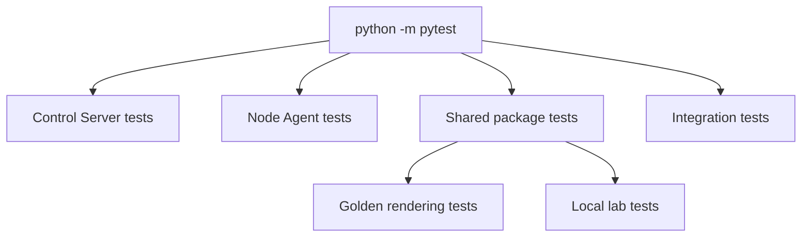
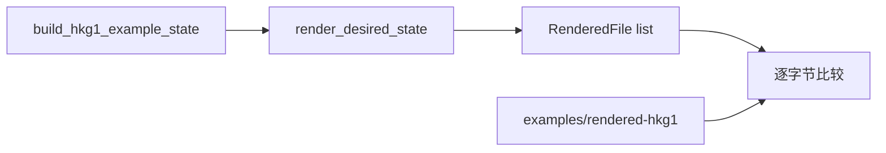

# 测试

本仓库使用 `pytest`。测试覆盖 Control Server、Node Agent、共享包、渲染模板、本地 lab 示例和多节点集成场景。

## 测试入口

`pyproject.toml` 已配置测试目录和 `pythonpath`：

```toml
[tool.pytest.ini_options]
testpaths = ["tests", "apps/node-agent/agent/tests", "apps/control-server/app/tests"]
asyncio_mode = "auto"
pythonpath = [
  "apps/control-server",
  "apps/node-agent",
  "packages/dn42_common",
  "packages/dn42_schemas",
  "packages/dn42_templates",
  "packages/dn42_runtime"
]
```

全量测试：

```bash
python -m pytest
```

指定文件或函数：

```bash
python -m pytest tests/unit/test_desired_state_schema.py -q
python -m pytest tests/unit/test_runtime_file_plan_safety.py::test_rejects_parent_escape -q
```

语法和导入检查：

```bash
python -m compileall apps packages tests
```

## 测试结构



## Control Server Tests

目录：`apps/control-server/app/tests/`

| 文件 | 覆盖内容 |
| --- | --- |
| `conftest.py` | 测试配置、临时数据库、FastAPI `TestClient` |
| `test_health.py` | `/healthz`、`/api/v1/healthz` |
| `test_db_repositories.py` | `TokenStore`、`DesiredStateStore`、`NodeStatusStore`、`PendingRegistrationStore`、generation bump |
| `test_agent_register.py` | enrollment token、Agent 注册、未知节点 pending-approval |
| `test_agent_http_auth.py` | Bearer token 鉴权、`node_id` 绑定校验 |
| `test_agent_ws.py` | WebSocket 鉴权（4401/4403）、`hello`、`desired_state_updated`、`snapshot_request` |
| `test_admin_crud.py` | nodes、peerings、interfaces、BGP sessions、DNS zones、generation 递增 |
| `test_node_status_and_tokens.py` | token 哈希/过期/轮换、健康推导、status-events |

```bash
python -m pytest apps/control-server/app/tests -q
```

测试方式：

| 技术 | 用途 |
| --- | --- |
| FastAPI `TestClient` | 触发应用 lifespan、路由、依赖注入 |
| 临时 SQLite 数据库 | 隔离每次测试的数据 |
| WebSocket test client | 验证 Agent 事件通道 |
| seed 数据 | 测试配置开启 `seed_bootstrap_node`，提供 hkg1 示例节点 |

## Node Agent Tests

目录：`apps/node-agent/agent/tests/`

| 文件 | 覆盖内容 |
| --- | --- |
| `test_core_config.py` | TOML、环境变量、CLI override、非法配置 |
| `test_core_naming.py` | runtime 项目名、容器名 |
| `test_main_cli.py` | CLI 解析、`--once`/`--plan-only` 语义、常驻模式要求 controller_url |
| `test_persistence.py` | `identity.json`、`desired-state.json` 读写与损坏处理 |
| `test_orchestrator.py` | `run_once()`、controller 模式、离线模式、三种 mode（apply / write-rendered / plan-only） |
| `test_watch.py` | WS URL 构造、事件过滤、stop_event、reconcile 触发 |
| `test_planner_health.py` | container plan、runtime snapshot、对账报告 |
| `test_apply_backends.py` | Docker API backend、`ApplyExecutor`、拓扑排序、端口/卷/健康检查映射 |
| `test_convergence.py` | `birdc configure` 热重载、WireGuard 脚本重放、尽力而为容错 |
| `test_network_collectors.py` | WireGuard dump、BIRD protocol 解析 |

```bash
python -m pytest apps/node-agent/agent/tests -q
```

测试方式：

| fake 对象 | 作用 |
| --- | --- |
| fake `controller_client` | 不访问真实 HTTP 服务 |
| fake `docker_observer` | 不访问真实 Docker Engine |
| fake `apply_executor` / `command_runner` | 不创建真实容器、不执行真实命令 |
| `tmp_path` | 验证本地状态目录和渲染目录 |

## Shared Package Tests

目录：`tests/unit/`

| 主题 | 代表文件 |
| --- | --- |
| `dn42_common` 校验器 | `test_common_validators.py`、`test_common_wireguard.py`、`test_common_domain.py`、`test_common_dn42_address_space.py`、`test_common_link_local.py` |
| labels / naming / communities | `test_common_labels.py`、`test_common_naming.py`、`test_common_communities.py` |
| `dn42_schemas` | `test_desired_state_schema.py`、`test_node_spec_dn42.py`、`test_runtime_build_spec.py`、`test_schemas_phase_c.py` |
| canonical IO | `test_schemas_canonical_io.py` |
| templates | `test_config_bird2_templates.py`、`test_dns_zone_rendering.py`、`test_templates_cli.py`、`test_template_package_architecture.py` |
| runtime | `test_runtime_file_plan_safety.py`、`test_runtime_role_defaults.py`、`test_runtime_build_spec.py` |
| Agent 协议和渲染 | `test_agent_protocol_schema.py`、`test_agent_render_plan.py`、`test_node_agent_controller_flow.py` |
| 导入工具 | `test_import_node_config.py` |
| lab examples | `test_local_two_node_lab.py`、`test_local_three_node_lab.py`、`test_two_internal_one_ebgp_demo.py` |

```bash
python -m pytest tests/unit -q
```

## Integration Tests

目录：`tests/integration/`

| 文件 | 覆盖内容 |
| --- | --- |
| `test_three_node_control_plane.py` | 真实多节点闭环：provision 三节点 → agent 注册 → WS 事件 → reconcile → 状态上报 |

## Golden Rendering Tests

golden test 用来保护模板输出不被意外改变。

关键文件：

```text
tests/unit/test_golden_rendered_hkg1.py
examples/rendered-hkg1/
```



刷新 golden 文件：

```bash
python -c "from pathlib import Path; from dn42_schemas.testing import build_hkg1_example_state; from dn42_templates import render_desired_state; from dn42_runtime import write_rendered_files; write_rendered_files(render_desired_state(build_hkg1_example_state()), Path('examples/rendered-hkg1'))"
```

刷新后运行：

```bash
python -m pytest tests/unit/test_golden_rendered_hkg1.py -q
```

只有在 schema 默认值、模板或 runtime 输出有意改变时，才应刷新 `examples/rendered-hkg1/`。

## 部署验证

本地端到端验证步骤见 [operations.md](operations.md#本地开发运行)；三节点 compose 联调见 [operations.md](operations.md#docker-compose-三节点联调)。

## Docker 注意事项

大多数单元测试不需要 Docker。下面这些命令会访问 Docker Engine：

```bash
python -m agent.main --plan-only --state-dir .agent-state
python -m agent.main --once --state-dir .agent-state --desired-state state.json
```

`--plan-only` 不写盘、不部署，但会观察 Docker runtime。没有启动 Docker Desktop 或 Docker Engine 时，可能因为无法连接 Docker socket 或 Windows named pipe 而失败。

## Troubleshooting

| 现象 | 处理 |
| --- | --- |
| `ModuleNotFoundError: No module named 'dn42_schemas'` | 确认从仓库根目录运行，或设置 `PYTHONPATH` |
| `No module named pytest` | 安装 dev 依赖：`pip install -e .[dev]` |
| golden test 失败 | 判断输出是否有意改变；有意改变则刷新 `examples/rendered-hkg1/` |
| Agent plan-only 连接 Docker 失败 | 启动 Docker Desktop / Docker Engine，或改跑不访问 Docker 的单元测试 |
| `.pytest_cache` 权限 warning | 不影响测试结果，可删除或修复 `.pytest_cache` 目录权限 |
