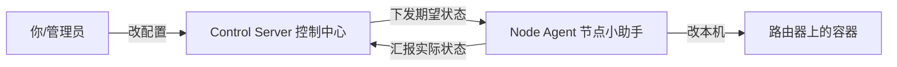
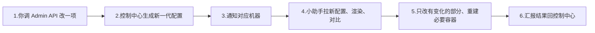

# 新手教程：从零上手 DN42 Control Backend

这份教程面向**第一次接触本项目的人**。它不假设你懂控制平面、BGP 自动化或容器编排，而是把每个功能拆成「这是什么、为什么需要、怎么一步步做」。如果你已经熟悉系统，请直接看 [架构文档](architecture.md) 和 [API 文档](api.md)。

> 阅读约定：命令默认在仓库根目录 `dn42-control-backend` 下执行；多行命令用反斜杠 `\` 续行（bash 约定）。

---

## 0. 先用大白话理解这套系统

想象你管着好几台 DN42 路由器。每台都要配 WireGuard 隧道、BIRD 路由、DNS……手动一台台改又累又容易错。

这套系统把「每台机器应该长什么样」写成一份**配置清单**（叫 `DesiredState`，意思是"期望状态"），然后：

- **Control Server（控制中心）**：保存这份清单，谁改了就生成新版本，并通知对应机器。
- **Node Agent（节点小助手）**：跑在每台路由器上，定时问控制中心"我最新该长什么样？"，然后**自动**把本机配置改成那样，再把"我现在实际什么样"汇报回去。

用一句话比喻：

> 控制中心是「班主任发作业」，节点小助手是「学生自己照着作业把房间收拾好，再拍照交回去」。

三个角色的关系：



---

## 1. 准备环境（只做一次）

安装依赖：

```bash
cd dn42-control-backend
python -m venv .venv
source .venv/bin/activate
pip install -e .[dev]
```

如果导入子包报错，设置一次搜索路径：

```bash
export PYTHONPATH=apps/control-server:apps/node-agent:packages/dn42_common:packages/dn42_schemas:packages/dn42_templates:packages/dn42_runtime
```

---

## 2. 教程一：把控制中心跑起来

**它是什么**：一个 Web 服务，存配置、发配置、收汇报。

**怎么做**：

```bash
# 练手时建议开启内置示例节点（默认不开，启动即空库）
export DN42_CONTROL_SEED_BOOTSTRAP_NODE=1
uvicorn app.main:app --app-dir apps/control-server --reload --host 0.0.0.0 --port 8000
```

跑起来后打开浏览器：

- 服务地址：`http://127.0.0.1:8000`
- 自动生成的接口文档（可以直接点着试）：`http://127.0.0.1:8000/docs`
- 健康检查：访问 `http://127.0.0.1:8000/healthz` 应返回 200

**确认活着**：

```bash
curl -s "http://127.0.0.1:8000/healthz"
```

> 小知识：第一次启动时，系统会自动建好数据库。只有设置了 `DN42_CONTROL_SEED_BOOTSTRAP_NODE=1`，才会在空库里塞一个示例节点 `edge1`（方便你练手）；不设置则启动即空库，节点要靠教程二的导入或审批流程进来。全部环境变量见 [配置参考](configuration.md)。

---

## 3. 教程二：把一台已有的路由器"导入"控制中心

**它是什么**：如果你手上已经有一台传统方式配好的 DN42 节点（一堆 bird/wireguard 配置文件），可以用一个脚本把它们一次性"读"进控制中心，变成受管节点。

**怎么做**（推荐走 HTTP，不直接碰数据库）：

```bash
python scripts/tools/import_node_config.py 迁移配置/hkg1 \
  --node-id edge1 \
  --controller-url http://127.0.0.1:8000 \
  --agent-token my-secret-token
```

逐项解释参数：

| 参数 | 大白话含义 |
| --- | --- |
| `迁移配置/hkg1` | 你那台机器现有配置文件所在的文件夹 |
| `--node-id edge1` | 给这台机器起的唯一名字 |
| `--controller-url` | 控制中心地址；**填了就走网络导入，不用直连数据库** |
| `--agent-token` | 给这台机器配一把"门钥匙"，之后小助手用它登录 |
| `--wg-port-range` | WireGuard 监听端口范围（默认 `51800-51899`），入站 peer 必须落在这个范围 |
| `--dry-run` | 只解析、打印结果，不真正写入（先看看对不对） |

**先试不写入**：加 `--dry-run`，它只会把解析出来的"期望状态"打印出来给你检查。

> 为什么有端口范围这一项？因为"别人主动拨进来"的 WireGuard 隧道，必须在主机上对外开放对应 UDP 端口，否则永远握不上手。这个范围就是告诉系统"放行哪些端口"。

---

## 4. 教程三：在路由器上启动"节点小助手"（常驻模式）

**它是什么**：跑在路由器本机的常驻进程，自动保持本机配置和控制中心一致。

**核心理念**：默认就是**后台常驻**——启动后它会一直连着控制中心，配置一变就立刻自动应用。你不需要每次手动跑。

**怎么做**（最简单的常驻启动）：

```bash
python -m agent.main --config /etc/dn42-control/agent.toml
```

配置文件 `agent.toml` 长这样：

```toml
[agent]
controller_url = "http://127.0.0.1:8000"   # 控制中心地址
enrollment_token = "enroll-token"           # 第一次注册用的通行证
requested_node_id = "edge1"             # 我是哪台机器
state_dir = "/var/lib/dn42-control/agent-state"  # 本地状态存哪
```

**三种运行模式**，按需选：

| 你想干嘛 | 用什么 | 会不会改本机 |
| --- | --- | --- |
| 正常长期运行（默认） | `python -m agent.main` | 会，自动持续保持一致 |
| 只跑一次看看效果就退出 | 加 `--once` | 会，部署一次后退出 |
| 只演练不动手（排错用） | 加 `--plan-only` | 不会，只算"该改哪些" |

> 还有一个进阶维度 `--mode`（也可用环境变量 `DN42_AGENT_MODE`）：默认 `apply` 真实部署；`write-rendered` 只渲染配置文件、不碰容器，适合没有 Docker 的演示环境。旧版的 `--watch`、`--apply-local` 参数已经移除。

**生产环境用 systemd 托管**（开机自启、崩了自动拉起）：参考 [deploy/systemd/dn42-node-agent@.service](../deploy/systemd/dn42-node-agent@.service)，关键是 `Type=simple` + `Restart=always`，`ExecStart` 就是上面那条常驻命令。

---

## 5. 教程四：新机器申请加入 + 你来审批

**它是什么**：一台控制中心还不认识的新机器，第一次来报到时，不会被直接放行，而是进入"待审批"列表，由你人工点头。这是一道安全闸门。

**发生了什么**（自动）：新机器的小助手调用注册接口 → 控制中心发现"不认识它" → 把它记进**待审批名单**，返回"挂起，等管理员批准"。

**你怎么审批**：

> 所有 `/api/v1/admin/*` 接口都要带管理员凭据：
> `-H "Authorization: Bearer <DN42_CONTROL_ADMIN_TOKEN>"`（下文示例省略）。

1. 看有谁在排队：

```bash
curl -s "http://127.0.0.1:8000/api/v1/admin/registrations?status=pending"
```

2. 批准第 3 号申请：

```bash
curl -s -X POST \
  "http://127.0.0.1:8000/api/v1/admin/registrations/3/approve" \
  -H "Content-Type: application/json" -d '{"note": "确认是我的机器"}'
```

3. 或者拒绝它：把上面的 `approve` 换成 `reject`。

> **重要**：批准 ≠ 直接能用。批准只是把它放进"门禁白名单"。真正要让它工作，还得给它下发配置（用教程二的导入，或 `POST /admin/provision` 灌一份期望状态）。下发完，它的小助手才能正式拿到 token 开始干活。

---

## 6. 教程五：管理"门钥匙"（Agent Token）

**它是什么**：每台机器的小助手都要用一把 token（令牌）才能登录控制中心。这一节教你怎么发、换、设过期、吊销。

**安全设计**（你只需知道结论）：token 在数据库里是**哈希存储**的（存的是指纹，不是明文），所以即使有人翻到数据库也偷不到原文。原始 secret 只在"签发的那一瞬间"返回一次，记得当场存好。

**常用操作**：

签发一把新钥匙（可设 7 天后过期）：

```bash
curl -s -X POST \
  "http://127.0.0.1:8000/api/v1/admin/nodes/edge1/agent-tokens" \
  -H "Content-Type: application/json" -d '{"ttl_seconds": 604800}'
# 响应里的 secret 字段就是钥匙原文，只出现这一次！
```

看某台机器有哪些钥匙（只显示元信息，不显示原文）：

```bash
curl -s "http://127.0.0.1:8000/api/v1/admin/nodes/edge1/agent-tokens"
```

轮换（吊销旧的、发一把新的，常用于定期换钥匙）：

```bash
curl -s -X POST \
  "http://127.0.0.1:8000/api/v1/admin/agent-tokens/<token_id>/rotate"
```

吊销（彻底作废）：

```bash
curl -s -X DELETE \
  "http://127.0.0.1:8000/api/v1/admin/agent-tokens/<token_id>"
```

> 给固定 token 也一样安全：导入/provision 时指定的固定字面量 token，数据库里同样只存哈希（主键是派生出来的 `agt_*` 编号），翻库也偷不到原文。

---

## 7. 教程六：随时看每台机器的"健康状况"

**它是什么**：控制中心会把每台机器汇报的"快照 / 对账 / 应用结果"都存下来，并自动判断它健不健康。你随时能查。

**健康状态怎么读**：

| 状态 | 含义 |
| --- | --- |
| `ok` | 一切正常，实际状态 = 期望状态 |
| `stale` | 落后了：机器还没追上最新配置，或太久没汇报 |
| `degraded` | 出问题了：应用失败、或检测到配置漂移 |
| `unknown` | 还没收到过任何汇报 |

**看整个机群概览**：

```bash
curl -s "http://127.0.0.1:8000/api/v1/admin/health"
# 返回类似：{"summary":{"ok":1},"nodes":[{...每台明细...}]}
```

**看某一台的详细健康**：

```bash
curl -s "http://127.0.0.1:8000/api/v1/admin/nodes/edge1/health"
```

**看某一台的历史事件**（排错神器，能看到它每次汇报了啥）：

```bash
curl -s "http://127.0.0.1:8000/api/v1/admin/nodes/edge1/status-events?kind=apply&limit=20"
```

`kind` 可选 `snapshot`（实际快照）、`report`（对账报告）、`apply`（应用结果）。

---

## 8. 教程七：改一个配置，让它在节点上生效

**它是什么**：日常运维最核心的动作——加一个 peer、改一个 BGP 会话、加一条 DNS 记录，然后让它自动推到机器上。

**整个流程**（你只做第 1 步，剩下自动）：



**举例：手动通知一台机器去拉最新配置**：

```bash
curl -s -X POST \
  "http://127.0.0.1:8000/api/v1/admin/nodes/edge1/notify" \
  -H "Content-Type: application/json" \
  -d '{"event": "desired_state_updated", "reason": "manual"}'
```

各类资源（节点、peering、接口、BGP 会话、DNS 区）的增删改接口，见 [API 文档](api.md)。

> 扰动范围：日常变更（加 peer、改会话、改 DNS）只会热加载对应配置——改哪条隧道只动哪条，其余 BGP 会话不受影响。只有改动容器本身的定义（端口范围、镜像、挂载等）才会重建相关容器，此时该节点的会话会短暂断开后自愈。

---

## 9. 教程八：给 BGP 会话起"人话名字"

**它是什么**：生成 BIRD 配置时，每个 BGP 邻居会有一个 protocol 名。以前是机器味十足的 `AS4242422189_v4`，现在可以用你自己起的、好记的会话名。

**怎么用**：在定义 BGP 会话（`BgpSessionSpec`）时，把 `name` 字段填成有意义的名字，比如：

```text
name = "iedon_4242422189_ex01_v4"
```

渲染出来的 BIRD 配置就会是：

```text
protocol bgp iedon_4242422189_ex01_v4 from dnpeers { ... }
```

而不是 `protocol bgp AS4242422189_v4`。

**好处**：在 `birdc show protocols` 里一眼就能认出"这是 iedon 的 ex01 v4 会话"，排错快得多。

> 兜底：如果某个会话没填 `name`，系统会自动退回老方案 `AS<asn>_v4`，不会报错。名字里的非法字符（非字母数字下划线）会被自动换成下划线，保证是合法的 BIRD 标识符。

---

## 10. 教程九：本地"自动重载"（Local Convergence）

**它是什么**：小助手部署完配置后，会顺手帮你把服务"热加载"，不用你手动进容器敲命令。

**它具体做什么**（部署成功后自动）：

- 对 BIRD 路由器执行 `birdc configure`（让 BIRD 重新读配置，幂等、安全）。
- 当 WireGuard 网关或 router-netns 容器被重建时，自动重放 WireGuard 的 `apply-*.sh` 脚本，把隧道重新拉起来。

**怎么开关**：默认开启。想关掉就设环境变量：

```bash
DN42_AGENT_LOCAL_CONVERGENCE=0
```

> 设计上是"尽力而为"：即使某一步热加载失败，也只会记一条警告，不会让整个部署崩掉。

---

## 11. 常见问题排查

| 现象 | 可能原因 / 怎么查 |
| --- | --- |
| 小助手连不上控制中心 | 检查 `controller_url` 是否可达；常驻模式**必须**配 `--controller-url` |
| 新机器注册后没反应 | 它在等审批，看教程四的待审批列表 |
| 健康显示 `stale` | 机器没追上最新一代，或太久没汇报；看 `status-events` 里最后一次时间 |
| 健康显示 `degraded` | 应用失败或有漂移；看该节点 `status-events?kind=apply` 的报错 |
| BGP 会话突然全断又自己好了 | 多半是隧道/容器重建触发，1～3 分钟自愈，属正常 |
| WireGuard 一直握不上手（handshake=0） | 入站 peer 的监听端口没在 `--wg-port-range` 内、没对外发布 |
| 想先演练不动机器 | 用 `--plan-only` 跑一遍看计划 |

更深入的内容：

- 配置清单每个字段的含义 → [desired-state.md](desired-state.md)
- 所有接口的完整定义 → [api.md](api.md)
- 部署到生产、节点接入、健康监控 → [operations.md](operations.md)
- 所有配置项和环境变量 → [configuration.md](configuration.md)
- 系统内部怎么运转 → [architecture.md](architecture.md)
- 安全边界与凭据 → [security.md](security.md)
