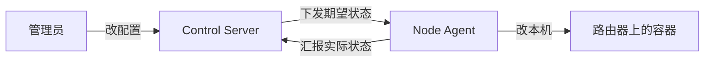

# 快速上手：本地从零跑通

这份教程面向第一次接触本项目的读者，目标是在本机把控制面 + 一个 agent 跑起来、看懂闭环。读完再看 [../guides/](../guides/)（怎么做某件事）和 [../reference/](../reference/)（查细节）。

> 命令默认在仓库根 `dn42-control-backend` 下执行；多行命令用反斜杠 `\` 续行（bash）。Windows 用 PowerShell 时把续行符换成反引号 `` ` `` 或写成一行。

## 心智模型（一句话）

> 控制面保存并下发 `DesiredState`，节点 agent 据此在本机渲染配置、部署容器、回报观察状态——单向声明、本地收敛，控制面不提供远程 shell。

控制面**标准形态**是三件套 `control-server + PostgreSQL + Redis`（缓存是旁路，不可用时回落 DB）；本机练手也可用最简的 `uvicorn + SQLite`。两种起法见第 2 步。



概念词汇见 [../overview.md](../overview.md#核心概念词汇表)。

## 1. 装依赖（只做一次）

```bash
cd dn42-control-backend
python -m venv .venv
source .venv/bin/activate
pip install -e .[dev]
```

如导入子包报错，设一次搜索路径：

```bash
export PYTHONPATH=apps/control-server:apps/node-agent:packages/dn42_common:packages/dn42_schemas:packages/dn42_templates:packages/dn42_runtime
```

## 2. 起控制面（两条路径，二选一）

### 路径 A —— 最简：`uvicorn + SQLite`（带 demo 节点，最快看懂闭环）

```bash
# 开内置示例节点 edge1（默认不播种，启动即空库）
export DN42_CONTROL_SEED_BOOTSTRAP_NODE=1
uvicorn app.main:app --app-dir apps/control-server --reload --host 0.0.0.0 --port 8000
```

- 数据库落在仓库根 `control.db`（SQLite），无需 PostgreSQL / Redis（缓存自动旁路）。
- 播种的 demo 节点 `edge1` 直接可供第 3 步的 agent 绑定。

### 路径 B —— 标准全栈：`docker compose`（control-server + PostgreSQL + Redis）

更接近生产的后端组合，一条 compose 拉起：

```bash
cp docker/.env.example docker/.env      # 至少改 POSTGRES_PASSWORD / DN42_CONTROL_ADMIN_TOKEN
docker compose -f docker/docker-compose.yml --env-file docker/.env up -d --build
```

- 默认仅发布到 `127.0.0.1:${CONTROL_PORT:-8000}`；启动期 `create_all` 在空库建当前 schema。
- 全栈**不播种** demo 节点，节点数据由导入 / `provision` 流程写入（见第 3 步说明与 [../guides/node-onboarding.md](../guides/node-onboarding.md)）。
- 栈说明 / 关停 / SQLite→PG 迁移见 [docker/README.md](../../docker/README.md) 与 [../guides/deployment.md](../guides/deployment.md)。

两条路径起好后都提供：

- 服务：`http://127.0.0.1:8000`
- 自动接口文档（可点着试）：`http://127.0.0.1:8000/docs`
- 健康探针：`curl -s http://127.0.0.1:8000/healthz` 返回 200

全部环境变量见 [../reference/configuration.md](../reference/configuration.md#1-control-server)。

## 3. 起节点 agent（三种运行模式）

另开一个终端（同样先 `source .venv/bin/activate`）。下例用**路径 A** 播种的 `edge1` 演示；路径 B 起的空库需先 `provision` / 导入一个节点，再把 `--requested-node-id` 换成该节点。

**只演练不动机器**（不写盘、不部署，排错用）：

```bash
python -m agent.main \
  --controller-url http://127.0.0.1:8000 \
  --enrollment-token enroll-token \
  --requested-node-id edge1 \
  --state-dir .agent-state \
  --plan-only
```

输出一份 JSON 摘要（node_id、generation、文件计划、容器计划等）。

**单次完整部署后退出**：把 `--plan-only` 换成 `--once`。

**常驻守护（生产默认形态）**：去掉 `--once` / `--plan-only`：

```bash
python -m agent.main \
  --controller-url http://127.0.0.1:8000 \
  --enrollment-token enroll-token \
  --requested-node-id edge1 \
  --state-dir .agent-state
```

它启动即 reconcile 一次，然后连控制面 WebSocket，配置一变就自动应用。参数也可写进 `agent.toml`（`--config`）或环境变量；离线单次排障用 `--desired-state <json>`。CLI 全参数见 [../reference/cli-and-scripts.md](../reference/cli-and-scripts.md)，运行模式原理见 [../internals/node-agent.md](../internals/node-agent.md#运行模式)。

## 4. 改一个配置，看它生效

加 peer、改会话、加 DNS 记录等动作都走 Admin API（带 `-H "Authorization: Bearer <DN42_CONTROL_ADMIN_TOKEN>"`）。**每次资源写入都自动触发 materialize + 摇门铃**，常驻 agent 随即拉取、渲染、对比、只改有变化的部分。

例如给节点打个标签（自动生成新一代并通知）：

```bash
curl -s -X PATCH "http://127.0.0.1:8000/api/v1/admin/nodes/edge1" \
  -H "Authorization: Bearer <ADMIN_TOKEN>" -H "Content-Type: application/json" \
  -d '{"labels": {"demo": "1"}}'
```

也可不改配置、只手动补一次门铃，触发目标节点重新拉取：

```bash
curl -s -X POST "http://127.0.0.1:8000/api/v1/admin/nodes/edge1/notify" \
  -H "Content-Type: application/json" \
  -d '{"event": "desired_state_updated", "reason": "manual"}'
```

各类资源的增删改见 [../reference/api.md](../reference/api.md)；建对外互联推荐用 Web「一键互联」向导或 `provision` 端点（见 [../guides/peering.md](../guides/peering.md)）。

## 5. 看健康

```bash
# 机群概览
curl -s "http://127.0.0.1:8000/api/v1/admin/health"
# 单节点详细
curl -s "http://127.0.0.1:8000/api/v1/admin/nodes/edge1/health"
# 历史事件（排错常用）
curl -s "http://127.0.0.1:8000/api/v1/admin/nodes/edge1/status-events?kind=apply&limit=20"
```

健康有五态 `ok` / `stale` / `degraded` / `down` / `unknown`，含义与排错见 [../guides/monitoring-and-troubleshooting.md](../guides/monitoring-and-troubleshooting.md)。

## 6. 打开 Web UI（可选）

```bash
cd apps/web
npm install && npm run dev      # http://127.0.0.1:5173
```

登录页填控制面地址 + admin token。控制面需允许该来源 CORS（`DN42_CONTROL_CORS_ORIGINS`）。界面含概览、节点详情、「一键互联」向导、DNS 组、路由调优等，指南见 [../guides/web-ui.md](../guides/web-ui.md)。

## 下一步

- 接入真实节点：[../guides/node-onboarding.md](../guides/node-onboarding.md)
- 建 eBGP / iBGP 互联（Web 一键互联向导）：[../guides/peering.md](../guides/peering.md)
- 配 DNS / 任播：[../guides/dns-and-anycast.md](../guides/dns-and-anycast.md)
- 路由调优（社区 / local_pref 三件套）：[../guides/monitoring-and-troubleshooting.md](../guides/monitoring-and-troubleshooting.md)
- 部署到生产：[../guides/deployment.md](../guides/deployment.md)
- 理解系统怎么运转：[../internals/architecture.md](../internals/architecture.md)
- 跑测试 / 贡献代码：[../contributing.md](../contributing.md)
