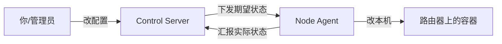

# 快速上手：本地从零跑通

这份教程面向**第一次接触本项目的人**，目标是在本机把控制面 + 一个 agent 跑起来、看懂闭环。读完再去看 [../guides/](../guides/)（怎么做某件事）和 [../reference/](../reference/)（查细节）。

> 命令默认在仓库根 `dn42-control-backend` 下执行；多行命令用反斜杠 `\` 续行（bash）。Windows 用 PowerShell 时请把续行符换成反引号 `` ` `` 或写成一行。

## 心智模型（一句话）

> 控制中心是"班主任发作业"（保存并下发 `DesiredState`），节点小助手是"学生照着作业把房间收拾好再拍照交回"（渲染配置、部署、上报）。



概念词汇见 [../overview.md](../overview.md#核心概念词汇表)。

## 1. 装依赖（只做一次）

```bash
cd dn42-control-backend
python -m venv .venv
source .venv/bin/activate
pip install -e .[dev]
```

如导入子包报错，设一次搜索路径：

```bash
export PYTHONPATH=apps/control-server:apps/node-agent:packages/dn42_common:packages/dn42_schemas:packages/dn42_templates:packages/dn42_runtime
```

## 2. 起控制中心

```bash
# 练手建议开内置示例节点 edge1（默认不播种，启动即空库）
export DN42_CONTROL_SEED_BOOTSTRAP_NODE=1
uvicorn app.main:app --app-dir apps/control-server --reload --host 0.0.0.0 --port 8000
```

- 服务：`http://127.0.0.1:8000`
- 自动接口文档（可点着试）：`http://127.0.0.1:8000/docs`
- 健康探针：`curl -s http://127.0.0.1:8000/healthz` 应返回 200

全部环境变量见 [../reference/configuration.md](../reference/configuration.md#control-server)。

## 3. 起节点小助手（三种模式）

另开一个终端（记得也 `source .venv/bin/activate`）。

**只演练不动机器**（不写盘、不部署，排错用）：

```bash
python -m agent.main \
  --controller-url http://127.0.0.1:8000 \
  --enrollment-token enroll-token \
  --requested-node-id edge1 \
  --state-dir .agent-state \
  --plan-only
```

输出一份 JSON 摘要（node_id、generation、文件计划、容器计划等）。

**单次完整部署后退出**：把 `--plan-only` 换成 `--once`。

**常驻守护（生产默认形态）**：去掉 `--once` / `--plan-only`：

```bash
python -m agent.main \
  --controller-url http://127.0.0.1:8000 \
  --enrollment-token enroll-token \
  --requested-node-id edge1 \
  --state-dir .agent-state
```

它会启动即 reconcile 一次，然后连控制面 WebSocket，配置一变就自动应用。CLI 全参数见 [../reference/cli-and-scripts.md](../reference/cli-and-scripts.md)，运行模式原理见 [../internals/node-agent.md](../internals/node-agent.md#运行模式)。

## 4. 改一个配置，看它生效

最常用的动作——加 peer、改会话、加 DNS 记录——都走 Admin API（需带 `-H "Authorization: Bearer <DN42_CONTROL_ADMIN_TOKEN>"`）。手动通知一台机器去拉最新配置：

```bash
curl -s -X POST "http://127.0.0.1:8000/api/v1/admin/nodes/edge1/notify" \
  -H "Content-Type: application/json" \
  -d '{"event": "desired_state_updated", "reason": "manual"}'
```

控制面会生成新一代配置并摇门铃，常驻 agent 自动拉取、渲染、对比、只改有变化的部分。各类资源的增删改见 [../reference/api.md](../reference/api.md)；建互联用 [../guides/peering.md](../guides/peering.md)。

## 5. 看健康

```bash
# 机群概览
curl -s "http://127.0.0.1:8000/api/v1/admin/health"
# 单节点详细
curl -s "http://127.0.0.1:8000/api/v1/admin/nodes/edge1/health"
# 历史事件（排错神器）
curl -s "http://127.0.0.1:8000/api/v1/admin/nodes/edge1/status-events?kind=apply&limit=20"
```

健康有五态 `ok` / `stale` / `degraded` / `down` / `unknown`，含义与排错见 [../guides/monitoring-and-troubleshooting.md](../guides/monitoring-and-troubleshooting.md)。

## 6. 打开 Web UI（可选）

```bash
cd apps/web
npm install && npm run dev      # http://127.0.0.1:5173
```

登录页填控制面地址 + admin token。注意控制面要允许该来源 CORS（`DN42_CONTROL_CORS_ORIGINS`）。界面指南见 [../guides/web-ui.md](../guides/web-ui.md)。

## 下一步

- 接入真实节点：[../guides/node-onboarding.md](../guides/node-onboarding.md)
- 部署到生产：[../guides/deployment.md](../guides/deployment.md)
- 理解系统怎么运转：[../internals/architecture.md](../internals/architecture.md)
- 跑测试 / 贡献代码：[../contributing.md](../contributing.md)
