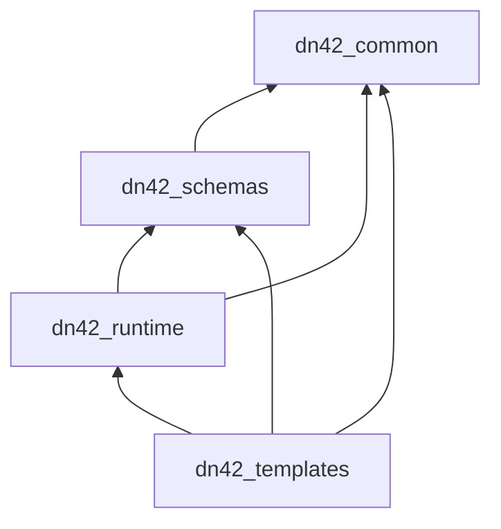

# packages

`packages/` 包含 Control Server 和 Node Agent 共享的基础库。

| 包 | 职责 | 详细文档 |
| --- | --- | --- |
| `dn42_common` | 公共校验器、命名、label、community、Jinja 工具 | [docs/dn42_common.md](docs/dn42_common.md) |
| `dn42_schemas` | Pydantic 协议模型，包含 `DesiredState` 和 Agent 协议 | [docs/dn42_schemas.md](docs/dn42_schemas.md) |
| `dn42_templates` | BIRD、WireGuard、CoreDNS、脚本和 runtime 文件渲染 | [docs/dn42_templates.md](docs/dn42_templates.md) |
| `dn42_runtime` | `RenderedFile`、写盘计划、router Dockerfile 渲染 | [docs/dn42_runtime.md](docs/dn42_runtime.md) |

包文档入口见 [docs/README.md](docs/README.md)。

## 依赖方向

箭头表示 import 方向。底层包不能反向 import 上层包。
