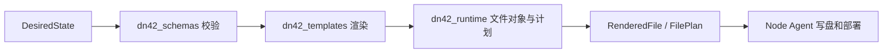
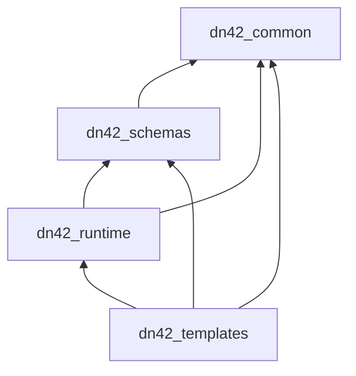

# 共享包文档

`packages/` 下的共享包构成“协议 -> 渲染 -> 写盘计划”的基础能力。Control Server 和 Node Agent 都依赖这些包，但它们不直接启动 API 服务，也不直接管理长期业务状态。

## 包分层

| 包 | 负责 | 不负责 |
| --- | --- | --- |
| [`dn42_common`](dn42_common.md) | 校验器、命名、label、community、Jinja 环境 | 业务模型、模板内容、Docker 调度 |
| [`dn42_schemas`](dn42_schemas.md) | `DesiredState`、Agent 协议、runtime snapshot、对账报告 | 渲染、写盘、调用 Docker |
| [`dn42_runtime`](dn42_runtime.md) | `RenderedFile`、路径安全、文件计划、router Dockerfile 渲染 | BIRD/WireGuard 业务模板 |
| [`dn42_templates`](dn42_templates.md) | BIRD、WireGuard、CoreDNS、脚本和最终渲染入口 | 管理数据库、部署容器 |

## 数据流



三条约束：

1. 新协议字段先进入 `dn42_schemas`。
2. `dn42_templates` 只消费已经被 schema 稳定表达的字段。
3. 容器编排、宿主机预检和清理属于 Node Agent，不属于共享包。

## 依赖方向



禁止反向依赖，例如 `dn42_common` 不能 import `dn42_schemas`，`dn42_runtime` 不能 import `dn42_templates`。

## Golden 样本

`examples/rendered-hkg1/` 是 `build_hkg1_example_state()` 的渲染快照。模板或 schema 输出有意改变时，需要刷新它：

```bash
python -c "from pathlib import Path; from dn42_schemas.testing import build_hkg1_example_state; from dn42_templates import render_desired_state; from dn42_runtime import write_rendered_files; write_rendered_files(render_desired_state(build_hkg1_example_state()), Path('examples/rendered-hkg1'))"
```

随后运行：

```bash
python -m pytest tests/unit/test_golden_rendered_hkg1.py -q
```
