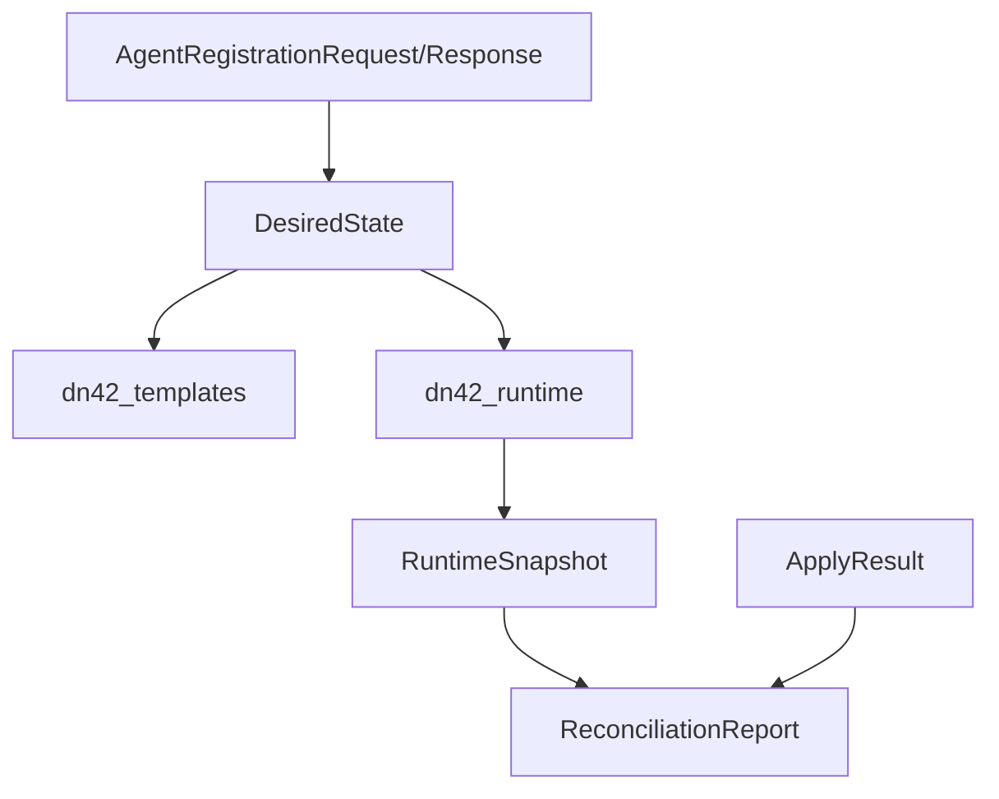

# dn42_schemas

`dn42_schemas` 是控制平面、Agent、模板和 runtime 之间的协议边界。跨进程或跨包传递的数据结构都应在这里定义，而不是用裸 `dict` 随处传递。

所有模型基于 Pydantic v2，公共基类是 `StrictModel`：

```python
ConfigDict(extra="forbid", frozen=True)
```

这意味着未知字段会被拒绝，模型对象默认不可变。

## 文件结构

| 文件 | 内容 |
| --- | --- |
| `base.py` | `StrictModel`、canonical JSON、SHA-256 |
| `enums.py` | `InterfaceKind`、`ServiceRole`、`ApplyStatus` 等枚举 |
| `network.py` | `NodeSpec`、`WireGuardPeerSpec`、`InterfaceSpec` |
| `routing.py` | `BgpSessionSpec`、BIRD、IGP、large community 配置 |
| `runtime.py` | runtime service、underlay、RPKI、Dockerfile、端口和挂载 |
| `dns.py` | DNS record、zone、forward、CoreDNS 总配置 |
| `lookglass.py` | looking glass 配置 |
| `agent.py` | Agent 注册、apply result、runtime snapshot、对账报告 |
| `desired_state.py` | `DesiredState` 和 `TemplateSetSpec` |
| `io.py` | 从 JSON/YAML 加载 `DesiredState` |
| `testing.py` | hkg1 和 local lab 示例状态 |

## 协议对象关系



## 主要枚举

| 枚举 | 常见值 |
| --- | --- |
| `InterfaceKind` | `dummy`、`wireguard`、`underlay` |
| `ServiceRole` | `router-netns`、`wg-gateway`、`bird-router`、`rpki-cache`、`dns`、`looking-glass-proxy`、`looking-glass-frontend` |
| `AddressFamily` | `ipv4`、`ipv6`、`mp-bgp` |
| `ApplyStatus` | `succeeded`、`failed`、`degraded`、`skipped` |
| `BootstrapStatus` | `accepted`、`pending-approval`、`rejected` |
| `AgentCapability` | `docker`、`systemd`、`wireguard`、`bird`、`coredns`、`rpki` |
| `RuntimeResourceStatus` | `running`、`stopped`、`missing`、`degraded`、`unknown` |
| `DriftSeverity` | `info`、`warning`、`critical` |

## DesiredState

`DesiredState` 是最核心的模型，完整说明见 [../../docs/desired-state.md](../../docs/desired-state.md)。

关键校验：

| 校验 | 说明 |
| --- | --- |
| interface 名唯一 | 防止 Linux 接口冲突 |
| BGP session 名唯一 | 防止 BIRD protocol 冲突 |
| BGP session 引用的 interface 必须存在 | 防止模板生成无效配置 |
| WireGuard interface 不承载多个外部 ASN | 防止把多个 eBGP 对端混入同一隧道 |
| runtime 必须包含核心角色 | `router-netns`、`wg-gateway`、`bird-router` |
| looking glass 自动注入 runtime services | 使用 `lookglass` 字段而不是手写 lookglass service |

## Runtime 模型

`RouterRuntimeSpec` 描述一个节点如何被部署。

```mermaid
flowchart TB
    runtime[RouterRuntimeSpec]
    underlay[UnderlayNetworkSpec]
    rpki[RpkiSpec]
    dockerfile[RouterDockerfileSpec]
    service[RuntimeServiceSpec[]]

    runtime --> underlay
    runtime --> rpki
    runtime --> dockerfile
    runtime --> service
```

重要规则：

| 规则 | 说明 |
| --- | --- |
| service 名唯一 | runtime service 名不能重复 |
| enabled service 必须满足依赖 | `depends_on` 指向已启用服务 |
| `network_mode: service:X` 必须可解析 | 共享 network namespace 必须存在 |
| 不允许重复 host port | 避免 Docker 端口冲突 |
| `wg-gateway` 和 `bird-router` 必须有 command 和必要 volume | 保证脚本和配置可访问 |

## Agent 协议

`agent.py` 定义三类数据：

| 类别 | 模型 |
| --- | --- |
| Bootstrap | `HostInventory`、`AgentRegistrationRequest`、`AgentRegistrationResponse` |
| Apply 反馈 | `PlanSummary`、`AppliedFileRecord`、`ApplyResult` |
| Reconcile 闭环 | `RuntimeSnapshot`、`ObservedContainer`、`ObservedInterface`、`ObservedWireGuardInterface`、`ObservedBgpProtocol`、`DriftItem`、`ReconciliationReport` |

`AgentRegistrationResponse.status == accepted` 时，`node_id`、`agent_id`、`agent_token`、`desired_state_generation` 必须全部非空。

所有时间字段使用 ISO-8601 字符串。

## Canonical JSON 和签名

`StrictModel` 提供：

```python
canonical_json()
canonical_sha256()
```

用途：

| 方法 | 用途 |
| --- | --- |
| `canonical_json()` | 生成排序稳定、空白稳定的 JSON 字符串 |
| `canonical_sha256()` | 对 canonical JSON 计算 SHA-256 |

## Testing helpers

| 函数 | 作用 |
| --- | --- |
| `build_hkg1_example_state()` | 构造 hkg1 示例 `DesiredState` |
| `build_local_three_node_states()` | 构造 local lab 多节点状态 |

这些 fixture 被 golden rendering tests 和开发脚本复用。

## 设计边界

| 进入 schemas | 不进入 schemas |
| --- | --- |
| 跨组件协议对象 | Jinja 模板 |
| 字段默认值和校验规则 | Docker SDK 调用 |
| runtime snapshot 和对账结构 | 文件写盘 |
| 签名和 canonical IO | Control Server 路由 |
