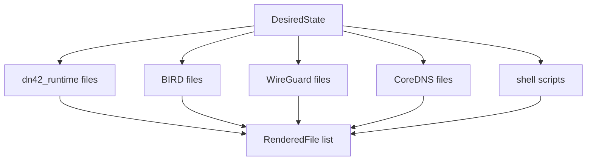

# dn42_templates

`dn42_templates` 把 `DesiredState` 渲染成节点上要运行的配置文件，包括 BIRD2、WireGuard、CoreDNS、脚本，以及来自 `dn42_runtime` 的 router Dockerfile。容器编排不渲染文件，由结构化 runtime 数据直达 agent 的 Docker Engine API。

## 文件结构

| 文件或目录 | 内容 |
| --- | --- |
| `paths.py` | 模板目录定位 |
| `bird2.py` | BIRD2 上下文和渲染 |
| `wireguard.py` | WireGuard `interface.conf` 渲染 |
| `coredns.py` | Corefile 和 zone 文件渲染 |
| `scripts.py` | apply/start shell 脚本渲染 |
| `desired_state.py` | `render_desired_state()` 顶层入口 |
| `config-bird2/` | BIRD2 模板 |
| `config-wireguard/` | WireGuard 模板 |
| `config-coredns/` | CoreDNS 模板 |
| `config-scripts/` | 脚本模板 |

## 顶层入口

```python
render_desired_state(state: DesiredState) -> list[RenderedFile]
render_bird_conf(state: DesiredState) -> str
```

输出文件：

| 路径 | 来源 |
| --- | --- |
| `bird/*.conf` | BIRD2 模板 |
| `wireguard/<iface>.conf` | WireGuard 模板 |
| `scripts/bird/*.sh` | BIRD apply/start 脚本 |
| `scripts/wg/*.sh` | WireGuard apply/start 脚本 |
| `coredns/Corefile` | CoreDNS 配置 |
| `coredns/zones/db.<zone>` | 内联 DNS records 生成的 zone 文件 |

## 渲染流程



## BIRD2

BIRD 模板文件：

```text
anycast_services.conf
bird.conf
community_filters.conf
custom_filters.conf
dn42_peers.conf
ibgp.conf
ospf.conf
ospf_interfaces.conf
rpki.conf
```

关键上下文：

| key | 说明 |
| --- | --- |
| `node_id` | 当前节点 ID |
| `ownas` | 本节点 ASN |
| `ownip` / `ownip6` | loopback 或 router ID |
| `ownnets4` / `ownnets6` | 本节点 prefix |
| `wg_peers` | 从 WireGuard interface 和 BGP session 合成的 peer 视图 |
| `internal_router_names` | 内部拓扑中的 router |
| `ospf_neighbor_interfaces` | IGP 邻接接口 |
| `large_communities` | large community 编码配置 |
| `rpki_ip` | RPKI cache 地址 |

`wg_peers` 按 interface 分组，只包含 enabled 且非内部的 BGP session。`DesiredState` 已保证一个 WireGuard interface 不承载多个外部 ASN。

## WireGuard

公开函数：

```python
render_wireguard(interface)
render_wireguard_apply_script(interface)
render_apply_all_wg_script(state)
render_wireguard_start_script()
```

输出：

| 文件 | 说明 |
| --- | --- |
| `wireguard/<iface>.conf` | WireGuard 配置 |
| `scripts/wg/apply-<iface>.sh` | 单接口 apply 脚本 |
| `scripts/wg/apply-all-wg.sh` | 顺序应用所有 WireGuard 接口 |
| `scripts/wg/start-wg-gateway.sh` | gateway 容器启动脚本 |

脚本会把 WireGuard 配置复制到容器内私有目录并设置 `0600` 权限，再调用 `wg-quick strip`，避免配置文件权限警告。

## CoreDNS

公开函数：

```python
render_corefile(state)
render_dns_zone(zone, serial=state.generation)
```

当 `state.dns is None` 或 `state.dns.enabled is False` 时，不输出 CoreDNS 文件。

`DnsZoneSpec.records` 非空时生成 `coredns/zones/db.<zone>`；为空时表示 zone 由外部 `records_ref` 提供，不生成 zone 文件。

## Scripts

脚本模板负责把配置应用到容器内 runtime：

| 模板 | 作用 |
| --- | --- |
| `config-scripts/bird/apply-bird.sh.j2` | 应用 BIRD 配置 |
| `config-scripts/bird/start-bird-router.sh.j2` | 启动 BIRD |
| `config-scripts/wg/apply-loopback.sh.j2` | 应用 loopback 地址 |
| `config-scripts/wg/apply-interface.sh.j2` | 应用单个 WireGuard 接口 |
| `config-scripts/wg/apply-all-wg.sh.j2` | 应用全部 WireGuard 接口 |
| `config-scripts/wg/start-wg-gateway.sh.j2` | 启动 WireGuard gateway |

## 命令行

渲染：

```bash
python -m dn42_templates render --state state.json --out ./rendered
```

写盘 dry-run：

```bash
python -m dn42_templates apply --state state.json --out ./rendered --dry-run --prune
```

## 设计边界

| 负责 | 不负责 |
| --- | --- |
| BIRD/WireGuard/CoreDNS/脚本模板 | 数据库存储 |
| 把 `DesiredState` 转成 `RenderedFile` | Docker 调度 |
| 调用 `dn42_runtime` 纳入 runtime 文件 | 文件原子写盘 |
| 模板上下文构造 | runtime 状态采集 |
